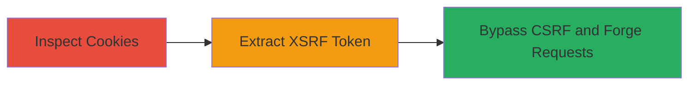

# Bypassing CSRF Protections via Cookie-Stored XSRF Tokens in RelateIQ Web Application

Multi-stage attack chain demonstrating a complete attack workflow.

## Chain Metrics Dashboard

| Metric | Value |
|--------|-------|
| Chain Status | Unverified |
| Total Steps | 1 |
| Execution Time | ~5 minutes |
| Skill Level | Intermediate |
| Complexity | Low |
| Impact Level | High |

## Attack Flow Visualization

## Prerequisites & Requirements

### Required Tools

- Browser Developer Tools (e.g., Chrome DevTools)

### Target Environment

- Web application (RelateIQ)
- Required services/ports: HTTPS on port 443
- Network access requirements: Direct access to the web application

### Initial Access Requirements

- Valid user session or authentication to the application
- Ability to inspect network traffic and cookies

## Detailed Attack Procedures

### Step 1: Inspect Cookie Handling for XSRF Tokens
procedure: [[procedures/Inspect-Web-Application-Cookies-for-XSRF-Tokens]]

**Objective**: Identify if XSRF tokens are improperly stored in cookies, enabling potential bypass of CSRF protections upon cookie compromise.

**Instructions**: Open the web application in a browser and authenticate if necessary. Use developer tools to monitor authentication and form submission requests. Examine the cookies set during these interactions to check for embedded XSRF token values.

**Expected Output**: Observation of XSRF tokens within cookie content, such as in a cookie named 'xsrf' or similar, containing the token value directly.

**Success Indicators**:
- Cookies contain readable XSRF token values
- Tokens are not isolated to request bodies or headers

## Attack Chain Summary

### Key Achievements

1. Discovered insecure storage of XSRF tokens in cookies, violating secure design principles.
2. Demonstrated potential for attackers to extract tokens via cookie compromise (e.g., XSS or interception).
3. Highlighted impact: Forged requests for unauthorized actions like account changes.

## Technique & Tactic Coverage

### MITRE ATT&CK Techniques

- [[Exploit Public-Facing Application]]

### MITRE ATT&CK Tactics

- [[Initial Access]]

---
*Last updated: 2023-10-01T12:00:00Z*
