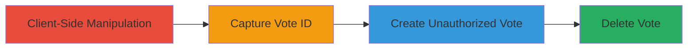

---
tags:
  - broken-access-control
  - vote-manipulation
  - hackerone
  - web-vulnerability
type: attack_chain
tools:
  - '[[tools/Browser-Developer-Tools]]'
  - '[[tools/cURL]]'
tactics:
  - '[[Initial Access]]'
verified: false
platforms:
  - Web
submitted: true
complexity: medium
created_at: '2023-10-01T00:00:00Z'
procedures:
  - '[[procedures/Manipulate-Client-Side-HTML-to-Reveal-Hidden-Vote-Controls]]'
  - '[[procedures/Capture-Vote-ID-by-Triggering-Vote-Request]]'
  - '[[procedures/Create-Unauthorized-Vote-via-POST-Request]]'
  - '[[procedures/Delete-Vote-via-DELETE-Request]]'
step_count: 4
techniques:
  - '[[Exploit Public-Facing Application]]'
updated_at: '2025-12-14T17:29:20.026Z'
description: >-
  An attack chain exploiting broken access controls in HackerOne's unreleased
  Vote functionality for Hacktivity reports, allowing unauthorized vote creation
  and deletion to manipulate report rankings.
skill_level: intermediate
impact_level: high
id: 411beb92-b5bd-4cb4-b148-ca73a10e4c97
validated: true
mitre_tactics:
  - '[[Initial Access]]'
mitre_techniques:
  - '[[Exploit Public-Facing Application]]'
---
# Bypassing Client-Side Controls to Manipulate Hacktivity Report Votes

Multi-stage attack chain demonstrating exploitation of inadequate server-side access controls in HackerOne's unreleased 'Vote' functionality for Hacktivity reports. The attack involves client-side manipulation to reveal hidden features and sending unauthorized HTTP requests to create or delete votes, potentially influencing report visibility or rankings once the feature is live.

## Chain Metrics Dashboard

| Metric | Value |
|--------|-------|
| Chain Status | Unverified |
| Total Steps | 4 |
| Execution Time | ~5 minutes |
| Skill Level | Intermediate |
| Complexity | Medium |
| Impact Level | High |

## Attack Flow Visualization



## Prerequisites & Requirements

### Required Tools

- [[tools/Browser-Developer-Tools]]
- [[tools/cURL]]

### Target Environment

- Web platform (HackerOne Hacktivity page)
- Required services/ports: HTTPS on port 443
- Network access requirements: Public internet access to hackerone.com

### Initial Access Requirements

- No credentials required (public page)
- Network position: External attacker
- Prior access needed: None

## Detailed Attack Procedures

### Step 1: Client-Side Manipulation
procedure: [[procedures/Manipulate-Client-Side-HTML-to-Reveal-Hidden-Vote-Controls]]

**Objective**: Reveal hidden vote functionality by tampering with client-side HTML and JavaScript.

**Instructions**: Open the Hacktivity page in a browser, access developer tools, and remove 'disabled' attributes from form controls. Modify JSON requests by changing 'false' to 'true' to enable vote buttons.

**Expected Output**: Hidden vote buttons become visible and clickable.

**Success Indicators**:
- Vote controls are no longer disabled
- JSON flags are updated to allow voting

### Step 2: Capture Vote ID
procedure: [[procedures/Capture-Vote-ID-by-Triggering-Vote-Request]]

**Objective**: Trigger a vote request to obtain a vote ID for further manipulation.

**Instructions**: Click the revealed vote button to send a POST request. Intercept the request using developer tools or a proxy to capture the assigned vote ID. Immediately delete the vote to avoid system impact.

**Expected Output**: POST request response containing a new vote ID.

**Success Indicators**:
- Vote ID is captured in the response
- Vote is successfully created and noted for deletion

### Step 3: Create Unauthorized Vote
procedure: [[procedures/Create-Unauthorized-Vote-via-POST-Request]]

**Objective**: Send an unauthorized POST request to create a vote on a target report.

**Instructions**: Use [[commands/curl-create-vote]] to send a POST request to the vote endpoint with the target report ID:

```bash
curl -X POST https://hackerone.com/reports/[Report_ID]/votes -H "Content-Type: application/json" -d '{"vote": true}'
```

**Expected Output**: HTTP 200 or 201 response confirming vote creation, possibly with a vote ID.

**Success Indicators**:
- Vote is created without authentication checks
- Response indicates successful vote assignment

### Step 4: Delete Vote
procedure: [[procedures/Delete-Vote-via-DELETE-Request]]

**Objective**: Remove the created vote using a DELETE request to clean up.

**Instructions**: Use [[commands/curl-delete-vote]] to send a DELETE request with the vote ID:

```bash
curl -X DELETE https://hackerone.com/reports/[Report_ID]/votes/[VOTE_ID]
```

**Expected Output**: HTTP 200 or 204 response confirming vote deletion.

**Success Indicators**:
- Vote is removed successfully
- No errors in response indicating access denial

## Attack Chain Summary

### Key Achievements

1. Bypassed client-side restrictions to access unreleased functionality
2. Created unauthorized votes on Hacktivity reports
3. Demonstrated potential for report manipulation
4. Highlighted lack of server-side authorization

## Technique & Tactic Coverage

### MITRE ATT&CK Techniques

- [[Exploit Public-Facing Application]]

### MITRE ATT&CK Tactics

- [[Initial Access]]

---

*Last updated: 2023-10-01T00:00:00Z*
