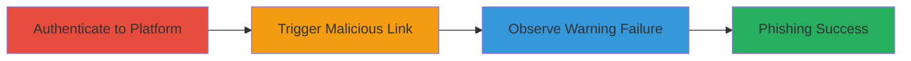

# Bypassing Domain Highlighting in HackerOne External Link Warnings on Mobile Browsers for Phishing

Multi-stage attack chain demonstrating how a UI flaw in HackerOne's external link warning enables phishing by failing to highlight true malicious domains on mobile Chrome and Edge browsers.

## Chain Metrics Dashboard

| Metric | Value |
|--------|-------|
| Chain Status | Unverified |
| Total Steps | 3 |
| Execution Time | ~5 minutes |
| Skill Level | Beginner |
| Complexity | Low |
| Impact Level | Medium |

## Attack Flow Visualization

## Prerequisites & Requirements

### Required Tools

- [[tools/Google-Chrome-Mobile]]
- [[tools/Microsoft-Edge-Mobile]]

### Target Environment

- HackerOne web platform
- Mobile devices (Android/iOS)
- Latest versions of Chrome or Edge browsers

### Initial Access Requirements

- Valid HackerOne account credentials
- Mobile network access to HackerOne
- No prior elevated access needed

## Detailed Attack Procedures

### Step 1: Authenticate to HackerOne
procedure: [[procedures/Authenticate-to-HackerOne-on-Mobile-Browser]]

**Objective**: Gain authenticated access to the HackerOne platform on a mobile browser to enable interaction with external links.

**Instructions**: Open the mobile browser and navigate to the HackerOne login page, then enter credentials to log in.

**Expected Output**: Successful login to the HackerOne dashboard.

**Success Indicators**:
- Dashboard loads without errors
- User is authenticated and can view reports

### Step 2: Trigger External Link Warning
procedure: [[procedures/Trigger-External-Link-Warning-with-Malicious-Link]]

**Objective**: Present a crafted malicious link within the platform to invoke the External Link Warning interstitial.

**Instructions**: While authenticated, click on a disguised malicious link, such as one embedding an IP address or evil domain in query parameters.

**Expected Output**: The External Link Warning page appears, but without proper domain highlighting.

**Success Indicators**:
- Warning interstitial is triggered
- Link destination is not clearly highlighted as malicious

### Step 3: Observe Domain Highlighting Failure
procedure: [[procedures/Observe-Domain-Highlighting-Failure]]

**Objective**: Verify that the warning page fails to visually distinguish the true malicious domain, misleading the user.

**Instructions**: Examine the interstitial page for lack of highlighting on the real domain (e.g., IP or evil.com) versus the trusted disguise.

**Expected Output**: No visual cue (e.g., no bolding or coloring) on the malicious part of the URL.

**Success Indicators**:
- True domain not highlighted
- User could be tricked into proceeding to malicious site

## Attack Chain Summary

### Key Achievements

1. Successful authentication on mobile without issues
2. Triggering of the flawed warning mechanism
3. Confirmation of UI failure enabling phishing deception

## Technique & Tactic Coverage

### MITRE ATT&CK Techniques

- [[T1566.002]]
- [[Exploit Public-Facing Application]]

### MITRE ATT&CK Tactics

- [[Initial Access]]

---

*Last updated: 2023-10-01T00:00:00Z*
