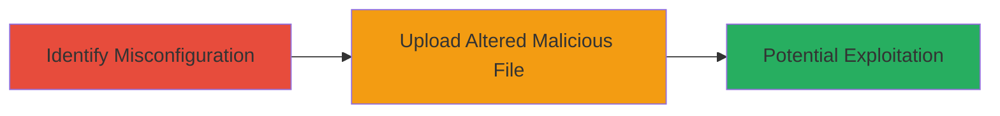

---
tags:
  - file-upload
  - bypass
  - dod
  - web
  - unrestricted-upload
type: attack_chain
tools: []
tactics:
  - '[[Initial Access]]'
  - '[[Execution]]'
commands: []
platforms:
  - Web
complexity: medium
procedures:
  - '[[procedures/Identify-File-Upload-Misconfiguration]]'
  - '[[procedures/Bypass-File-Upload-Signature-Checks]]'
step_count: 2
techniques:
  - '[[Exploit Public-Facing Application]]'
  - '[[Remote File Copy]]'
description: >-
  A multi-step attack exploiting a misconfigured file upload feature on a
  Department of Defense website to bypass signature-based detection and upload
  dangerous file types, potentially leading to code execution or data
  compromise.
skill_level: intermediate
impact_level: high
id: ba032aa0-bb8d-4970-8fce-c7ebd40c41ad
created_at: '2025-12-14T05:32:10.345Z'
updated_at: '2025-12-14T05:32:10.345Z'
verified: false
validated: true
submitted: true
mitre_tactics:
  - '[[Initial Access]]'
  - '[[Execution]]'
mitre_techniques:
  - '[[Exploit Public-Facing Application]]'
  - '[[Remote File Copy]]'
---
# Bypassing File Upload Signature Checks on DoD Website for Malicious File Upload

## Overview

This attack chain demonstrates how a misconfiguration in the file upload functionality of a Department of Defense (DoD) website can be exploited to bypass signature-based analysis. By altering the structure or content of a malicious file, attackers can evade detection mechanisms, successfully upload dangerous file types, and potentially achieve code execution or data compromise on the server. The vulnerability stems from reliance on simplistic signature checks without additional validation layers like content-type enforcement or server-side scanning.

## Chain Metrics Dashboard

| Metric | Value |
|--------|-------|
| Chain Status | Unverified |
| Total Steps | 2 |
| Execution Time | ~5 minutes |
| Skill Level | Intermediate |
| Complexity | Medium |
| Impact Level | High |

## Attack Flow Visualization

## Prerequisites & Requirements

### Required Tools

- Browser developer tools or proxy like Burp Suite for file manipulation

### Target Environment

- Web application with file upload feature
- No specific ports required; accessible via standard HTTP/HTTPS

### Initial Access Requirements

- Public access to the DoD website's file upload endpoint
- No credentials needed for unauthenticated upload

## Detailed Attack Procedures

### Step 1: Identify Misconfiguration
procedure: [[procedures/Identify-File-Upload-Misconfiguration]]

**Objective**: Analyze the file upload mechanism to detect reliance on signature-based analysis that can be bypassed.

**Instructions**: Inspect the upload form using browser developer tools to understand file handling. Test with benign files to observe rejection patterns based on signatures. Note that the system checks file magic bytes or extensions but fails on subtle alterations.

**Expected Output**: Confirmation that uploads are rejected only on exact signature matches, indicating bypass potential.

**Success Indicators**:
- Upload logs or responses reveal signature-based rejection
- No additional validation like MIME type enforcement observed

### Step 2: Bypass Signature Checks and Upload
procedure: [[procedures/Bypass-File-Upload-Signature-Checks]]

**Objective**: Modify a malicious file to evade detection and achieve successful upload of a dangerous type.

**Instructions**: Create or obtain a malicious file (e.g., a script disguised as an image). Alter its header bytes slightly (e.g., append null bytes or modify non-critical metadata) to change the signature without affecting functionality. Use a proxy to intercept and modify the upload request if needed, then submit the altered file via the upload form.

**Expected Output**: Server accepts the file without rejection, storing it on the system.

**Success Indicators**:
- File upload succeeds with no error
- Access the uploaded file to verify persistence and potential execution

## Attack Chain Summary

### Key Achievements

1. Identified weak signature-based file validation in the DoD upload feature
2. Successfully bypassed checks by altering file content, enabling malicious upload
3. Demonstrated high-impact potential for server-side exploitation

## Technique & Tactic Coverage

### MITRE ATT&CK Techniques

- [[Exploit Public-Facing Application]]
- [[Remote File Copy]]

### MITRE ATT&CK Tactics

- [[Initial Access]]
- [[Execution]]

---
*Last updated: 2023-10-01*
