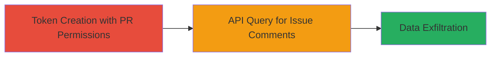

---
tags:
  - github
  - pat
  - access-control-bypass
  - information-disclosure
type: attack_chain
tools: []
tactics:
  - '[[Collection]]'
commands:
  - '[[commands/github-api-query-issue-comments]]'
platforms:
  - Web
  - GitHub
complexity: medium
procedures:
  - '[[procedures/Exploit-GitHub-PAT-Misscoping-for-Issue-Comment-Access]]'
step_count: 1
techniques:
  - '[[T1213.003]]'
description: >-
  An improper authorization vulnerability in GitHub Enterprise Server
  (CVE-2023-51380) allows users with only Pull Request permissions via Personal
  Access Tokens to read restricted issue comments, leading to unauthorized
  information disclosure.
skill_level: intermediate
impact_level: medium
id: 39176731-e548-4809-9b73-e325eb048d52
created_at: '2025-12-14T17:30:07.270Z'
updated_at: '2025-12-14T17:30:07.270Z'
verified: false
validated: true
submitted: true
mitre_tactics:
  - '[[Collection]]'
mitre_techniques:
  - '[[T1213.003]]'
---
# Bypassing GitHub Issue Permissions to Read Sensitive Comments via Pull Request PATs

## Overview

This attack chain exploits an improper authorization vulnerability in GitHub Enterprise Server (CVE-2023-51380), discovered by researcher 'archangel' on September 28, 2023. Attackers with a Personal Access Token (PAT) scoped only to 'Pull Request' permissions can bypass the requirement for 'Issues' permissions to read comments on issues. This leads to the unauthorized leakage of sensitive data in issue comments, such as internal discussions, secrets, or proprietary information. The vulnerability affects the GitHub API endpoints for issue comments and is classified as medium severity. No privilege escalation or further exploitation is required beyond token creation and API queries.

## Chain Metrics Dashboard

| Metric | Value |
|--------|-------|
| Chain Status | Unverified |
| Total Steps | 1 |
| Execution Time | ~5 minutes |
| Skill Level | Intermediate |
| Complexity | Medium |
| Impact Level | Medium |

## Attack Flow Visualization



## Prerequisites & Requirements

### Required Tools

- None (uses standard HTTP clients like curl)

### Target Environment

- GitHub Enterprise Server (self-hosted or cloud)
- API access enabled
- No specific ports; uses HTTPS (443)

### Initial Access Requirements

- Valid user account with ability to create PATs
- PAT scoped only to 'Pull Request' repo permissions (no 'Issues' access)
- Knowledge of target repository and issue IDs

## Detailed Attack Procedures

### Step 1: Exploit PAT Misscoping for Unauthorized Access
procedure: [[procedures/Exploit-GitHub-PAT-Misscoping-for-Issue-Comment-Access]]

**Objective**: Use a mis-scoped PAT to query and retrieve issue comments without required permissions, exfiltrating sensitive data.

**Instructions**: First, create a PAT with only 'Pull Request' permissions for the target repository. Then, use the GitHub API to query comments on a specific issue, bypassing 'Issues' permission checks.

Execute [[commands/github-api-query-issue-comments]] to fetch comments:

```bash
gitHub_api_query_issue_comments --token $PAT --repo owner/repo --issue 123
```

Validate the response for unauthorized data access by checking if comments contain sensitive information not visible via the UI with the same token.

**Expected Output**: JSON response with issue comment details, including body text that should be restricted.

**Success Indicators**:
- API returns 200 OK with comment data
- Comments reveal sensitive information (e.g., API keys, discussions) without triggering permission errors
- No 'Issues' permission required in token scope

## Attack Chain Summary

### Key Achievements

1. Successful creation of a limited-scope PAT that grants unintended access to issue comments.
2. Retrieval of restricted issue data via API without proper permissions.
3. Potential exposure of sensitive repository information, enabling further reconnaissance or attacks.

## Technique & Tactic Coverage

### MITRE ATT&CK Techniques

- [[T1213.003]]

### MITRE ATT&CK Tactics

- [[Collection]]

---
*Last updated: 2023-10-01*
