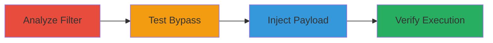

---
tags:
  - xss
  - stored-xss
  - filter-bypass
  - regex-greedy
  - vimeo
type: attack_chain
tools: []
tactics:
  - '[[Initial Access]]'
  - '[[Execution]]'
commands: []
platforms:
  - Web
complexity: medium
procedures:
  - '[[procedures/Analyze-XSS-Filter-Mechanism]]'
  - '[[procedures/Test-XSS-Bypass-Payloads]]'
  - '[[procedures/Inject-Payload-into-Profile-Update]]'
  - '[[procedures/Verify-Stored-XSS-Execution]]'
step_count: 4
techniques:
  - '[[Exploit Public-Facing Application]]'
  - '[[JavaScript]]'
description: >-
  A multi-stage attack exploiting a flawed greedy regex filter in Vimeo's input
  handling to store and execute malicious JavaScript payloads across various
  contexts, enabling arbitrary code execution for viewing users.
skill_level: intermediate
impact_level: high
id: 0b36d5c0-2bd9-4930-a714-16941f72eb8a
created_at: '2025-12-14T03:16:30.923Z'
updated_at: '2025-12-14T03:16:30.923Z'
verified: false
validated: true
submitted: true
mitre_tactics:
  - '[[Initial Access]]'
  - '[[Execution]]'
mitre_techniques:
  - '[[Exploit Public-Facing Application]]'
  - '[[JavaScript]]'
---
# Bypassing Greedy XSS Filter for Multiple Stored XSS in Vimeo

## Overview

This attack chain demonstrates how a greedy regex filter in Vimeo's application, designed to remove strings from '<' to '>', can be bypassed using encoded and malformed payloads. The filter's overreach allows injection of HTML tags like frameset via URL encoding and newline characters, leading to stored XSS in the database. Once stored, the payload executes arbitrary JavaScript in contexts such as JavaScript inputs, unencoded string outputs, and JSON responses with HTML headers, affecting other users who view profiles or related content. The attack was identified through structural analysis and evasion testing, resulting in persistent XSS opportunities.

## Chain Metrics Dashboard

| Metric | Value |
|--------|-------|
| Chain Status | Unverified |
| Total Steps | 4 |
| Execution Time | ~10 minutes |
| Skill Level | Intermediate |
| Complexity | Medium |
| Impact Level | High |

## Attack Flow Visualization

## Prerequisites & Requirements

### Required Tools

- Web browser (e.g., Chrome with Developer Tools)
- Access to a Vimeo account for testing

### Target Environment

- Web platform
- Vimeo's profile update and viewing endpoints
- No specific ports or services required beyond standard HTTPS (443)

### Initial Access Requirements

- Valid Vimeo user account
- Network access to vimeo.com
- No prior elevated access needed

## Detailed Attack Procedures

### Step 1: Analyze Application Security Structure
procedure: [[procedures/Analyze-XSS-Filter-Mechanism]]

**Objective**: Identify the XSS protection mechanism to understand potential weaknesses.

**Instructions**: Use browser developer tools to inspect network requests during input submission, such as profile updates. Observe how the application processes HTML-like inputs and note the regex pattern that strips from '<' to '>'.

**Expected Output**: Confirmation of a greedy regex filter removing entire strings containing angle brackets.

**Success Indicators**:
- Filter behavior documented
- Potential bypass vectors noted (e.g., encoding)

### Step 2: Test Basic Evasion Techniques
procedure: [[procedures/Test-XSS-Bypass-Payloads]]

**Objective**: Develop and validate a payload that evades the filter while injecting executable HTML.

**Instructions**: Craft payloads using URL encoding and control characters, such as <%0crameset%20src='javascript:alert(1)'>. Submit to a test input field and monitor the response for successful insertion without stripping.

**Expected Output**: Payload appears in the backend response without removal.

**Success Indicators**:
- Encoded payload bypasses filter
- HTML tag partially preserved

### Step 3: Inject Payload into Input Fields
procedure: [[procedures/Inject-Payload-into-Profile-Update]]

**Objective**: Store the malicious payload in the database via a vulnerable endpoint.

**Instructions**: Navigate to the profile update page on Vimeo, enter the bypass payload in the bio or description field, and submit. Despite frontend HTML entity encoding, the payload should persist in the database.

**Expected Output**: Profile updates successfully with the payload stored server-side.

**Success Indicators**:
- No frontend errors on submission
- Payload retrievable from database via subsequent requests

### Step 4: Verify Stored XSS in Response Contexts
procedure: [[procedures/Verify-Stored-XSS-Execution]]

**Objective**: Confirm arbitrary JavaScript execution in multiple output contexts.

**Instructions**: View the updated profile or related content in different contexts (e.g., JavaScript eval, unencoded prints, JSON with HTML headers). Check for alert() or other JS execution.

**Expected Output**: JavaScript executes, such as popping an alert when viewed by any user.

**Success Indicators**:
- XSS triggers in JS inputs
- Execution in unencoded strings and JSON outputs

## Attack Chain Summary

### Key Achievements

1. Bypassed greedy regex filter using encoded malformed tags
2. Achieved persistent storage of XSS payloads in user profiles
3. Enabled cross-user JavaScript execution in diverse output contexts

## Technique & Tactic Coverage

### MITRE ATT&CK Techniques

- [[Exploit Public-Facing Application]]
- [[JavaScript]]

### MITRE ATT&CK Tactics

- [[Initial Access]]
- [[Execution]]

---
*Last updated: 2023-10-01*
