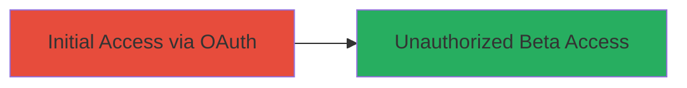

# Bypassing Legal Robot Private Beta Waitlist via OAuth Logical Flaw

Multi-stage attack chain demonstrating a complete attack workflow.

## Chain Metrics Dashboard

| Metric | Value |
|--------|-------|
| Chain Status | Unverified |
| Total Steps | 1 |
| Execution Time | ~1 minutes |
| Skill Level | Beginner |
| Complexity | Low |
| Impact Level | High |

## Attack Flow Visualization

## Prerequisites & Requirements

### Required Tools

- Web browser (e.g., Chrome or Firefox)

### Target Environment

- Web platform
- OAuth-enabled services (e.g., Google, Facebook)
- Access to Legal Robot application during private beta

### Initial Access Requirements

- No prior credentials required
- Internet access to the target site
- No waitlist registration needed

## Detailed Attack Procedures

### Step 1: Bypass Registration via OAuth Login
procedure: [[procedures/Exploit-OAuth-Auth-Bypass-to-Skip-Registration]]

**Objective**: Gain unauthorized access to the private beta by exploiting the OAuth flow's failure to enforce waitlist checks.

**Instructions**: Navigate to the Legal Robot login page and select OAuth login with a provider like Google. Complete the OAuth authorization without prior registration. The system grants access directly, skipping the waitlist.

**Expected Output**: Successful login and dashboard access in the private beta application.

**Success Indicators**:
- Access to beta features without waitlist approval
- No registration prompt or denial

## Attack Chain Summary

### Key Achievements

1. Bypassed private beta waitlist and registration process
2. Gained unauthorized access to the Legal Robot application
3. Demonstrated logical flaw in OAuth handling, potentially allowing mass unauthorized entry

## Technique & Tactic Coverage

### MITRE ATT&CK Techniques

- [[Valid Accounts]]

### MITRE ATT&CK Tactics

- [[Initial Access]]

---
*Last updated: 2023-10-01T00:00:00Z*
