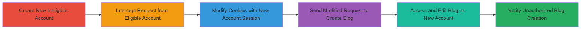

---
tags:
  - access-bypass
  - cookie-manipulation
  - web-vulnerability
  - lichess
type: attack_chain
tools:
  - '[[tools/Burp-Suite]]'
tactics:
  - '[[Initial Access]]'
  - '[[Lateral Movement]]'
commands: []
verified: false
platforms:
  - Web
submitted: true
complexity: medium
procedures:
  - '[[procedures/Attempt-Blog-Creation-with-New-Lichess-Account]]'
  - '[[procedures/Intercept-Blog-Creation-Request-with-Burp-Suite]]'
  - '[[procedures/Modify-Request-Cookies-and-Send-with-New-Account]]'
  - '[[procedures/Access-Created-Blog-URL-with-New-Account]]'
  - '[[procedures/Edit-and-Submit-Blog-Content-as-New-Account]]'
  - '[[procedures/Verify-Unauthorized-Blog-Creation-on-Lichess]]'
step_count: 6
techniques:
  - '[[Valid Accounts]]'
  - '[[Exploit Public-Facing Application]]'
description: >-
  An improper access control vulnerability in Lichess.org allows ineligible
  accounts to create blog posts by intercepting and modifying HTTP requests with
  session cookies from the new account using Burp Suite.
skill_level: intermediate
impact_level: high
id: 068107c9-b719-408b-bc5d-7ffc7e2b0677
created_at: '2025-12-14T17:30:07.264Z'
updated_at: '2025-12-14T17:30:07.264Z'
validated: true
mitre_tactics:
  - '[[Initial Access]]'
  - '[[Lateral Movement]]'
mitre_techniques:
  - '[[Valid Accounts]]'
  - '[[Exploit Public-Facing Application]]'
---
# Bypassing Lichess Blog Creation Restrictions via Session Cookie Manipulation

Multi-stage attack chain demonstrating a complete attack workflow exploiting improper access control in Lichess.org's blog creation feature.

## Chain Metrics Dashboard

| Metric | Value |
|--------|-------|
| Chain Status | Unverified |
| Total Steps | 6 |
| Execution Time | ~10 minutes |
| Skill Level | Intermediate |
| Complexity | Medium |
| Impact Level | High |

## Attack Flow Visualization

## Prerequisites & Requirements

### Required Tools

- [[tools/Burp-Suite]]

### Target Environment

- Lichess.org web platform
- HTTP/HTTPS access to blog creation endpoint (e.g., /blog/new POST)
- No specific ports beyond standard web (80/443)

### Initial Access Requirements

- Ability to create a new Lichess account (ineligible for blogging)
- Access to an old eligible Lichess account for request interception
- Burp Suite configured as a proxy for browser traffic
- Network access to lichess.org without restrictions

## Detailed Attack Procedures

### Step 1: Attempt Blog Creation with New Account
procedure: [[procedures/Attempt-Blog-Creation-with-New-Lichess-Account]]

**Objective**: Confirm the new account's ineligibility for blog creation to establish the restriction baseline.

**Instructions**: Register a new account on lichess.org and navigate to the blog creation page. Attempt to submit a blog post form, including any required fields like title and content. Note the error message indicating account restrictions (e.g., based on account age or activity).

**Expected Output**: Error response from the server blocking blog creation for new accounts.

**Success Indicators**:
- Error message displayed: "Account ineligible for blog creation"
- No blog post is created

### Step 2: Intercept Blog Creation Request with Burp Suite
procedure: [[procedures/Intercept-Blog-Creation-Request-with-Burp-Suite]]

**Objective**: Capture a valid blog creation request from an eligible account, including CAPTCHA solution, for later modification.

**Instructions**: Log in to an old eligible Lichess account in a browser proxied through Burp Suite. Prepare a blog post by filling the form and solving any CAPTCHA. Intercept the outgoing HTTP POST request to the blog creation endpoint using Burp's Proxy or Intruder tab, then forward it to Repeater and drop the original request to prevent actual creation.

**Expected Output**: Intercepted POST request in Burp Repeater, containing form data (title, content, CAPTCHA token) and cookies from the eligible account.

**Success Indicators**:
- Request captured with 200 OK potential
- Form data and CAPTCHA solution preserved

### Step 3: Modify Request Cookies and Send with New Account
procedure: [[procedures/Modify-Request-Cookies-and-Send-with-New-Account]]

**Objective**: Bypass eligibility checks by replacing session cookies to associate the request with the ineligible account.

**Instructions**: In Burp Repeater, copy the session cookies from the new ineligible account (obtained by logging in separately). Replace the Cookie header in the intercepted request with these new cookies. Forward the modified request to the server.

**Expected Output**: Server response with 302 redirect and Location header pointing to the new blog URL (e.g., https://lichess.org/blog/[slug]).

**Success Indicators**:
- Location header present in response
- No eligibility error returned

### Step 4: Access Created Blog URL with New Account
procedure: [[procedures/Access-Created-Blog-URL-with-New-Account]]

**Objective**: View the draft blog post created under the new account's session.

**Instructions**: Copy the URL from the Location header in the previous response. In a browser logged in with the new account (ensure no Burp proxy interference), navigate to this URL.

**Expected Output**: Page loads showing the draft blog post content from the intercepted request.

**Success Indicators**:
- Blog draft visible and editable
- Associated with the new account

### Step 5: Edit and Submit Blog Content as New Account
procedure: [[procedures/Edit-and-Submit-Blog-Content-as-New-Account]]

**Objective**: Confirm full control over the unauthorized blog by editing and submitting.

**Instructions**: On the draft blog page, modify the content, title, or other fields as desired. Submit the update form using the new account's session.

**Expected Output**: Successful update confirmation, with the blog now reflecting changes.

**Success Indicators**:
- Form submits without errors
- Changes saved to the blog draft

### Step 6: Verify Unauthorized Blog Creation on Lichess
procedure: [[procedures/Verify-Unauthorized-Blog-Creation-on-Lichess]]

**Objective**: Validate that the ineligible account can now manage and potentially publish the blog.

**Instructions**: Navigate to the new account's blog section on lichess.org. Check for the created post and attempt to publish or further edit it.

**Expected Output**: Blog post listed under the account, fully accessible for publishing.

**Success Indicators**:
- Post visible in account's blog dashboard
- Editable and publishable despite ineligibility

## Attack Chain Summary

### Key Achievements

1. Successfully bypassed account age/activity restrictions for blog creation.
2. Demonstrated cookie-based session manipulation to impersonate eligibility.
3. Enabled unauthorized content creation, risking platform integrity.

## Technique & Tactic Coverage

### MITRE ATT&CK Techniques

- [[Valid Accounts]] Valid Accounts
- [[Exploit Public-Facing Application]] Exploit Public-Facing Application

### MITRE ATT&CK Tactics

- [[Initial Access]] Initial Access
- [[Lateral Movement]] Lateral Movement

---

*Last updated: 2023-10-01*
