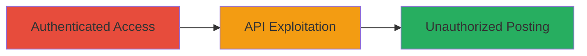

---
id: ac-uuid-001
name: Bypassing Mattermost Channel Post Permissions via Slash Command API
type: attack_chain
description: "Attack chain exploiting improper access control in Mattermost to allow unauthorized message posting in restricted channels using the slash command execution API."
verified: false
submitted: false
step_count: 1
created_at: 2023-10-01T00:00:00Z
updated_at: 2023-10-01T00:00:00Z
procedures: [[procedures/Execute-Mattermost-Slash-Command-for-Unauthorized-Posting]]
techniques: [[Valid Accounts]], [[Exploit Public-Facing Application]]
tactics: [[Initial Access]]
tags: mattermost, access-control-bypass, api-vulnerability, slash-command
platforms: Web
tools: []
---

# Bypassing Mattermost Channel Post Permissions via Slash Command API

Multi-stage attack chain demonstrating a complete attack workflow.

## Chain Metrics Dashboard

| Metric | Value |
|--------|-------|
| Chain Status | Unverified |
| Total Steps | 1 |
| Execution Time | ~1 minutes |
| Skill Level | Intermediate |
| Complexity | Medium |
| Impact Level | High |

## Attack Flow Visualization



## Prerequisites & Requirements

### Required Tools

- None (uses standard HTTP client like curl)

### Target Environment

- Mattermost Cloud or self-hosted instance
- Web platform with API access
- Open ports: 443 (HTTPS)

### Initial Access Requirements

- Valid authenticated session as a team member (cookies or token)
- Knowledge of team_id and channel_id
- CSRF token from the session

## Detailed Attack Procedures

### Step 1: Execute Slash Command for Unauthorized Posting
procedure: [[procedures/Execute-Mattermost-Slash-Command-for-Unauthorized-Posting]]

**Objective**: Bypass channel post permissions by executing a slash command via the API to post a message in a restricted channel.

**Instructions**: Authenticate to the Mattermost instance to obtain session cookies and CSRF token. Identify the target team_id and channel_id from the URL or API responses. Use [[commands/mattermost-execute-slash-command]] to send a POST request to the /api/v4/commands/execute endpoint with a simple /echo command payload.

```bash
curl -X POST https://test3.cloud.mattermost.com/api/v4/commands/execute \
  -H "Content-Type: application/json" \
  -H "X-CSRF-Token: 5jkue786iyfd6dkpiq7ftisys6y" \
  -b "session_cookie_here" \
  -d '{"command":"/echo ami","channel_id":"khhnkrf5wf8yibwx8bd14s6fbw","team_id":"8jdphis493d4pbq3u1bagz643r"}'
```

**Expected Output**: HTTP 200 response with the command execution result, and the message 'ami' appears in the target channel.

**Success Indicators**:
- Message posted successfully in the channel despite lacking post_message permission
- No error response from the API indicating permission denial

## Attack Chain Summary

### Key Achievements

1. Bypassed standard channel posting restrictions using the slash command API
2. Demonstrated potential for information disclosure or disruption in team communications
3. Highlighted improper permission enforcement on the /api/v4/commands/execute endpoint

## Technique & Tactic Coverage

### MITRE ATT&CK Techniques

- [[Valid Accounts]] Valid Accounts
- [[Exploit Public-Facing Application]] Exploit Public-Facing Application

### MITRE ATT&CK Tactics

- [[Initial Access]] Initial Access

---
*Last updated: 2023-10-01T00:00:00Z*
