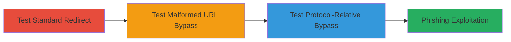

# Bypassing Open Redirect Validation in Khan Academy Login for Phishing

Multi-stage attack chain demonstrating how to identify and exploit an open redirect vulnerability in Khan Academy's login page via the 'continue' parameter, allowing redirection to external malicious sites for phishing after login attempts.

## Chain Metrics Dashboard

| Metric | Value |
|--------|-------|
| Chain Status | Unverified |
| Total Steps | 3 |
| Execution Time | ~5 minutes |
| Skill Level | Beginner |
| Complexity | Low |
| Impact Level | Medium |

## Attack Flow Visualization



## Prerequisites & Requirements

### Required Tools

- Web browser or [[commands/curl-access-url]]

### Target Environment

- Web application: Khan Academy login page
- Required services/ports: HTTPS on port 443
- Network access requirements: Internet access to khanacademy.org

### Initial Access Requirements

- No credentials required
- Public network position
- No prior access needed

## Detailed Attack Procedures

### Step 1: Test Standard Redirect URL
procedure: [[procedures/Test-Standard-Redirect-URL]]

**Objective**: Verify that standard external redirect URLs are blocked by the application's validation.

**Instructions**: Access the login page with a standard HTTP redirect URL using [[commands/curl-access-url]] or a web browser.

```bash
curl -L "https://www.khanacademy.org/login?continue=http://www.olivierbeg.nl"
```

**Expected Output**: The request is blocked, and no redirect occurs; the application returns an error or stays on the login page.

**Success Indicators**:
- Redirect blocked (confirms validation exists)
- No navigation to external site

### Step 2: Test Malformed URL Bypass
procedure: [[procedures/Test-Malformed-URL-Bypass]]

**Objective**: Bypass validation using a malformed URL with a single slash after the protocol.

**Instructions**: Access the login page with the malformed URL using [[commands/curl-access-url]] or a web browser.

```bash
curl -L "https://www.khanacademy.org/login?continue=http:/www.olivierbeg.nl"
```

**Expected Output**: Successful redirect to the external site (e.g., www.olivierbeg.nl).

**Success Indicators**:
- Redirect to external domain occurs
- Validation bypassed

### Step 3: Test Protocol-Relative URL Bypass
procedure: [[procedures/Test-Protocol-Relative-URL-Bypass]]

**Objective**: Exploit protocol-relative URLs to bypass updated validation and redirect to external sites.

**Instructions**: After an initial fix, test with a protocol-relative URL using [[commands/curl-access-url]] or a web browser.

```bash
curl -L "https://www.khanacademy.org/login?continue=//google.be"
```

**Expected Output**: Redirect to the external site (e.g., google.be) despite validation attempts.

**Success Indicators**:
- External redirect succeeds
- Potential for phishing setup confirmed

## Attack Chain Summary

### Key Achievements

1. Confirmed blocking of standard redirects, establishing baseline validation.
2. Bypassed validation with malformed 'http:/' URL, enabling arbitrary redirects.
3. Exploited protocol-relative '//' URLs post-fix, allowing persistent phishing vectors.

## Technique & Tactic Coverage

### MITRE ATT&CK Techniques

- [[Exploit Public-Facing Application]] Exploit Public-Facing Application
- [[Phishing]] Phishing

### MITRE ATT&CK Tactics

- [[Initial Access]] Initial Access

---
*Last updated: 2023-10-01T00:00:00Z*
