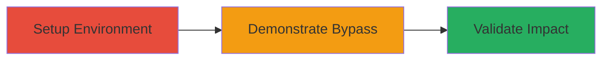

# Bypassing PHP String Validation via mbstring.func_overload in Unsafe Codebases

Multi-stage attack chain demonstrating a complete attack workflow.

## Chain Metrics Dashboard

| Metric | Value |
|--------|-------|
| Chain Status | Unverified |
| Total Steps | 1 |
| Execution Time | ~5 minutes |
| Skill Level | Intermediate |
| Complexity | Low |
| Impact Level | Low |

## Attack Flow Visualization



## Prerequisites & Requirements

### Required Tools

- PHP interpreter with mbstring extension

### Target Environment

- PHP-based web application using raw substr/strlen (e.g., Airship codebase)
- Server with PHP configuration allowing mbstring.func_overload
- Access to codebase or runtime environment

### Initial Access Requirements

- Code review access or server shell
- No special credentials needed for demonstration

## Detailed Attack Procedures

### Step 1: Demonstrate String Handling Bypass
procedure: [[procedures/Demonstrate-mbstring-Overload-Bypass-in-PHP]]

**Objective**: Show how enabling mbstring.func_overload causes substr and strlen to misbehave, leading to potential security bypasses in validation or serialization.

**Instructions**: Create a POC script mimicking unsafe code usage and execute it with overload enabled using [[commands/php-mbstring-overload-poc]]:

```bash
php -d mbstring.func_overload=2 ./poc.php
```

Review the output for discrepancies in string lengths or substrings, which could allow multibyte character injections to bypass checks.

**Expected Output**: Unserialized object dump showing bypassed restrictions, e.g., allowing forbidden property access or object instantiation.

**Success Indicators**:
- String length reported incorrectly (byte vs. character count)
- Substring extraction fails to handle multibyte strings properly
- Potential bypass in serialization validation confirmed

## Attack Chain Summary

### Key Achievements

1. Identified unsafe string function usage in PHP codebase
2. Demonstrated impact of mbstring.func_overload on security operations
3. Highlighted risks in edge cases for applications like Airship

## Technique & Tactic Coverage

### MITRE ATT&CK Techniques

- [[Python]]

### MITRE ATT&CK Tactics

- [[Execution]]

---
*Last updated: 2023-10-01T00:00:00Z*
