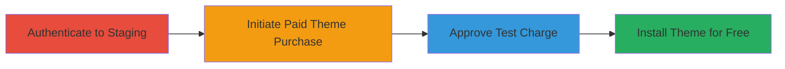

# Bypassing Payment for Paid Shopify Themes via Staging Environment Access Control Flaw

Multi-stage attack chain demonstrating exploitation of improper access control in Shopify's staging environment at themes.shopify.io, allowing authenticated users to install paid themes for free by leveraging test charges instead of real payments.

## Chain Metrics Dashboard

| Metric | Value |
|--------|-------|
| Chain Status | Unverified |
| Total Steps | 4 |
| Execution Time | ~5 minutes |
| Skill Level | Beginner |
| Complexity | Low |
| Impact Level | High |

## Attack Flow Visualization

## Prerequisites & Requirements

### Required Tools

- Web browser (e.g., Chrome, Firefox)

### Target Environment

- Web platform
- Access to Shopify account with valid credentials
- Public internet access to https://themes.shopify.io

### Initial Access Requirements

- Valid Shopify user credentials (any authenticated user)
- No special privileges required

## Detailed Attack Procedures

### Step 1: Authenticate to Staging Environment
procedure: [[procedures/Authenticate-to-Shopify-Staging-Environment]]

**Objective**: Gain access to the publicly accessible staging login page using valid credentials.

**Instructions**: Open a web browser and navigate to the staging login page at https://themes.shopify.io/login. Enter valid Shopify credentials to authenticate.

**Expected Output**: Successful login redirecting to the staging theme store dashboard.

**Success Indicators**:
- Login successful without errors
- Access to theme browsing interface

### Step 2: Initiate Purchase of Paid Theme
procedure: [[procedures/Initiate-Purchase-of-Paid-Theme-on-Staging]]

**Objective**: Select and attempt to purchase a paid theme, triggering the test charge mechanism.

**Instructions**: Once logged in, browse the available themes on the staging site. Locate a paid theme and click the 'buy theme' button to initiate the purchase process.

**Expected Output**: Redirect to a purchase confirmation page without requiring real payment details.

**Success Indicators**:
- Paid theme selected
- Purchase initiation without payment prompt

### Step 3: Approve Test Charge
procedure: [[procedures/Approve-Test-Charge-on-Shop-Dashboard]]

**Objective**: Handle the test charge approval in the shop dashboard to proceed with installation.

**Instructions**: The process redirects to your Shopify shop interface, displaying a test charge screen. Review and approve the test charge as prompted.

**Expected Output**: Test charge approved, allowing progression to installation.

**Success Indicators**:
- Test charge screen appears
- Approval completes without real transaction

### Step 4: Install Theme Without Payment
procedure: [[procedures/Install-Theme-Without-Payment]]

**Objective**: Complete the theme installation for free, bypassing actual payment.

**Instructions**: After approving the test charge, click 'approve charge' to finalize the installation. The theme is now installed and available for download, save, modify, or re-upload.

**Expected Output**: Theme installed successfully in your Shopify store without any cost.

**Success Indicators**:
- Theme appears in installed themes list
- No payment deducted from account

## Attack Chain Summary

### Key Achievements

1. Gained unauthorized free access to paid themes via staging environment
2. Bypassed payment mechanisms using test charges
3. Enabled modification and re-distribution of proprietary theme content

## Technique & Tactic Coverage

### MITRE ATT&CK Techniques

- [[Exploit Public-Facing Application]]

### MITRE ATT&CK Tactics

- [[Initial Access]]

---
*Last updated: 2023-10-01T00:00:00Z*
