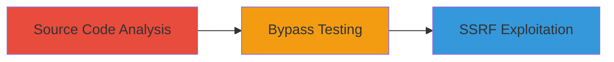

# Bypassing Smokescreen Domain Deny List via Double Brackets for SSRF

Multi-stage attack chain demonstrating a complete attack workflow exploiting a vulnerability in Stripe's Smokescreen library.

## Chain Metrics Dashboard

| Metric | Value |
|--------|-------|
| Chain Status | Unverified |
| Total Steps | 3 |
| Execution Time | ~30 minutes |
| Skill Level | Intermediate |
| Complexity | Medium |
| Impact Level | High |

## Attack Flow Visualization

## Prerequisites & Requirements

### Required Tools

- GitHub access for source code review
- Testing environment with Smokescreen proxy

### Target Environment

- Smokescreen proxy service (Go-based)
- Required services/ports: HTTP/HTTPS proxy endpoints
- Network access requirements: Ability to send requests through the proxy

### Initial Access Requirements

- No credentials required for public GitHub analysis
- Network position: External attacker with proxy access
- Prior access needed: None, but proxy usage implies application integration

## Detailed Attack Procedures

### Step 1: Source Code Analysis
procedure: [[procedures/Analyze-Smokescreen-Source-Code-for-Deny-List]]

**Objective**: Identify weaknesses in the domain deny_list implementation by reviewing the source code.

**Instructions**: Access the Smokescreen repository on GitHub and examine the domain validation logic. Focus on how brackets are stripped from domain names before checking against the deny_list.

**Expected Output**: Identification of incomplete bracket stripping that only handles single sets of brackets.

**Success Indicators**:
- Logic flaw confirmed in bracket handling
- Potential bypass vectors noted, such as nested brackets

### Step 2: Bypass Testing
procedure: [[procedures/Test-Double-Bracket-Bypass-in-Domain-Validation]]

**Objective**: Validate the bypass by crafting inputs with double brackets to evade the deny_list filter.

**Instructions**: Prepare test inputs using double brackets around forbidden domains, such as "[http://[internal.example.com]]". Submit these through the Smokescreen proxy and observe if validation fails to strip all brackets.

**Expected Output**: Requests to denied domains pass validation due to unstripped brackets.

**Success Indicators**:
- Forbidden domain request accepted by proxy
- No denial from deny_list enforcement

### Step 3: SSRF Demonstration
procedure: [[procedures/Demonstrate-SSRF-via-Bypassed-Proxy-Requests]]

**Objective**: Exploit the bypass to perform unauthorized requests to internal or restricted domains.

**Instructions**: Use the bypassed proxy to forward requests to internal services, such as metadata endpoints or restricted APIs, confirming SSRF impact.

**Expected Output**: Successful proxying of requests to denied domains, potentially accessing sensitive internal resources.

**Success Indicators**:
- Internal domain responses received
- Evidence of SSRF, like access to non-public services

## Attack Chain Summary

### Key Achievements

1. Discovered incomplete bracket stripping in Smokescreen's deny_list logic
2. Successfully bypassed domain restrictions using double brackets [[]]
3. Demonstrated SSRF enabling unauthorized internal requests

## Technique & Tactic Coverage

### MITRE ATT&CK Techniques

- [[Exploit Public-Facing Application]]

### MITRE ATT&CK Tactics

- [[Initial Access]]

---
*Last updated: 2023-10-01T00:00:00Z*
