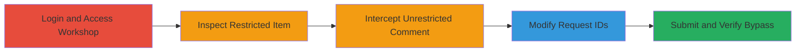

# Bypassing Steam Workshop Comment Restrictions via IDOR

Multi-stage attack chain demonstrating a complete workflow to exploit an Insecure Direct Object Reference (IDOR) vulnerability in the Steam Community Workshop, allowing unauthorized comment posting on items restricted to game owners.

## Chain Metrics Dashboard

| Metric | Value |
|--------|-------|
| Chain Status | Unverified |
| Total Steps | 5 |
| Execution Time | ~10 minutes |
| Skill Level | Intermediate |
| Complexity | Medium |
| Impact Level | High |

## Attack Flow Visualization

## Prerequisites & Requirements

### Required Tools

- [[tools/Burp-Suite]]
- [[tools/Firefox-Quantum]]

### Target Environment

- Web platform (steamcommunity.com)
- No specific ports or services required beyond standard HTTPS (443)
- Network access to Steam Community website

### Initial Access Requirements

- Valid Steam account (free to create)
- Do not own the target game associated with the workshop item
- Burp Suite proxy configured in browser (e.g., Firefox set to intercept traffic via 127.0.0.1:8080)

## Detailed Attack Procedures

### Step 1: Login and Access Workshop
procedure: [[procedures/Login-and-Access-Steam-Community-Workshop]]

**Objective**: Gain initial access to the Steam Community and navigate to the Workshop subsection to begin reconnaissance.

**Instructions**: Log in to your Steam account using [[tools/Firefox-Quantum]] and directly access the Workshop section via the URL. Ensure proxy is active if planning to intercept later requests.

**Technical Details**: Visit https://steamcommunity.com/?subsection=workshop to load the Workshop interface.

**Expected Output**: Workshop landing page loads, displaying available items.

**Success Indicators**:
- Successful login confirmed
- Workshop subsection accessible

### Step 2: Inspect Restricted Workshop Item Comment Section
procedure: [[procedures/Inspect-Restricted-Workshop-Item-Comment-Section]]

**Objective**: Identify a target workshop item where comments are restricted due to lack of game ownership, confirming the access control in place.

**Instructions**: Search for and navigate to a specific workshop item associated with a game you do not own. Observe the comment section to note the restriction.

**Technical Details**: Use a URL like https://steamcommunity.com/sharedfiles/filedetails/?id=1404861377. Comments are visible, but the post comment input is disabled with a message indicating game ownership is required.

**Expected Output**: Comment section visible but posting disabled.

**Success Indicators**:
- Disabled post comment UI element observed
- No ownership prompt bypassed yet

### Step 3: Intercept Comment Post from Unrestricted Artwork
procedure: [[procedures/Intercept-Comment-Post-from-Unrestricted-Artwork]]

**Objective**: Establish a baseline comment posting request from an unrestricted area (artwork) to capture the HTTP structure for modification.

**Instructions**: Navigate to an artwork item where commenting is allowed, enter a test comment, and intercept the submission using [[tools/Burp-Suite]].

**Technical Details**: Go to https://steamcommunity.com/sharedfiles/filedetails/?id=1406988713, post a comment like 'testrestriction', and capture the POST request in Burp's Proxy > HTTP history or Repeater.

**Expected Output**: Intercepted POST request to the comment endpoint, including parameters like sessionid, comment, and extended_data.

**Success Indicators**:
- Request intercepted successfully
- Comment posts without errors in unrestricted context

### Step 4: Modify Request for IDOR Exploitation
procedure: [[procedures/Modify-Request-for-IDOR-Exploitation]]

**Objective**: Alter the intercepted request to reference the restricted workshop item's IDs, exploiting the IDOR to bypass ownership checks.

**Instructions**: In [[tools/Burp-Suite]] Repeater, edit the URL and POST body to match the target workshop item's details, then prepare for forwarding.

**Technical Details**: Change URL contributor ID and file ID to target (e.g., file ID 1404861377); update 'extended_data' JSON with matching contributor ID and app ID; set 'count' to the existing comment count on the target item.

**Expected Output**: Modified request ready in Burp, with all IDs pointing to the restricted item.

**Success Indicators**:
- Parameters updated without syntax errors
- Request structure validated

### Step 5: Submit Modified Comment Request
procedure: [[procedures/Submit-Modified-Comment-Request]]

**Objective**: Forward the tampered request to the server, confirming the IDOR bypass by successfully posting the unauthorized comment.

**Instructions**: Forward the modified request in Burp and refresh the target workshop item page to verify the comment appears.

**Technical Details**: Send the POST to the endpoint; server processes without validating game ownership, adding the comment.

**Expected Output**: 200 OK response; new comment visible on the workshop item page upon refresh.

**Success Indicators**:
- Comment posted successfully
- No authorization error from server
- Visible on restricted item

## Attack Chain Summary

### Key Achievements

1. Bypassed game ownership restriction for workshop comments
2. Demonstrated IDOR in comment endpoint parameters
3. Enabled potential spam or abuse in restricted communities

## Technique & Tactic Coverage

### MITRE ATT&CK Techniques

- [[Exploit Public-Facing Application]]

### MITRE ATT&CK Tactics

- [[Initial Access]]

---
*Last updated: 2023-10-01T00:00:00Z*
