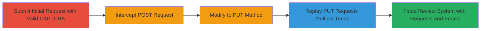

---
tags:
  - captcha-bypass
  - method-tampering
  - business-logic-flaw
  - dos
  - web-vulnerability
type: attack_chain
tools:
  - '[[tools/HTTP-Proxy-Burp-Suite]]'
tactics:
  - '[[Initial Access]]'
verified: false
platforms:
  - Web
submitted: true
complexity: medium
created_at: '2023-10-01T00:00:00Z'
procedures:
  - '[[procedures/Create-Initial-Approval-Request-with-Valid-CAPTCHA]]'
  - '[[procedures/Intercept-Submitted-Approval-Request]]'
  - '[[procedures/Modify-Request-Method-to-PUT]]'
  - '[[procedures/Replay-Modified-Request-Multiple-Times]]'
step_count: 4
techniques:
  - '[[Exploit Public-Facing Application]]'
updated_at: '2025-12-14T17:28:36.282Z'
description: >-
  A multi-step attack exploiting improper reCAPTCHA validation and business
  logic flaws to bypass CAPTCHA, enabling unlimited approval requests and
  flooding the review system with emails.
skill_level: intermediate
impact_level: high
id: f293048b-1a0a-4888-b586-064b1de432b3
validated: true
mitre_tactics:
  - '[[Initial Access]]'
mitre_techniques:
  - '[[Exploit Public-Facing Application]]'
---
# CAPTCHA Bypass via HTTP Method Tampering in Instagram Brand Approval Requests

Multi-stage attack chain demonstrating a complete attack workflow exploiting a CAPTCHA bypass in the Instagram Brand Site's approval request system, allowing infinite submissions and email flooding.

## Chain Metrics Dashboard

| Metric | Value |
|--------|-------|
| Chain Status | Unverified |
| Total Steps | 4 |
| Execution Time | ~5 minutes |
| Skill Level | Intermediate |
| Complexity | Medium |
| Impact Level | High |

## Attack Flow Visualization

## Prerequisites & Requirements

### Required Tools

- [[tools/HTTP-Proxy-Burp-Suite]]

### Target Environment

- Web platform (WordPress/PHP-based site)
- Access to https://en.instagram-brand.com/requests/new
- No authentication required for public form submission

### Initial Access Requirements

- Public internet access
- No credentials needed
- Valid reCAPTCHA token obtainable via browser

## Detailed Attack Procedures

### Step 1: Create Initial Approval Request with Valid CAPTCHA
procedure: [[procedures/Create-Initial-Approval-Request-with-Valid-CAPTCHA]]

**Objective**: Submit a legitimate approval request to obtain a valid reCAPTCHA token for later reuse.

**Instructions**: Navigate to the approval request form and fill it out completely, including generating a valid CAPTCHA token through the browser's reCAPTCHA widget.

**Expected Output**: Successful form submission resulting in a POST request to the backend API.

**Success Indicators**:
- Form fields accepted without errors
- Valid g-recaptcha-response token captured in the request payload

### Step 2: Intercept Submitted Approval Request
procedure: [[procedures/Intercept-Submitted-Approval-Request]]

**Objective**: Capture the legitimate POST request using a proxy to prepare for modification.

**Instructions**: Configure the proxy tool to intercept traffic from the browser, then submit the form to capture the full request details, including the g-recaptcha-response token.

**Expected Output**: Intercepted POST request to /wp-json/brc/v1/approval-requests with form data.

**Success Indicators**:
- Request details visible in proxy interface
- Token and payload intact

### Step 3: Modify Request Method to PUT
procedure: [[procedures/Modify-Request-Method-to-PUT]]

**Objective**: Change the HTTP method to exploit the business logic flaw, allowing token reuse without re-verification.

**Instructions**: In the proxy tool, edit the intercepted request by changing the method from POST to PUT, then forward it to the server while keeping the original payload.

**Expected Output**: Server accepts the PUT request and creates a new entry without CAPTCHA re-validation.

**Success Indicators**:
- Response code 200 or success
- New approval request appears in the dashboard

### Step 4: Replay Modified Request Multiple Times
procedure: [[procedures/Replay-Modified-Request-Multiple-Times]]

**Objective**: Repeat the tampered request to flood the system with unlimited submissions, triggering excessive emails.

**Instructions**: Use the proxy's repeater feature to send the modified PUT request repeatedly, observing the creation of multiple duplicate entries.

**Expected Output**: Multiple approval requests created, each generating review notifications and emails.

**Success Indicators**:
- Dashboard shows accumulating requests
- Email notifications sent to administrators (verifiable via spoofed sender or volume)

## Attack Chain Summary

### Key Achievements

1. Bypassed reCAPTCHA validation by exploiting HTTP status code check flaw
2. Reused a single valid token infinitely via method tampering
3. Flooded the approval review system, causing denial of service through email overload
4. Demonstrated potential for harassment via spoofed emails to users

## Technique & Tactic Coverage

### MITRE ATT&CK Techniques

- [[Exploit Public-Facing Application]]

### MITRE ATT&CK Tactics

- [[Initial Access]]

---

*Last updated: 2023-10-01T00:00:00Z*
