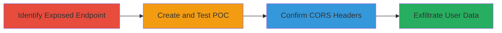

---
tags:
  - cors
  - misconfiguration
  - wordpress
  - api
  - discovery
  - reconnaissance
type: attack_chain
tools: []
tactics:
  - '[[Discovery]]'
verified: false
platforms:
  - Web
submitted: true
complexity: medium
created_at: '2023-10-01T00:00:00Z'
procedures:
  - '[[procedures/Identify-WordPress-REST-API-Endpoint-Exposing-Users]]'
  - '[[procedures/Create-POC-for-CORS-Misconfiguration-Test]]'
  - '[[procedures/Inspect-Response-Headers-for-CORS-Policy]]'
step_count: 3
techniques:
  - '[[Account Discovery]]'
  - '[[Exploit Public-Facing Application]]'
updated_at: '2025-12-14T17:29:20.451Z'
description: >-
  Multi-stage attack chain exploiting a misconfigured CORS policy on the
  WordPress REST API to expose sensitive admin usernames via cross-origin
  requests.
skill_level: intermediate
impact_level: high
id: c7f5655a-80ed-4ee0-bb04-4a1a5b096bae
validated: true
mitre_tactics:
  - '[[Discovery]]'
mitre_techniques:
  - '[[Account Discovery]]'
  - '[[Exploit Public-Facing Application]]'
---
# CORS Misconfiguration in WordPress REST API Exposing Admin Usernames

Multi-stage attack chain demonstrating the exploitation of a permissive CORS policy on the WordPress REST API endpoint to leak admin usernames, potentially enabling further attacks like credential harvesting or session hijacking.

## Chain Metrics Dashboard

| Metric | Value |
|--------|-------|
| Chain Status | Unverified |
| Total Steps | 3 |
| Execution Time | ~5 minutes |
| Skill Level | Intermediate |
| Complexity | Medium |
| Impact Level | High |

## Attack Flow Visualization



## Prerequisites & Requirements

### Required Tools

- Browser Developer Tools
- Text Editor for HTML/JS POC

### Target Environment

- Web platform with WordPress installation
- Accessible REST API endpoint (e.g., /wp-json/wp/v2/users/)
- No authentication required for user enumeration

### Initial Access Requirements

- Public network access to the target domain
- No prior credentials needed
- Ability to host or load a local HTML file for testing

## Detailed Attack Procedures

### Step 1: Identify Exposed Endpoint
procedure: [[procedures/Identify-WordPress-REST-API-Endpoint-Exposing-Users]]

**Objective**: Discover the WordPress REST API endpoint that exposes user information without authentication.

**Instructions**: Navigate to the target site's WordPress REST API users endpoint using a browser or curl to check for unauthenticated access to admin usernames.

**Expected Output**: JSON response containing an array of user objects with usernames, including admin accounts.

**Success Indicators**:
- JSON response with user data visible
- Admin usernames (e.g., 'admin') listed in the response

### Step 2: Create and Test POC
procedure: [[procedures/Create-POC-for-CORS-Misconfiguration-Test]]

**Objective**: Demonstrate the CORS misconfiguration by crafting a cross-origin request that retrieves the user data from an unauthorized domain.

**Instructions**: Create an HTML file with JavaScript using XMLHttpRequest to send a credentialed GET request to the endpoint. Load the HTML in a browser and observe if the request succeeds cross-origin.

Execute the POC using [[commands/xmlhttprequest-cross-origin-wordpress-api]]:

```javascript
var xhr = new XMLHttpRequest(); xhr.onreadystatechange = function(){ if(this.readyState == 4 && this.status == 200){ document.getElementById("demo").innerHTML = alert(this.responseText); } }; xhr.open("GET", "https://lonestarcell.com/wp-json/wp/v2/users/", true); xhr.withCredentials = true; xhr.send();
```

**Expected Output**: Alert or console log displaying the JSON user data, confirming cross-origin access.

**Success Indicators**:
- Request completes without CORS errors
- User data retrieved and displayed

### Step 3: Confirm CORS Policy
procedure: [[procedures/Inspect-Response-Headers-for-CORS-Policy]]

**Objective**: Verify the permissive CORS headers that allow arbitrary origins and credentialed requests.

**Instructions**: Use browser developer tools to inspect the response headers from the POC request or direct endpoint access.

**Expected Output**: Headers like Access-Control-Allow-Origin: * and Access-Control-Allow-Credentials: true.

**Success Indicators**:
- Permissive CORS headers present
- No origin restrictions enforced

## Attack Chain Summary

### Key Achievements

1. Identified unauthenticated exposure of admin usernames via WordPress REST API.
2. Demonstrated cross-origin data exfiltration using a simple HTML POC.
3. Confirmed the root cause as unsafe CORS policy allowing credentialed requests from any domain.

## Technique & Tactic Coverage

### MITRE ATT&CK Techniques

- [[Account Discovery]] Account Discovery
- [[Exploit Public-Facing Application]] Exploit Public-Facing Application

### MITRE ATT&CK Tactics

- [[Discovery]] Discovery

---

*Last updated: 2023-10-01T00:00:00Z*
