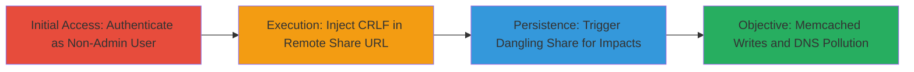

---
tags:
  - crlf-injection
  - nextcloud
  - memcached
  - dns-pollution
  - http-response-splitting
type: attack_chain
tools: []
tactics:
  - '[[Execution]]'
  - '[[Initial Access]]'
commands:
  - '[[commands/curl-crlf-payload]]'
platforms:
  - Web
  - PHP
complexity: medium
procedures:
  - '[[procedures/Exploit-CRLF-Injection-in-Nextcloud-Remote-Share]]'
step_count: 3
techniques:
  - '[[Exploit Public-Facing Application]]'
description: >-
  A multi-stage attack exploiting CRLF injection in Nextcloud's remote share
  feature to manipulate HTTP responses, enabling unauthorized memcached writes
  and DNS pollution via dangling shares.
skill_level: intermediate
impact_level: high
id: 1b76488f-51bf-4e89-bf32-d1ab6c9d07b7
created_at: '2025-12-14T17:29:20.243Z'
updated_at: '2025-12-14T17:29:20.243Z'
verified: false
validated: true
submitted: true
mitre_tactics:
  - '[[Execution]]'
  - '[[Initial Access]]'
mitre_techniques:
  - '[[Exploit Public-Facing Application]]'
---
# CRLF Injection in Nextcloud Remote Share for Memcached Writes and DNS Pollution

## Overview

This attack chain exploits a CRLF injection vulnerability in Nextcloud 16's remote share feature, where non-admin users can inject CRLF characters into the server URL field. By crafting a malicious URL, attackers manipulate HTTP responses during dangling remote share attempts, leading to unauthorized writes to memcached (e.g., injecting cache pollution) and potential DNS pollution if shares persist over time. The vulnerability stems from insufficient input validation in the PHP-based web application, allowing response splitting that affects backend services like memcached. This can disrupt caching layers and network resolution, with high impact on availability.

## Chain Metrics Dashboard

| Metric | Value |
|--------|-------|
| Chain Status | Unverified |
| Total Steps | 3 |
| Execution Time | ~5 minutes |
| Skill Level | Intermediate |
| Complexity | Medium |
| Impact Level | High |

## Attack Flow Visualization



## Prerequisites & Requirements

### Required Tools

- None (uses built-in Nextcloud interface and optional curl for testing)

### Target Environment

- Nextcloud 16 or vulnerable versions
- PHP-based web platform
- Memcached service enabled
- Open access to remote share feature

### Initial Access Requirements

- Valid non-admin user credentials
- Network access to Nextcloud instance
- No prior admin privileges needed

## Detailed Attack Procedures

### Step 1: Authenticate and Access Remote Share
procedure: [[procedures/Exploit-CRLF-Injection-in-Nextcloud-Remote-Share]]

**Objective**: Gain access to the remote share functionality as a non-admin user to prepare for payload injection.

**Instructions**: Log in to the Nextcloud instance using non-admin credentials via the web interface. Navigate to the sharing section and select the option to create a remote share, where the server URL input is available.

**Expected Output**: Access to the remote share creation form.

**Success Indicators**:
- Successful login without admin privileges
- Remote share URL input field visible

### Step 2: Inject Malicious CRLF Payload
procedure: [[procedures/Exploit-CRLF-Injection-in-Nextcloud-Remote-Share]]

**Objective**: Enter a crafted URL with CRLF characters to enable HTTP response splitting.

**Instructions**: In the server URL field, input a payload like `http://evil.com%0d%0aHeader: Value%0d%0a` to inject headers. Use [[commands/curl-crlf-payload]] to test the payload syntax locally if needed:

```bash
curl -X POST 'https://nextcloud.example.com/remote.php/dav/shares' -d 'url=http://evil.com%0d%0aSet-Cookie: malicious=value%0d%0a'
```
Submit the share creation form with the injected URL.

**Expected Output**: Share creation appears successful, but backend HTTP requests are manipulated.

**Success Indicators**:
- No immediate error on share creation
- Injected headers reflected in server logs or responses

### Step 3: Trigger Dangling Share and Observe Impacts
procedure: [[procedures/Exploit-CRLF-Injection-in-Nextcloud-Remote-Share]]

**Objective**: Initiate a dangling remote share attempt to trigger prolonged backend interactions, leading to memcached writes and DNS pollution.

**Instructions**: Attempt to access or resolve the dangling share, which triggers repeated HTTP requests to the malicious URL. Monitor for side effects like unauthorized memcached sets (e.g., via cache logs) or DNS queries to polluted domains. If testing, use browser dev tools or proxy to observe response splitting.

**Expected Output**: Evidence of memcached writes (e.g., unexpected cache entries) and anomalous DNS resolutions.

**Success Indicators**:
- Memcached logs show unauthorized writes
- DNS cache or resolver shows pollution from extended share attempts

## Attack Chain Summary

### Key Achievements

1. Bypassed input validation to inject CRLF in remote share URLs
2. Manipulated HTTP responses for arbitrary header injection
3. Achieved unauthorized memcached writes and DNS pollution without admin access

## Technique & Tactic Coverage

### MITRE ATT&CK Techniques

- [[Exploit Public-Facing Application]]

### MITRE ATT&CK Tactics

- [[Execution]]
- [[Initial Access]]

---
*Last updated: 2023-10-01*
