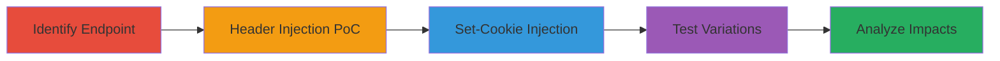

---
tags:
  - crlf-injection
  - http-response-splitting
  - cookie-injection
  - xss
  - csrf-bypass
type: attack_chain
tools:
  - '[[tools/Browser]]'
  - '[[tools/Bandicam]]'
tactics:
  - '[[Initial Access]]'
  - '[[Execution]]'
commands:
  - '[[commands/curl-header-injection-test]]'
  - '[[commands/curl-set-cookie-injection]]'
  - '[[commands/curl-variation-test]]'
platforms:
  - Web
complexity: medium
procedures:
  - '[[procedures/Identify-Vulnerable-Endpoint-and-Parameter]]'
  - '[[procedures/Craft-PoC-for-Header-Injection]]'
  - '[[procedures/Demonstrate-Set-Cookie-Injection]]'
  - '[[procedures/Test-Persistence-and-Variations]]'
  - '[[procedures/Analyze-Potential-Impacts]]'
step_count: 5
techniques:
  - '[[Exploit Public-Facing Application]]'
  - '[[JavaScript]]'
description: >-
  Exploits CRLF injection vulnerability in Twitter Ads endpoints to inject
  arbitrary HTTP headers and cookies, potentially leading to XSS, session
  fixation, or CSRF bypass
skill_level: intermediate
impact_level: high
id: 5cd45f4a-41e7-466e-a88a-b29715964a0f
created_at: '2025-12-11T06:10:16.139Z'
updated_at: '2025-12-11T06:10:16.139Z'
verified: false
validated: true
submitted: true
mitre_tactics:
  - '[[TA0001]]'
  - '[[TA0002]]'
mitre_techniques:
  - '[[T1190]]'
  - '[[T1059.007]]'
---
# CRLF Injection in Twitter Ads Endpoint for Arbitrary Header and Cookie Injection

Multi-stage attack chain demonstrating exploitation of a CRLF injection vulnerability in the Twitter Ads platform, allowing injection of arbitrary HTTP headers and cookies. This can lead to severe impacts like XSS via cookies, session fixation, or bypassing CSRF protections. The vulnerability was found in parameters like 't' and 'ref' across multiple endpoints.

## Chain Metrics Dashboard

| Metric | Value |
|--------|-------|
| Chain Status | Unverified |
| Total Steps | 5 |
| Execution Time | ~10 minutes |
| Skill Level | Intermediate |
| Complexity | Medium |
| Impact Level | High |

## Attack Flow Visualization



## Prerequisites & Requirements

### Required Tools

- [[tools/Browser]]
- [[tools/Bandicam]]

### Target Environment

- Web platform (Twitter Ads)
- Services: Twitter Ads endpoints
- Network access requirements: Public internet access to ads.twitter.com

### Initial Access Requirements

- No credentials required
- Direct access to public endpoints
- Browser for testing

## Detailed Attack Procedures

### Step 1: Identify Vulnerable Endpoint and Parameter - [[procedures/Identify-Vulnerable-Endpoint-and-Parameter]]

**Procedure**: [[procedures/Identify-Vulnerable-Endpoint-and-Parameter]]

**Objective**: Test the /subscriptions/mobile/landing endpoint with the 't' parameter to confirm it accepts URL-encoded CRLF sequences for header injection.

**Expected Output**: Response headers show injected content, confirming vulnerability.

**Success Indicators**:
- Injected CRLF sequences appear in HTTP response
- No sanitization of %0d%0a in parameters

First, use [[commands/curl-header-injection-test]] to test the endpoint:

```bash
curl -i 'https://ads.twitter.com/subscriptions/mobile/landing?ref=gl-tw-tw-promote-mode?t=%0d%0atest:tested'
```

Inspect the response headers for the injected 'test:tested' header.

### Step 2: Craft PoC for Header Injection - [[procedures/Craft-PoC-for-Header-Injection]]

**Procedure**: [[procedures/Craft-PoC-for-Header-Injection]]

**Objective**: Create and submit a proof-of-concept URL to demonstrate arbitrary header injection.

**Expected Output**: Custom header appears in the HTTP response.

**Success Indicators**:
- Response includes the injected header
- Works in modern browsers

Execute [[commands/curl-header-injection-test]] with the PoC URL:

```bash
curl -i 'https://ads.twitter.com/subscriptions/mobile/landing?ref=gl-tw-tw-promote-mode?t=%0d%0atest:tested'
```

Verify the 'test:tested' header in the output.

### Step 3: Demonstrate Set-Cookie Injection - [[procedures/Demonstrate-Set-Cookie-Injection]]

**Procedure**: [[procedures/Demonstrate-Set-Cookie-Injection]]

**Objective**: Inject a Set-Cookie header to set arbitrary cookies on the victim's browser.

**Expected Output**: Browser sets the injected cookie.

**Success Indicators**:
- Cookie is set as specified
- Potential for XSS or session fixation

Use [[commands/curl-set-cookie-injection]] to test:

```bash
curl -i 'https://ads.twitter.com/subscriptions/mobile/landing?t=%0d%0aSet-Cookie:%20csrf_id=injection%3b'
```

Check the response for the Set-Cookie header.

### Step 4: Test Persistence and Variations - [[procedures/Test-Persistence-and-Variations]]

**Procedure**: [[procedures/Test-Persistence-and-Variations]]

**Objective**: Verify the vulnerability persists across variations and endpoints after initial fixes.

**Expected Output**: Injections work on alternative endpoints like /subscriptions/mobile/signup and /subscriptions/mobile/intro.

**Success Indicators**:
- Variations successfully inject headers
- Issue not fully mitigated initially

Test with [[commands/curl-variation-test]]:

```bash
curl -i 'https://ads.twitter.com/subscriptions/mobile/signup?ref=en-btc-help-twitter-promote-mode-header%0d%0aSet-Cookie:csrf_id=test%3b%20Path=/%3b'
```

And another variation:

```bash
curl -i 'https://ads.twitter.com/subscriptions/mobile/intro?ref=%0d%0atest:tested'
```

Confirm injections in responses.

### Step 5: Analyze Potential Impacts - [[procedures/Analyze-Potential-Impacts]]

**Procedure**: [[procedures/Analyze-Potential-Impacts]]

**Objective**: Evaluate combinations with other vulnerabilities like XSS via cookies or CSRF bypass.

**Expected Output**: Documentation of potential attack chains.

**Success Indicators**:
- Identification of escalation paths
- Works across browsers

Review impacts: Combine with XSS for cookie-based attacks or bypass Double-Submit Cookie CSRF.

## Attack Chain Summary

### Key Achievements

1. Confirmed CRLF injection in multiple endpoints
2. Demonstrated arbitrary header and cookie setting
3. Highlighted risks of XSS, session fixation, and CSRF bypass

## Technique & Tactic Coverage

### MITRE ATT&CK Techniques

- [[Exploit Public-Facing Application]]
- [[JavaScript]]

### MITRE ATT&CK Tactics

- [[Initial Access]]
- [[Execution]]

*Last updated: 2023-10-01*
