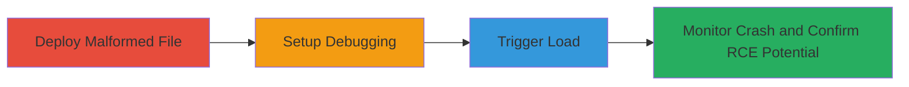

---
tags:
  - buffer-overflow
  - rce
  - csgo
  - bsp
  - valve
  - source-engine
type: attack_chain
tools:
  - '[[tools/WinDBG]]'
tactics:
  - '[[Initial Access]]'
  - '[[Execution]]'
verified: false
platforms:
  - Windows
submitted: true
complexity: medium
created_at: '2023-10-01T00:00:00Z'
procedures:
  - '[[procedures/Deploy-Malformed-BSP-File-to-CS-GO-Map-Directory]]'
  - '[[procedures/Attach-WinDBG-Debugger-to-CS-GO-Process]]'
  - '[[procedures/Load-Malicious-Map-via-CS-GO-In-Game-Console]]'
  - '[[procedures/Monitor-and-Confirm-Buffer-Overflow-in-WinDBG]]'
step_count: 4
techniques:
  - '[[Malicious File]]'
  - '[[Exploitation for Client Execution]]'
updated_at: '2025-12-14T17:24:08.833Z'
description: >-
  A multi-stage attack exploiting a buffer overflow in CS:GO's BSP file parsing
  to achieve remote code execution by tricking victims into loading a malicious
  map.
skill_level: intermediate
impact_level: high
id: 2b88e8b5-814d-41b4-93f1-07e9588f3931
validated: true
mitre_tactics:
  - '[[Initial Access]]'
  - '[[Execution]]'
mitre_techniques:
  - '[[Malicious File]]'
  - '[[Exploitation for Client Execution]]'
---
# CS:GO Buffer Overflow Exploitation via Malformed BSP File for Remote Code Execution

Multi-stage attack chain demonstrating exploitation of a buffer overflow vulnerability in CS:GO's map loading mechanism through a crafted .BSP file, leading to remote code execution.

## Chain Metrics Dashboard

| Metric | Value |
|--------|-------|
| Chain Status | Unverified |
| Total Steps | 4 |
| Execution Time | ~5 minutes |
| Skill Level | Intermediate |
| Complexity | Medium |
| Impact Level | High |

## Attack Flow Visualization

## Prerequisites & Requirements

### Required Tools

- [[tools/WinDBG]]

### Target Environment

- Windows OS
- CS:GO installed via Steam (Source Engine-based game)
- Access to CS:GO map directory (typically steamapps/common/Counter-Strike Global Offensive/csgo/maps/)

### Initial Access Requirements

- Victim must be tricked into downloading and placing the malicious .BSP file in the map directory (e.g., via social engineering or malicious server)
- Local access to run CS:GO and debugger
- No network credentials required, but remote delivery could involve phishing

## Detailed Attack Procedures

### Step 1: Deploy Malformed BSP File
procedure: [[procedures/Deploy-Malformed-BSP-File-to-CS-GO-Map-Directory]]

**Objective**: Place the crafted malformed .BSP file into the game's map directory to make it available for loading, setting up the initial exploit vector.

**Instructions**: Manually copy the pre-crafted malformed .BSP file (e.g., de_fuzz.bsp) into the CS:GO maps folder. This file was created via fuzzing or manual editing to include invalid zipFileHeader data triggering the buffer overflow.

**Expected Output**: File successfully placed in steamapps/common/Counter-Strike Global Offensive/csgo/maps/de_fuzz.bsp.

**Success Indicators**:
- File visible in map directory
- No immediate errors on placement

### Step 2: Setup Debugging Environment
procedure: [[procedures/Attach-WinDBG-Debugger-to-CS-GO-Process]]

**Objective**: Attach a debugger to the CS:GO process to monitor memory access and capture the impending crash for analysis.

**Instructions**: Launch CS:GO first, then use WinDBG to attach to the running csgo.exe process. This allows real-time observation of the vulnerability trigger.

**Expected Output**: WinDBG successfully attached, showing the CS:GO process under debugging control.

**Success Indicators**:
- Debugger attached without process interruption
- No anti-debugging triggers activated

### Step 3: Trigger the Vulnerability
procedure: [[procedures/Load-Malicious-Map-via-CS-GO-In-Game-Console]]

**Objective**: Load the malicious map using the in-game console to initiate the buffer overflow during .BSP parsing.

**Instructions**: Open the CS:GO console (default ~ key) and enter the map load command for the malformed file. This parses the zipFileHeader, leading to the access violation.

**Expected Output**: Game attempts to load the map, resulting in a crash or access violation.

**Success Indicators**:
- Console command accepted
- Map loading initiated, triggering parsing

### Step 4: Analyze the Exploit Impact
procedure: [[procedures/Monitor-and-Confirm-Buffer-Overflow-in-WinDBG]]

**Objective**: Observe the crash in the debugger to confirm the buffer overflow and assess potential for code execution.

**Instructions**: With WinDBG attached, monitor for the access violation during map loading. Analyze the stack trace to verify the overflow in zipFileHeader processing, demonstrating the path to RCE via crafted payload.

**Expected Output**: Access violation exception in WinDBG, pointing to buffer overflow in CS:GO's map loader.

**Success Indicators**:
- Crash confirmed as buffer overflow
- Memory corruption observed, enabling RCE potential

## Attack Chain Summary

### Key Achievements

1. Successful deployment of malformed .BSP file without detection
2. Triggered buffer overflow via legitimate game feature (map loading)
3. Confirmed vulnerability leading to access violation and RCE opportunity

## Technique & Tactic Coverage

### MITRE ATT&CK Techniques

- [[Malicious File]]
- [[Exploitation for Client Execution]]

### MITRE ATT&CK Tactics

- [[Initial Access]]
- [[Execution]]

---
*Last updated: 2023-10-01T00:00:00Z*
