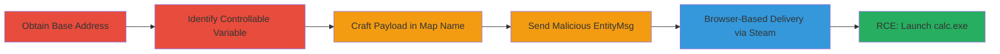

# CS:GO Client RCE via Unsanitized Entity Index in CSVCMsg_EntityMsg

Multi-stage attack chain exploiting an out-of-bounds read vulnerability in the CS:GO client's CSVCMsg_EntityMsg handler. The attack allows remote code execution by sending crafted messages to a connecting client, using a known-address variable like the map name to stage a ROP chain and fake object, ultimately launching arbitrary processes such as calc.exe on the victim's machine. This enables full control when victims connect to a malicious server, either directly or via browser-induced Steam protocol.

## Chain Metrics Dashboard

| Metric | Value |
|--------|-------|
| Chain Status | Unverified |
| Total Steps | 5 |
| Execution Time | ~10 minutes |
| Skill Level | Advanced |
| Complexity | High |
| Impact Level | Critical |

## Attack Flow Visualization

## Prerequisites & Requirements

### Required Tools

- [[tools/Python-3-Script-for-CSGO-Exploit]]
- [[tools/Unspecified-Debugger]]
- [[tools/HTML-File-for-Steam-Protocol-Attack]]

### Target Environment

- Target OS/Platform: Windows
- Required services/ports: CS:GO client (default game port, e.g., 27015 UDP/TCP); potential conflict if attacker on same host
- Network access requirements: Victim must connect to attacker's malicious server; internet access for Steam browser protocol

### Initial Access Requirements

- Credential requirements: None (exploits unauthenticated client connection)
- Network position: Attacker hosts malicious CS:GO server
- Prior access needed: None, but base address may require local debugging or memory disclosure

## Detailed Attack Procedures

### Step 1: Obtain Base Address
procedure: [[procedures/Obtain-Client-Panorama-Base-Address]]

**Objective**: Retrieve the base address of client_panorama.dll to calculate offsets for the entity list and payload placement.

**Instructions**: Use a debugger to attach to the running CS:GO process and read the module base, or leverage a prior memory disclosure vulnerability.

**Expected Output**: Hexadecimal base address (e.g., 0x12345678).

**Success Indicators**:
- Base address obtained without crashing the client
- For distributed attacks, low-entropy ASLR guess succeeds

### Step 2: Identify Controllable Variable
procedure: [[procedures/Identify-Server-Controllable-Variable]]

**Objective**: Select a server-side variable with a known, fixed address in the client for payload staging.

**Instructions**: Analyze client code to identify globals like the map name string, which is copied from server messages to a predictable location in client_panorama.dll.

**Expected Output**: Confirmed variable (e.g., map name global) with offset details.

**Success Indicators**:
- Variable address is static or calculable
- No client-side sanitization of the variable

### Step 3: Craft and Send Payload
procedure: [[procedures/Craft-and-Send-Payload-as-Map-Name]]

**Objective**: Embed ROP chain and fake IClientNetworkable object into the map name to bypass string limitations.

**Instructions**: Use the Python script to generate the payload and send it multiple times as the map name in server responses.

**Expected Output**: Payload loaded into client memory at the known variable address.

**Success Indicators**:
- Client receives and copies payload without truncation
- Memory inspection confirms ROP gadgets and fake object placement

### Step 4: Trigger Execution
procedure: [[procedures/Send-Malicious-EntityMsg-to-Trigger-RCE]]

**Objective**: Send a crafted CSVCMsg_EntityMsg with invalid ent_index to invoke virtual function on the fake object, executing the ROP chain.

**Instructions**: Calculate ent_index as (fake_object_address - entity_list_base) / entity_size, then send the message via the Python script to call IProcessUtils::LaunchProcess and spawn calc.exe.

**Expected Output**: calc.exe launches on victim client.

**Success Indicators**:
- No client crash on invalid index
- Arbitrary code (e.g., process launch) executes

### Step 5: Browser Delivery
procedure: [[procedures/Launch-Browser-Based-Attack-via-Steam-Protocol]]

**Objective**: Automate victim connection via a malicious website using Steam's browser protocol.

**Instructions**: Host the HTML file with an iframe to the malicious server IP, tricking the victim into visiting the site to initiate CS:GO connection without confirmation.

**Expected Output**: Victim's CS:GO launches and connects automatically, triggering the exploit.

**Success Indicators**:
- Iframe loads and Steam protocol activates
- Client connects to server and RCE occurs

## Attack Chain Summary

### Key Achievements

1. Achieved client-side RCE without authentication by exploiting unvalidated ent_index.
2. Demonstrated drive-by compromise via Steam browser integration.
3. Bypassed ASLR using known-address staging in low-entropy 32-bit environment.

## Technique & Tactic Coverage

### MITRE ATT&CK Techniques

- [[Exploitation for Client Execution]] Exploitation for Client Execution
- [[Process Hollowing]] Process Hollowing (via ROP to LaunchProcess)

### MITRE ATT&CK Tactics

- [[Execution]] Execution
- [[Initial Access]] Initial Access

---
*Last updated: 2023-10-01T00:00:00Z*
