# CS:GO Panorama UI XSS Leading to RCE via Kick/Disconnect Message

Multi-stage attack chain demonstrating exploitation of an XSS vulnerability in the CS:GO Panorama UI framework's disconnect/kick popup, enabling remote code execution on victim machines by injecting malicious HTML/JavaScript payloads via server-sent messages.

## Chain Metrics Dashboard

| Metric | Value |
|--------|-------|
| Chain Status | Unverified |
| Total Steps | 6 |
| Execution Time | ~30 minutes |
| Skill Level | Intermediate |
| Complexity | Medium |
| Impact Level | High |

## Attack Flow Visualization

```mermaid
graph LR
    A[Analyze UI Files] --> B[Test XSS in Disconnect]
    B --> C[Setup Server and Mods]
    C --> D[Test Kick Payloads]
    D --> E[Deploy Test Plugin]
    E --> F[Deploy Auto-Exploit Plugin]
    F --> G[RCE on Victim]

    style A fill:#e74c3c
    style B fill:#e74c3c
    style C fill:#f39c12
    style D fill:#f39c12
    style E fill:#3498db
    style F fill:#3498db
    style G fill:#27ae60
```



## Prerequisites & Requirements

### Required Tools

- [[tools/SourceMod]]
- [[tools/Metamod]]

### Target Environment

- CS:GO client on Windows
- Access to CS:GO installation files
- Dedicated CS:GO server setup

### Initial Access Requirements

- Local CS:GO installation for analysis
- Ability to host a dedicated server
- Victim connection to the attacker's server

## Detailed Attack Procedures

### Step 1: Analyze Panorama UI Files for XSS

procedure: [[procedures/Analyze-Panorama-UI-Files-for-XSS]]

**Objective**: Extract and inspect CS:GO's Panorama UI files to identify unsanitized HTML parsing points.

**Instructions**: Locate the CS:GO installation directory, unzip the code.pbin file, and search for vulnerable attributes in XML layout files.

**Expected Output**: Identification of popup_generic.xml with Label tag set to html='true'.

**Success Indicators**:
- Vulnerable files located
- html='true' attributes found

### Step 2: Test Disconnect Message for XSS

procedure: [[procedures/Test-Disconnect-Message-for-XSS]]

**Objective**: Verify XSS by injecting HTML payload into a disconnect message and observing rendering.

**Instructions**: In the CS:GO console, execute [[commands/disconnect-with-image-payload]] to test image loading in the popup.

```bash
# In CS:GO console
disconnect ""
```

**Expected Output**: External image loads in the disconnect popup after cache bypass.

**Success Indicators**:
- Image appears in popup
- Confirms raw HTML parsing

### Step 3: Setup CS:GO Dedicated Server with SourceMod

procedure: [[procedures/Setup-CS-GO-Dedicated-Server-with-SourceMod]]

**Objective**: Prepare a controlled server environment for plugin-based payload delivery.

**Instructions**: Follow Valve documentation to set up the server, then install [[tools/Metamod]] and [[tools/SourceMod]].

**Expected Output**: Server running with mod support enabled.

**Success Indicators**:
- Server accessible
- SourceMod commands available

### Step 4: Test Kick Commands for Payload Delivery

procedure: [[procedures/Test-Kick-Commands-for-Payload-Delivery]]

**Objective**: Evaluate built-in kick methods and develop custom plugin for unrestricted payload injection.

**Instructions**: Test native kickid and sm_kick, then implement KickClient() in a plugin for full payload support.

**Expected Output**: Custom plugin allows arbitrary message length for payloads.

**Success Indicators**:
- Payloads bypass char limits
- JS execution via onmouseover confirmed

### Step 5: Deploy Testkick Plugin and Execute Payload

procedure: [[procedures/Deploy-Testkick-Plugin-and-Execute-Payload]]

**Objective**: Deliver and trigger XSS payload manually via plugin command.

**Instructions**: Compile and place testkick.smx in the plugins folder, connect to server, and run [[commands/sm-testkick-with-rce-payload]].

```bash
# In CS:GO console after connecting
sm_testkick <a onmouseover="javascript:SteamOverlayAPI.OpenExternalBrowserURL('file://C:/Windows/System32/calc.exe')">The remote host stopped receiving communications and closed the connection</a>
```

**Expected Output**: Mouseover launches calc.exe.

**Success Indicators**:
- Popup renders malicious link
- RCE on hover

### Step 6: Create and Deploy Autokick Plugin for Auto-RCE

procedure: [[procedures/Create-and-Deploy-Autokick-Plugin-for-Auto-RCE]]

**Objective**: Automate exploitation on player spawn for interaction-free RCE.

**Instructions**: Develop autokick.smx to hook spawn events and kick with payload after delay, then deploy to server.

**Expected Output**: Automatic kick and RCE on spawn.

**Success Indicators**:
- Plugin triggers on connect
- No user interaction needed

## Attack Chain Summary

### Key Achievements

1. Discovered XSS in Panorama UI via static analysis
2. Achieved manual RCE via kick payloads
3. Automated exploitation for botnet potential

## Technique & Tactic Coverage

### MITRE ATT&CK Techniques

- [[JavaScript]]
- [[Exploitation for Client Execution]]

### MITRE ATT&CK Tactics

- [[Execution]]

---

*Last updated: 2023-10-01T00:00:00Z*
