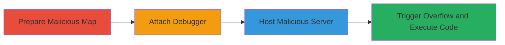

---
tags:
  - buffer-overflow
  - rce
  - csgo
  - valve
  - source-engine
type: attack_chain
tools:
  - '[[tools/WinDBG]]'
tactics:
  - '[[Execution]]'
verified: false
platforms:
  - Windows
submitted: true
complexity: medium
created_at: '2023-10-01T00:00:00Z'
procedures:
  - '[[procedures/Prepare-Malicious-CSGO-Map]]'
  - '[[procedures/Attach-Debugger-to-CSGO-Process]]'
  - '[[procedures/Host-Malicious-Game-Server]]'
  - '[[procedures/Trigger-Texture-Overflow-and-Observe-Crash]]'
step_count: 4
techniques:
  - '[[Exploitation for Client Execution]]'
updated_at: '2025-12-14T17:23:50.081Z'
description: >-
  A multi-stage exploit leveraging a stack buffer overflow in CS:GO's texture
  processing to achieve remote code execution on victim clients by hosting a
  malicious map.
skill_level: intermediate
impact_level: high
id: ecb6d3bd-375b-4273-b2d8-4d59986bee03
validated: true
mitre_tactics:
  - '[[Execution]]'
mitre_techniques:
  - '[[Exploitation for Client Execution]]'
---
# CS:GO Stack Buffer Overflow in Texture Handling for Remote Code Execution

Multi-stage attack chain demonstrating a complete attack workflow exploiting a stack buffer overflow in CS:GO's texture handling to achieve remote code execution.

## Chain Metrics Dashboard

| Metric | Value |
|--------|-------|
| Chain Status | Unverified |
| Total Steps | 4 |
| Execution Time | ~10 minutes |
| Skill Level | Intermediate |
| Complexity | Medium |
| Impact Level | High |

## Attack Flow Visualization

## Prerequisites & Requirements

### Required Tools

- [[tools/WinDBG]]

### Target Environment

- Target OS/Platform: Windows
- Required services/ports: CS:GO client (default ports 27015-27030 for game servers)
- Network access requirements: Ability to host a local or remote CS:GO server and have victims connect

### Initial Access Requirements

- Credential requirements: None (social engineering to trick victim into joining server)
- Network position: Attacker hosts server; victim connects remotely
- Prior access needed: CS:GO installed on attacker's and victim's machines

## Detailed Attack Procedures

### Step 1: Prepare Malicious Map
procedure: [[procedures/Prepare-Malicious-CSGO-Map]]

**Objective**: Create and extract a custom map containing a malicious texture file with an excessively long name and TEXTUREFLAGS_DEPTHRENDERTARGET flag to set up the overflow condition.

**Instructions**: Download the malicious map file (e.g., F478261) and extract it to the CS:GO installation directory under the /csgo folder. Ensure the installation path is not excessively long to avoid extraction issues.

**Expected Output**: Malicious map 'aim_pwn' ready in the CS:GO maps directory.

**Success Indicators**:
- Map file extracted without errors
- Texture file with long name and flag present in map resources

### Step 2: Attach Debugger to CS:GO Process
procedure: [[procedures/Attach-Debugger-to-CSGO-Process]]

**Objective**: Launch CS:GO and attach a debugger to monitor the process for crash analysis during testing.

**Instructions**: Start csgo.exe and attach WinDBG to the process to observe memory and execution flow.

**Expected Output**: Debugger attached successfully, CS:GO process running under supervision.

**Success Indicators**:
- No attachment errors
- Process breakpoints can be set

### Step 3: Host Malicious Game Server
procedure: [[procedures/Host-Malicious-Game-Server]]

**Objective**: Host a local game using the malicious map to simulate a server that victims would connect to.

**Instructions**: Within CS:GO, create and host a new local game selecting the 'aim_pwn' map, which loads the malicious texture.

**Expected Output**: Server hosted, map loaded, ready for connections.

**Success Indicators**:
- Game server starts without crashes
- Map resources, including textures, are queued for loading

### Step 4: Trigger Overflow and Execute Code
procedure: [[procedures/Trigger-Texture-Overflow-and-Observe-Crash]]

**Objective**: Connect to the hosted game or load the map to trigger the texture loading, causing the stack overflow and EIP overwrite for RCE.

**Instructions**: Connect a client (or the debugged instance) to the server, triggering texture download and processing. Observe the overflow in the debugger.

**Expected Output**: Crash with EIP overwritten (e.g., to 0x61616161), enabling arbitrary code execution payload delivery.

**Success Indicators**:
- Buffer overflow confirmed
- Return pointer (EIP) overwritten
- Potential for shellcode execution

## Attack Chain Summary

### Key Achievements

1. Successful preparation of a malicious map exploiting texture name length.
2. Controlled hosting of a server to deliver the exploit.
3. Triggering of remote code execution via client-side overflow.
4. Validation of RCE impact through debugger observation.

## Technique & Tactic Coverage

### MITRE ATT&CK Techniques

- [[Exploitation for Client Execution]]

### MITRE ATT&CK Tactics

- [[Execution]]

---
*Last updated: 2023-10-01T00:00:00Z*
