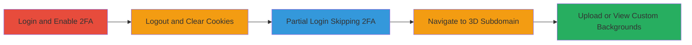

---
tags:
  - auth-bypass
  - 2fa-bypass
  - steam-auth
  - web-vulnerability
type: attack_chain
tools: []
tactics:
  - '[[Initial Access]]'
verified: false
platforms:
  - Web
submitted: true
complexity: low
created_at: '2023-10-01T00:00:00Z'
procedures:
  - '[[procedures/CS-Money-2FA-Bypass-via-Partial-Steel-Auth]]'
step_count: 5
techniques:
  - '[[Valid Accounts]]'
updated_at: '2025-12-14T17:24:45.430Z'
description: >-
  A multi-step authentication bypass vulnerability on CS Money allowing partial
  Steam login to access and manipulate custom backgrounds on the 3d.cs.money
  subdomain without completing 2FA.
skill_level: beginner
impact_level: low
id: 7016f488-82ef-41f8-a83c-317dadca9a31
validated: true
mitre_tactics:
  - '[[Initial Access]]'
mitre_techniques:
  - '[[Valid Accounts]]'
---
# CS Money 2FA Bypass for Unauthorized Access to 3D Subdomain Background Features

Multi-stage attack chain demonstrating an authentication bypass on the CS Money platform, exploiting improper 2FA enforcement after Steam login to access the 3d.cs.money subdomain.

## Chain Metrics Dashboard

| Metric | Value |
|--------|-------|
| Chain Status | Unverified |
| Total Steps | 5 |
| Execution Time | ~5 minutes |
| Skill Level | Beginner |
| Complexity | Low |
| Impact Level | Low |

## Attack Flow Visualization

## Prerequisites & Requirements

### Required Tools

- Web browser (e.g., Chrome or Firefox)

### Target Environment

- CS Money platform (cs.money)
- 3d.cs.money subdomain
- Steam account linked to CS Money

### Initial Access Requirements

- Valid Steam account with CS Money integration
- CS Money Prime subscription for upload functionality
- No prior full 2FA setup issues

## Detailed Attack Procedures

### Step 1: Login and Enable 2FA
procedure: [[procedures/CS-Money-2FA-Bypass-via-Partial-Steel-Auth]]

**Objective**: Establish a baseline authenticated session with 2FA enabled on the main CS Money platform.

**Instructions**: Open a web browser and navigate to cs.money. Log in using your Steam account credentials. Once logged in, navigate to the account settings and enable two-factor authentication (2FA) if not already active. Confirm the 2FA setup by generating and verifying a code.

**Expected Output**: Successful login confirmation and 2FA enabled status displayed in account settings.

**Success Indicators**:
- 2FA activation prompt appears and is completed
- Account dashboard accessible post-2FA

### Step 2: Logout and Clear Cookies
procedure: [[procedures/CS-Money-2FA-Bypass-via-Partial-Steel-Auth]]

**Objective**: Reset the authentication state to simulate a fresh session without persistent cookies.

**Instructions**: From the CS Money dashboard, select the logout option to end the current session. Then, in your browser settings, clear all cookies associated with cs.money and related domains (including steamcommunity.com if applicable). Optionally, clear cache for a complete reset.

**Expected Output**: Browser shows no active session; login page reloads upon revisiting cs.money.

**Success Indicators**:
- No automatic login on revisit
- Cookies list empty for CS Money domains

### Step 3: Partial Login Skipping 2FA
procedure: [[procedures/CS-Money-2FA-Bypass-via-Partial-Steel-Auth]]

**Objective**: Re-authenticate via Steam but bypass the 2FA verification step due to improper enforcement.

**Instructions**: Navigate back to cs.money and initiate login with the same Steam account. Complete the Steam authentication flow, but when the 2FA code prompt appears, do not enter it—simply close or ignore the prompt and proceed as if authenticated.

**Expected Output**: Partial session established; user appears logged in without 2FA completion error.

**Success Indicators**:
- Access to basic account features without 2FA code
- No redirect to 2FA verification page

### Step 4: Navigate to 3D Subdomain
procedure: [[procedures/CS-Money-2FA-Bypass-via-Partial-Steel-Auth]]

**Objective**: Access the vulnerable 3d.cs.money subdomain using the partial authentication session.

**Instructions**: In the same browser session, directly enter the URL https://3d.cs.money in the address bar and load the page. The subdomain should load without requiring additional authentication.

**Expected Output**: 3D background viewer or editor interface loads successfully.

**Success Indicators**:
- Subdomain accessible without login prompt
- User-specific content (if any) visible

### Step 5: Upload or View Custom Backgrounds
procedure: [[procedures/CS-Money-2FA-Bypass-via-Partial-Steel-Auth]]

**Objective**: Exploit the bypass to interact with Prime-exclusive features like background upload or viewing.

**Instructions**: If you have a Prime subscription, prepare an image file for upload. On the 3d.cs.money page, use the Ctrl+V keyboard shortcut to paste and upload a custom background image. Alternatively, view any previously uploaded backgrounds without interruption.

**Expected Output**: Background uploads successfully or existing ones display; no 2FA enforcement.

**Success Indicators**:
- Image uploads and appears in the 3D viewer
- No authentication errors during interaction

## Attack Chain Summary

### Key Achievements

1. Successful 2FA bypass via partial Steam session
2. Unauthorized access to 3d.cs.money features
3. Manipulation of custom content without full verification

## Technique & Tactic Coverage

### MITRE ATT&CK Techniques

- [[Valid Accounts]]

### MITRE ATT&CK Tactics

- [[Initial Access]]

---

*Last updated: 2023-10-01T00:00:00Z*
