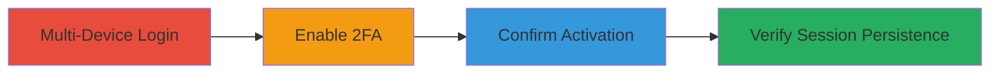

---
tags:
  - 2fa-bypass
  - session-management
  - mfa-flaw
  - web-vulnerability
type: attack_chain
tools: []
tactics:
  - '[[Initial Access]]'
verified: false
platforms:
  - Web
submitted: true
complexity: low
created_at: '2023-10-01T00:00:00Z'
procedures:
  - '[[procedures/Login-to-CS-Money-on-Multiple-Devices]]'
  - '[[procedures/Enable-2FA-on-CS-Money-Security-Page]]'
  - '[[procedures/Confirm-2FA-Activation-on-CS-Money]]'
  - '[[procedures/Verify-Persistent-Session-on-Second-Device]]'
step_count: 4
techniques:
  - '[[Valid Accounts]]'
updated_at: '2025-12-14T17:24:47.466Z'
description: >-
  Demonstrates a session management flaw in CS Money where enabling 2FA does not
  invalidate existing sessions on other devices, allowing unauthorized access
  without 2FA verification.
skill_level: beginner
impact_level: high
id: 2d7073cb-b01c-40e1-b4df-611ac259b1fc
validated: true
mitre_tactics:
  - '[[Initial Access]]'
mitre_techniques:
  - '[[Valid Accounts]]'
---
# CS Money 2FA Bypass via Persistent Existing Sessions

Multi-stage attack chain demonstrating a complete attack workflow to exploit a session management vulnerability in CS Money's 2FA activation process.

## Chain Metrics Dashboard

| Metric | Value |
|--------|-------|
| Chain Status | Unverified |
| Total Steps | 4 |
| Execution Time | ~5 minutes |
| Skill Level | Beginner |
| Complexity | Low |
| Impact Level | High |

## Attack Flow Visualization

## Prerequisites & Requirements

### Required Tools

- Web browser (e.g., Chrome, Firefox)
- Two separate devices or browser sessions

### Target Environment

- Target Platform: Web application at https://cs.money/
- Required services/ports: Standard HTTPS (443)
- Network access requirements: Internet access to CS Money domain

### Initial Access Requirements

- Valid CS Money account credentials (username/password)
- No prior 2FA enabled on the account
- Ability to simulate multi-device access

## Detailed Attack Procedures

### Step 1: Multi-Device Account Access
procedure: [[procedures/Login-to-CS-Money-on-Multiple-Devices]]

**Objective**: Establish active sessions on two separate devices to test session persistence.

**Instructions**: Open a web browser on Device A and navigate to https://cs.money/. Enter your account credentials to log in. Repeat the process on Device B using the same credentials, ensuring both sessions are active without 2FA prompts.

**Expected Output**: Successful login on both devices, with access to account dashboard.

**Success Indicators**:
- Dashboard loads on both devices
- No logout or errors occur

### Step 2: Enable 2FA on Primary Device
procedure: [[procedures/Enable-2FA-on-CS-Money-Security-Page]]

**Objective**: Activate 2FA on the account using one device to trigger the vulnerability test.

**Instructions**: On Device A, navigate to the security settings at https://cs.money/security/. Locate the 2FA enablement option, follow the prompts to set up an authenticator app (e.g., scan QR code and enter verification code), and complete the activation process.

**Expected Output**: Confirmation message indicating 2FA is now enabled for the account.

**Success Indicators**:
- 2FA setup completes successfully
- Account settings reflect 2FA as active

### Step 3: Confirm 2FA Activation
procedure: [[procedures/Confirm-2FA-Activation-on-CS-Money]]

**Objective**: Verify that 2FA is properly enabled account-wide.

**Instructions**: On Device A, refresh the security page or log out and attempt to log back in. You should now be prompted for a 2FA code during re-authentication.

**Expected Output**: 2FA prompt appears on subsequent logins from Device A.

**Success Indicators**:
- 2FA code required for new logins
- No errors in activation status

### Step 4: Test Session Persistence on Secondary Device
procedure: [[procedures/Verify-Persistent-Session-on-Second-Device]]

**Objective**: Demonstrate that the existing session on the second device bypasses 2FA.

**Instructions**: Switch to Device B, where the session was established before 2FA activation. Reload any page on https://cs.money/, such as the dashboard, without entering new credentials or 2FA codes.

**Expected Output**: The page reloads successfully, maintaining logged-in state without 2FA interruption.

**Success Indicators**:
- Session remains active on Device B
- Full account access persists without re-authentication

## Attack Chain Summary

### Key Achievements

1. Established multi-device sessions prior to 2FA enablement
2. Activated 2FA without invalidating existing sessions
3. Confirmed 2FA functionality for new logins while bypassing it on legacy sessions
4. Exposed potential for attackers to retain unauthorized access post-security changes

## Technique & Tactic Coverage

### MITRE ATT&CK Techniques

- [[Valid Accounts]]

### MITRE ATT&CK Tactics

- [[Initial Access]]

---
*Last updated: 2023-10-01T00:00:00Z*
