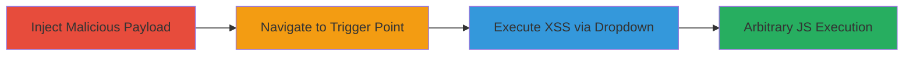

# CSP-Bypass XSS in GitLab Project Settings via Unsanitized Deployment Key Title

Multi-stage attack chain demonstrating exploitation of a cross-site scripting vulnerability in GitLab's project repository settings, where user-controlled deployment key titles are not sanitized, allowing injection of HTML and script tags. The attack bypasses Content Security Policy (CSP) with 'strict-dynamic' due to jQuery's rendering behavior, enabling arbitrary JavaScript execution such as alerting the domain or making unauthorized requests to private resources on behalf of the victim.

## Chain Metrics Dashboard

| Metric | Value |
|--------|-------|
| Chain Status | Unverified |
| Total Steps | 3 |
| Execution Time | ~5 minutes |
| Skill Level | Intermediate |
| Complexity | Medium |
| Impact Level | High |

## Attack Flow Visualization

## Prerequisites & Requirements

### Required Tools

- Web browser with developer tools (e.g., Chrome DevTools for inspecting CSP and execution)

### Target Environment

- GitLab instance (self-hosted or SaaS)
- Access to a project with repository settings permissions
- Valid SSH key for deployment key creation

### Initial Access Requirements

- Authenticated user account with project maintainer or owner role
- No special network access beyond standard web interface

## Detailed Attack Procedures

### Step 1: Inject Malicious Deployment Key
procedure: [[procedures/Inject-Malicious-Deployment-Key-in-GitLab]]

**Objective**: Create a deployment key with an unsanitized title containing a malicious script tag to prepare the XSS payload.

**Instructions**: Access the project settings and add a new deployment key with the injected payload in the title field.

**Expected Output**: Deployment key successfully added, visible in the list without immediate execution.

**Success Indicators**:
- Key added confirmation message
- Key appears in the deployment keys list

### Step 2: Navigate to Protected Branches Section
procedure: [[procedures/Navigate-to-Protected-Branches-in-GitLab-Settings]]

**Objective**: Position the interface to the area where the deployment keys dropdown will render the malicious title.

**Instructions**: From the repository settings page, expand the protected branches section to load the relevant UI elements.

**Expected Output**: Protected branches form expands, showing options like 'Allowed to push'.

**Success Indicators**:
- Form section visible and interactive
- No errors in page load

### Step 3: Trigger XSS Execution
procedure: [[procedures/Trigger-XSS-via-Deployment-Key-Dropdown-in-GitLab]]

**Objective**: Interact with the dropdown to render the unsanitized title via jQuery, executing the injected script and bypassing CSP.

**Instructions**: Click the 'Allowed to push' dropdown to force rendering of deployment key titles, triggering script execution.

**Expected Output**: Alert box or console log showing domain (e.g., alert('gitlab.com')), confirming JS execution.

**Success Indicators**:
- JavaScript alert or network request executed
- Browser console shows script output without CSP violation

## Attack Chain Summary

### Key Achievements

1. Successful injection of arbitrary HTML/script into user-controlled input without sanitization.
2. CSP bypass via jQuery's dynamic insertion under 'strict-dynamic' policy.
3. Client-side JavaScript execution enabling potential data exfiltration or unauthorized actions on private GitLab resources.

## Technique & Tactic Coverage

### MITRE ATT&CK Techniques

- [[JavaScript]]

### MITRE ATT&CK Tactics

- [[Execution]]

---
*Last updated: 2023-10-01T00:00:00Z*
