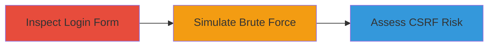

# CSRF Absence in Nextcloud Login Form Enabling Potential Form Submission Attacks

Multi-stage attack chain demonstrating the identification of missing CSRF protection in a web login form and simulation of brute force attacks to assess exploitability.

## Chain Metrics Dashboard

| Metric | Value |
|--------|-------|
| Chain Status | Unverified |
| Total Steps | 2 |
| Execution Time | ~5 minutes |
| Skill Level | Intermediate |
| Complexity | Low |
| Impact Level | Medium |

## Attack Flow Visualization

## Prerequisites & Requirements

### Required Tools

- [[tools/Burp-Intruder]]

### Target Environment

- Web platform running PHP-based application (e.g., Nextcloud)
- Access to the login endpoint (e.g., https://portal.nextcloud.com/login.php)
- No specific ports required beyond standard HTTPS (443)

### Initial Access Requirements

- Public access to the login page
- No credentials needed for inspection
- Network access to the target URL

## Detailed Attack Procedures

### Step 1: Inspect Login Form for CSRF Token
procedure: [[procedures/Inspect-Login-Form-for-CSRF-Token]]

**Objective**: Examine the HTML source of the login form to determine if CSRF token validation is present, identifying potential vulnerabilities for unauthorized form submissions.

**Instructions**: Navigate to the target login page and view the page source. Look for hidden input fields or meta tags related to CSRF tokens in the form element.

**Expected Output**: HTML form without any CSRF token fields, such as <input type="hidden" name="csrf_token" value="...">.

**Success Indicators**:
- No CSRF token field found in the form
- Form submits POST requests to /login.php with username and password fields only

### Step 2: Simulate Brute Force on Login Form
procedure: [[procedures/Simulate-Brute-Force-on-Login-Form]]

**Objective**: Use automated tools to send multiple login attempts, testing if the absence of CSRF tokens allows unrestricted brute force attacks, though noting that CSRF does not inherently prevent brute force.

**Instructions**: Configure a proxy tool like Burp Suite to intercept and replay POST requests to the login endpoint with varying payloads for username and password.

**Expected Output**: Successful sending of multiple requests without token validation errors, but potential rate limiting or other defenses may apply.

**Success Indicators**:
- Multiple POST requests processed without CSRF rejection
- No token-related errors in responses

## Attack Chain Summary

### Key Achievements

1. Identified missing CSRF token in login form HTML
2. Demonstrated ability to submit form without token validation
3. Highlighted potential for CSRF-based attacks tricking users into form submissions

## Technique & Tactic Coverage

### MITRE ATT&CK Techniques

- [[Exploit Public-Facing Application]]
- [[Brute Force]]

### MITRE ATT&CK Tactics

- [[Initial Access]]
- [[Lateral Movement]]

---
*Last updated: 2023-10-01T00:00:00Z*
