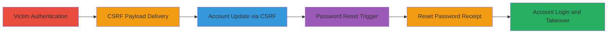

---
tags:
  - csrf
  - account-takeover
  - web-vulnerability
  - coldfusion
type: attack_chain
tools:
  - '[[tools/tempmail]]'
tactics:
  - '[[Initial Access]]'
  - '[[Credential Access]]'
verified: false
platforms:
  - Web
  - ColdFusion
submitted: true
created_at: '2023-10-01T00:00:00Z'
procedures:
  - '[[procedures/Setup-Malicious-CSRF-Page]]'
  - '[[procedures/Deliver-CSRF-Link-to-Victim]]'
  - '[[procedures/Exploit-CSRF-to-Update-Account]]'
  - '[[procedures/Trigger-Password-Reset-for-Victim]]'
  - '[[procedures/Receive-and-Use-Reset-Password]]'
  - '[[procedures/Login-to-Taken-Over-Account]]'
step_count: 7
techniques:
  - '[[Exploit Public-Facing Application]]'
  - '[[Valid Accounts]]'
updated_at: '2025-12-14T17:33:06.160Z'
description: >-
  A multi-stage attack exploiting CSRF on a ColdFusion web application's account
  update endpoint to change the victim's email, followed by password reset abuse
  for complete account takeover.
id: f412aedc-27b6-445a-9832-840d0df587d3
validated: true
mitre_tactics:
  - '[[Initial Access]]'
  - '[[Credential Access]]'
mitre_techniques:
  - '[[Exploit Public-Facing Application]]'
  - '[[Valid Accounts]]'
---
# CSRF Account Update Leading to Full Account Takeover via Email Change and Password Reset

Multi-stage attack chain demonstrating a complete account takeover workflow via CSRF on a ColdFusion-based web application.

## Chain Metrics Dashboard

| Metric | Value |
|--------|-------|
| Chain Status | Unverified |
| Total Steps | 7 |
| Execution Time | ~5 minutes |
| Skill Level | Intermediate |
| Complexity | Medium |
| Impact Level | High |

## Attack Flow Visualization

## Prerequisites & Requirements

### Required Tools

- [[tools/tempmail]]

### Target Environment

- Web application built on ColdFusion
- Accessible POST endpoint /registration/my-account.cfm without CSRF protection
- Forgot password functionality that emails new passwords to the account email

### Initial Access Requirements

- Victim must be authenticated and visit the malicious link while logged in
- Attacker needs a way to deliver the link (e.g., phishing email or social engineering)
- No prior credentials required for attacker

## Detailed Attack Procedures

### Step 1: Victim Logs In

procedure: [[procedures/Victim-Authentication-Setup]]

**Objective**: Ensure the victim is authenticated to the target application, making their session vulnerable to CSRF.

**Instructions**: The victim must log in to the application and navigate to or remain on a page like /registration/index.cfm. No direct attacker action here; rely on social engineering to lure the victim to the app first.

**Expected Output**: Victim's browser session is active with valid authentication cookies.

**Success Indicators**:
- Victim confirms login or attacker observes via subsequent steps

### Step 2: Setup Malicious CSRF Page

procedure: [[procedures/Setup-Malicious-CSRF-Page]]

**Objective**: Create and host a malicious HTML page that auto-submits a form to forge a request updating the victim's account.

**Instructions**: Use a web server to host an HTML file with hidden form fields mimicking the account update form. Include JavaScript to auto-submit upon page load.

**Expected Output**: Hosted page ready at attacker's domain, e.g., http://attacker.com/csrf.html.

**Success Indicators**:
- Page loads and form submits without errors in testing
- history.pushState prevents navigation away

### Step 3: Deliver CSRF Link to Victim

procedure: [[procedures/Deliver-CSRF-Link-to-Victim]]

**Objective**: Trick the victim into visiting the malicious page while authenticated.

**Instructions**: Send the link to the hosted CSRF page via email, chat, or other means, disguising it as a legitimate resource.

**Expected Output**: Victim clicks the link, triggering the form submission.

**Success Indicators**:
- Victim reports clicking or attacker monitors server logs for access

### Step 4: Exploit CSRF to Update Account

procedure: [[procedures/Exploit-CSRF-to-Update-Account]]

**Objective**: Forge a POST request to change the victim's email to an attacker-controlled temporary address.

**Instructions**: The auto-submitting form updates fields like email to 'voyan61996@jrvps.com' (from tempmail), name, address, etc., and submits to /registration/my-account.cfm with cmdSubmit='Update My Account'.

**Expected Output**: Victim's account email updated silently; no visible change to victim.

**Success Indicators**:
- Subsequent password reset goes to attacker's email

### Step 5: Trigger Password Reset for Victim

procedure: [[procedures/Trigger-Password-Reset-for-Victim]]

**Objective**: Initiate a password reset using the victim's known username to generate a new password.

**Instructions**: Navigate to the forgot password page, enter the victim's username, and submit the form.

**Expected Output**: Reset request processed, new password emailed to the updated (attacker-controlled) email.

**Success Indicators**:
- Confirmation page or email receipt

### Step 6: Receive and Use Reset Password

procedure: [[procedures/Receive-and-Use-Reset-Password]]

**Objective**: Retrieve the new password from the temporary email.

**Instructions**: Check the tempmail inbox for the password reset email containing the new password.

**Expected Output**: New password obtained, e.g., a temporary generated string.

**Success Indicators**:
- Email received with password

### Step 7: Login to Taken Over Account

procedure: [[procedures/Login-to-Taken-Over-Account]]

**Objective**: Access the victim's account using the username and new password for full control.

**Instructions**: Visit the login page at /, enter the username and received password, and submit.

**Expected Output**: Successful login, granting access to all account features and data.

**Success Indicators**:
- Dashboard or account page loads for attacker
- Ability to make further changes

## Attack Chain Summary

### Key Achievements

1. Unauthorized account information update via CSRF
2. Email hijacking enabling password reset interception
3. Complete account takeover without direct credential compromise

## Technique & Tactic Coverage

### MITRE ATT&CK Techniques

- [[Exploit Public-Facing Application]]
- [[Valid Accounts]]

### MITRE ATT&CK Tactics

- [[Initial Access]]
- [[Credential Access]]

---
*Last updated: 2023-10-01T00:00:00Z*
