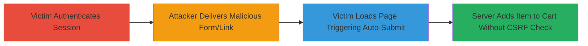

# CSRF Attack Adding Greeting Card to Starbucks Shopping Cart

Multi-stage attack chain demonstrating a complete CSRF workflow on the Starbucks website, allowing unauthorized addition of items to a victim's cart.

## Chain Metrics Dashboard

| Metric | Value |
|--------|-------|
| Chain Status | Unverified |
| Total Steps | 4 |
| Execution Time | ~1 minute |
| Skill Level | Intermediate |
| Complexity | Medium |
| Impact Level | High |

## Attack Flow Visualization

## Prerequisites & Requirements

### Required Tools

- None (uses basic HTML/JavaScript)

### Target Environment

- Web platform
- Starbucks website (www.starbucks.com)
- Authenticated user session

### Initial Access Requirements

- Victim must be tricked into visiting the malicious page while logged in
- Attacker needs a delivery method (e.g., email, social engineering)
- No special credentials for attacker

## Detailed Attack Procedures

### Step 1: Victim Logs into Starbucks Account

**Objective**: Establish an authenticated session on the target website, enabling cookie-based requests.

**Instructions**: The victim navigates to www.starbucks.com and logs in with their credentials, creating a session cookie that will be used in subsequent requests.

**Expected Output**: Successful login, session established.

**Success Indicators**:
- Victim is on the shop page or account dashboard
- No logout or errors

### Step 2: Attacker Crafts and Delivers Malicious Form
procedure: [[procedures/CSRF-Add-Item-to-Starbucks-Shopping-Cart]]

**Objective**: Prepare and send a malicious HTML form that targets the vulnerable updatecart endpoint.

**Instructions**: Create an HTML page with a hidden POST form to https://www.starbucks.com/shop/updatecart, including parameters for adding a greeting card (card_id=greeting_card, card_quantity=1, defined_amount=25, defined_currency=USD, greeting_card=true). Host the page or send as a link/file via email or messaging, tricking the victim to open it while logged in.

**Expected Output**: Victim receives and clicks the link, loading the page.

**Success Indicators**:
- Malicious page loads in victim's browser
- Form parameters match vulnerability details

### Step 3: Victim Triggers Form Submission
procedure: [[procedures/CSRF-Add-Item-to-Starbucks-Shopping-Cart]]

**Objective**: Auto-submit the forged request using the victim's session cookies.

**Instructions**: The HTML includes JavaScript to immediately submit the form upon page load: document.forms[0].submit();. This sends the POST request to the endpoint without user interaction beyond clicking the link.

**Expected Output**: POST request sent with victim's cookies, processed by server.

**Success Indicators**:
- No browser errors on submission
- Network request visible in dev tools (if monitored)

### Step 4: Item Added to Victim's Cart
procedure: [[procedures/CSRF-Add-Item-to-Starbucks-Shopping-Cart]]

**Objective**: Confirm unauthorized modification of the victim's shopping cart.

**Instructions**: The server processes the request due to missing CSRF protection, adding the $25 greeting card to the cart. Victim may proceed to checkout unknowingly.

**Expected Output**: Item appears in victim's cart on next page refresh.

**Success Indicators**:
- Cart contains unauthorized $25 greeting card
- Potential financial loss if victim checks out

## Attack Chain Summary

### Key Achievements

1. Forged authenticated request to modify user data without consent
2. Demonstrated lack of CSRF tokens on sensitive POST endpoint
3. Potential for financial impact and brand reputation damage

## Technique & Tactic Coverage

### MITRE ATT&CK Techniques

- [[Drive-by Compromise]]
- [[Exploit Public-Facing Application]]

### MITRE ATT&CK Tactics

- [[Initial Access]]

---

*Last updated: 2024-10-04T00:00:00Z*
