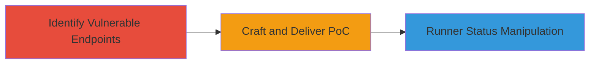

# CSRF Attack on GitLab Admin Panel to Pause or Resume CI/CD Runners

Multi-stage attack chain demonstrating a complete attack workflow exploiting CSRF in GitLab's admin panel to manipulate CI/CD runner status.

## Chain Metrics Dashboard

| Metric | Value |
|--------|-------|
| Chain Status | Unverified |
| Total Steps | 2 |
| Execution Time | ~5 minutes |
| Skill Level | Intermediate |
| Complexity | Low |
| Impact Level | Low |

## Attack Flow Visualization

## Prerequisites & Requirements

### Required Tools

- Web browser for testing
- HTML editor or simple text editor for crafting PoC

### Target Environment

- GitLab instance (self-hosted or SaaS)
- Admin panel access
- Authenticated administrator session

### Initial Access Requirements

- Attacker needs a way to lure the admin (e.g., phishing email with malicious link)
- Victim must be an authenticated GitLab admin
- No direct network access to the GitLab instance required beyond the victim's browser

## Detailed Attack Procedures

### Step 1: Identify Vulnerable Endpoints
procedure: [[procedures/Identify-CSRF-Vulnerable-Endpoints-in-GitLab-Admin-Panel]]

**Objective**: Locate the admin endpoints in GitLab that handle runner pause/resume actions and confirm lack of CSRF protection.

**Instructions**: Access the GitLab admin panel and inspect the network traffic or documentation for runner management URLs. Test the endpoints http://{gitlab_instance}/admin/runners/:runner_id/resume and http://{gitlab_instance}/admin/runners/:runner_id/pause by sending POST requests without a CSRF token to verify if the actions succeed.

**Expected Output**: Successful pause or resume of a runner without token validation, confirming the vulnerability.

**Success Indicators**:
- Endpoint responds with 200 OK or action confirmation without requiring CSRF token
- Runner status changes in the admin panel

### Step 2: Reproduce CSRF Exploit
procedure: [[procedures/Reproduce-CSRF-Exploit-to-Pause-or-Resume-Runners]]

**Objective**: Craft a malicious webpage that forges the request to manipulate runner status when visited by an authenticated admin.

**Instructions**: Create an HTML page with a form or JavaScript that auto-submits a POST request to the vulnerable endpoints. Host the page on an attacker-controlled server and send a link to the admin (e.g., via email). When the admin visits while logged in, the request is sent on their behalf.

**Expected Output**: Runner status paused or resumed in the GitLab admin panel without the admin's direct action.

**Success Indicators**:
- Admin's browser submits the forged request successfully
- CI/CD pipeline disruption or resumption observed in GitLab

## Attack Chain Summary

### Key Achievements

1. Identification of unprotected admin endpoints for runner management
2. Successful CSRF exploitation leading to unauthorized runner status changes
3. Temporary disruption of CI/CD pipelines without full compromise

## Technique & Tactic Coverage

### MITRE ATT&CK Techniques

- [[Drive-by Compromise]]
- [[Exploit Public-Facing Application]]

### MITRE ATT&CK Tactics

- [[Initial Access]]

---
*Last updated: 2023-10-01T00:00:00Z*
