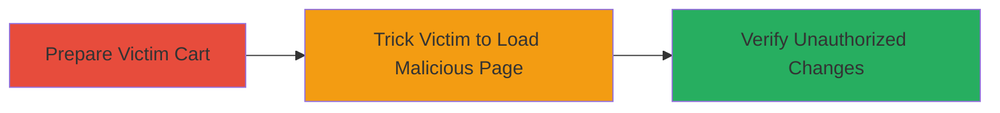

# CSRF Attack on Khan Academy Shop Cart to Unauthorizedly Modify Items

Multi-stage attack chain demonstrating a complete CSRF workflow against the Khan Academy online shop, allowing unauthorized modification of a victim's shopping cart contents.

## Chain Metrics Dashboard

| Metric | Value |
|--------|-------|
| Chain Status | Unverified |
| Total Steps | 3 |
| Execution Time | ~2 minutes |
| Skill Level | Beginner |
| Complexity | Low |
| Impact Level | Medium |

## Attack Flow Visualization

## Prerequisites & Requirements

### Required Tools

- Web browser for manual verification
- HTML editor or simple web server to host the PoC page

### Target Environment

- Web platform
- Access to http://shop.khanacademy.org/cart
- Victim must be authenticated to the shop

### Initial Access Requirements

- Victim must visit a malicious webpage controlled by the attacker
- No special credentials needed beyond victim's session
- Network access to the Khan Academy shop domain

## Detailed Attack Procedures

### Step 1: Prepare Victim Cart
procedure: [[procedures/Empty-Khan-Academy-Shopping-Cart]]

**Objective**: Ensure the victim's cart is in a known state (empty) to clearly observe the effects of the CSRF attack.

**Instructions**: Manually access the cart page to empty it. This step simulates the victim's initial cart state but can be skipped if the cart is already empty.

**Expected Output**: Shopping cart displays as empty.

**Success Indicators**:
- Cart contents show zero items
- No products listed on http://shop.khanacademy.org/cart

### Step 2: Trick Victim into Executing CSRF
procedure: [[procedures/Submit-CSRF-POC-to-Add-Cart-Item]]

**Objective**: Deliver the malicious HTML form to the victim, causing an unauthorized POST request to update the cart with a new item.

**Instructions**: Host the PoC HTML on a controlled domain and lure the victim (e.g., via phishing email or malicious link) to visit it. The form auto-submits on page load, forging the request using the victim's authenticated session.

**Expected Output**: The victim's browser silently submits the POST, adding the item without alert.

**Success Indicators**:
- Network traffic shows POST to /cart with updates[211669705]=1
- No user interaction required beyond loading the page

### Step 3: Verify the Attack Impact
procedure: [[procedures/Verify-Cart-Modification-via-CSRF]]

**Objective**: Confirm the unauthorized addition of the item to the victim's cart, demonstrating the CSRF success.

**Instructions**: Have the victim (or attacker with access) revisit the cart page to check for the added item.

**Expected Output**: Cart now contains the product with ID 211669705 and quantity 1.

**Success Indicators**:
- Item appears in cart without user action
- Product details match the forged updates parameter

## Attack Chain Summary

### Key Achievements

1. Bypassed CSRF protections to forge cart updates
2. Demonstrated unauthorized addition of items to a live e-commerce cart
3. Highlighted risks of session-based actions without token validation

## Technique & Tactic Coverage

### MITRE ATT&CK Techniques

- [[Drive-by Compromise]] Drive-by Compromise
- [[Exploit Public-Facing Application]] Exploit Public-Facing Application

### MITRE ATT&CK Tactics

- [[Initial Access]] Initial Access

---
*Last updated: 2023-10-01T00:00:00Z*
