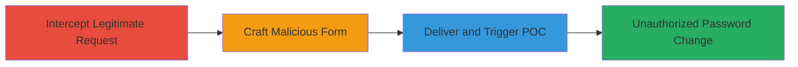

# CSRF Attack on Password Change Endpoint for Unauthorized Account Takeover

Multi-stage attack chain demonstrating a CSRF workflow targeting a web application's password change functionality to forge unauthorized requests.

## Chain Metrics Dashboard

| Metric | Value |
|--------|-------|
| Chain Status | Unverified |
| Total Steps | 3 |
| Execution Time | ~5 minutes |
| Skill Level | Intermediate |
| Complexity | Medium |
| Impact Level | High |

## Attack Flow Visualization

## Prerequisites & Requirements

### Required Tools

- [[tools/Burp-Suite]]

### Target Environment

- Web application with password change endpoint (e.g., POST /password_reset)
- No specific ports required beyond standard HTTPS (443)
- Attacker needs ability to host or deliver HTML content to victim

### Initial Access Requirements

- Victim must be authenticated to the target site
- Attacker requires network access to intercept or observe legitimate requests (e.g., via proxy)
- No prior credentials needed, but social engineering may be used to lure victim to malicious page

## Detailed Attack Procedures

### Step 1: Intercept Password Change Request
procedure: [[procedures/Intercept-Password-Change-Request-with-Burp-Suite]]

**Objective**: Capture the legitimate password change request to understand the endpoint, parameters, and any CSRF protections.

**Instructions**: Configure Burp Suite as a proxy and initiate a password change on the target site to intercept the POST request. Analyze the form data including old_password, password, password_confirmation, and check for CSRF tokens.

**Expected Output**: Captured HTTP request details, including endpoint URL and parameters.

**Success Indicators**:
- Request intercepted successfully
- Parameters and endpoint identified
- CSRF token presence noted (or absence exploited)

### Step 2: Generate Malicious CSRF HTML Form
procedure: [[procedures/Generate-Malicious-CSRF-HTML-Form]]

**Objective**: Craft a self-submitting HTML form that mimics the password change request but omits CSRF protections to forge the action from an external site.

**Instructions**: Use the intercepted data from Burp Suite to create an HTML page with a hidden form targeting the password_reset endpoint. Set the form to auto-submit via JavaScript, excluding any CSRF token field.

**Expected Output**: A functional HTML POC file that, when loaded by the victim, submits the forged request.

**Success Indicators**:
- HTML form generated without CSRF token
- Form submission tested in a controlled environment
- Request structure matches intercepted legitimate request

### Step 3: Deliver and Trigger CSRF Attack
procedure: [[procedures/Deliver-and-Trigger-CSRF-POC]]

**Objective**: Deliver the malicious HTML to the victim while they are authenticated, triggering the unauthorized password change.

**Instructions**: Host the HTML POC on an attacker-controlled site or send via email/phishing. Modify form values (e.g., new password) as needed. When victim visits, the form auto-submits to change their password.

**Expected Output**: Successful POST to the target endpoint, potentially resulting in password update if CSRF validation is absent.

**Success Indicators**:
- Victim loads the page and form submits
- Target endpoint receives and processes the request (monitor via proxy if possible)
- Account password changed without user interaction

## Attack Chain Summary

### Key Achievements

1. Intercepted and analyzed password change mechanics
2. Created a bypass for alleged CSRF protections via forged form
3. Enabled potential account takeover through unauthorized password reset

## Technique & Tactic Coverage

### MITRE ATT&CK Techniques

- [[Exploit Public-Facing Application]]
- [[Drive-by Compromise]]

### MITRE ATT&CK Tactics

- [[Initial Access]]
- [[Execution]]

---
*Last updated: 2023-10-01T00:00:00Z*
