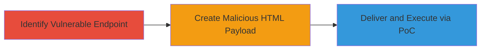

# CSRF Attack to Modify Privacy Settings on apps.owncloud.com

Multi-stage attack chain demonstrating a complete CSRF workflow targeting the privacy settings functionality on apps.owncloud.com.

## Chain Metrics Dashboard

| Metric | Value |
|--------|-------|
| Chain Status | Unverified |
| Total Steps | 3 |
| Execution Time | ~5 minutes |
| Skill Level | Intermediate |
| Complexity | Medium |
| Impact Level | High |

## Attack Flow Visualization



## Prerequisites & Requirements

### Required Tools

- None (manual testing and HTML creation)

### Target Environment

- Web platform
- Access to apps.owncloud.com privacy settings endpoint
- Victim must be authenticated

### Initial Access Requirements

- Attacker needs to lure victim to malicious site while authenticated to owncloud
- No prior credentials required beyond victim's session

## Detailed Attack Procedures

### Step 1: Identify Vulnerable Endpoint
procedure: [[procedures/Exploit-CSRF-in-OwnCloud-Privacy-Settings]]

**Objective**: Locate the privacy settings update endpoint and confirm lack of CSRF protection.

**Instructions**: Manually inspect the privacy settings form on apps.owncloud.com using browser developer tools to identify the POST endpoint (e.g., /api/privacy/update). Test by submitting a forged request from a different origin without tokens to verify it processes without validation.

**Expected Output**: Successful unauthorized update when request is forged.

**Success Indicators**:
- Endpoint accepts cross-origin POST without CSRF token
- Privacy settings change without user interaction on target site

### Step 2: Create Malicious HTML Payload
procedure: [[procedures/Exploit-CSRF-in-OwnCloud-Privacy-Settings]]

**Objective**: Develop an HTML page that auto-submits a forged request to alter privacy settings.

**Instructions**: Create an HTML file named 'change_privacy_settings.html' with a hidden form targeting the vulnerable endpoint. Set form action to the privacy update URL and include parameters for modified settings (e.g., visibility to public). Use JavaScript to auto-submit on load.

Example HTML structure:

```html
<!DOCTYPE html>
<html>
<body>
<form id="csrf-form" action="https://apps.owncloud.com/api/privacy/update" method="POST">
    <input type="hidden" name="privacy_level" value="public" />
    <input type="hidden" name="share_enabled" value="true" />
</form>
<script>
    document.getElementById('csrf-form').submit();
</script>
</body>
</html>
```

Host this file on an attacker-controlled server.

**Expected Output**: Form submits automatically, altering victim's settings.

**Success Indicators**:
- Page loads and form submits without user input
- Victim's privacy settings updated upon inspection

### Step 3: Deliver and Execute via PoC
procedure: [[procedures/Exploit-CSRF-in-OwnCloud-Privacy-Settings]]

**Objective**: Demonstrate the attack by tricking the victim into loading the malicious page while authenticated.

**Instructions**: Lure the victim to the hosted HTML page (e.g., via phishing email or malicious link). Record a video PoC showing the victim's browser (logged into owncloud) loading the page, resulting in settings change. Verify by checking the account's privacy status post-load.

**Expected Output**: Video or log showing unauthorized change.

**Success Indicators**:
- Privacy settings modified (e.g., account now public)
- No alerts or blocks from the application

## Attack Chain Summary

### Key Achievements

1. Identified CSRF vulnerability in privacy endpoint
2. Crafted and hosted malicious HTML for auto-submission
3. Demonstrated impact via PoC, leading to data exposure risk

## Technique & Tactic Coverage

### MITRE ATT&CK Techniques

- [[Drive-by Compromise]]

### MITRE ATT&CK Tactics

- [[Initial Access]]

---
*Last updated: 2023-10-01T00:00:00Z*
