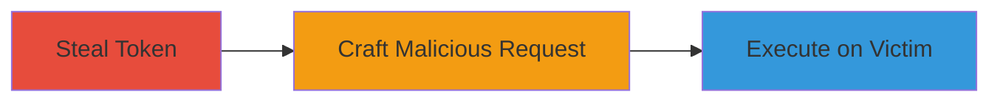

---
tags:
  - csrf
  - owncloud
  - token-reuse
  - web-vulnerability
type: attack_chain
tools: []
tactics:
  - '[[Initial Access]]'
  - '[[Execution]]'
verified: false
platforms:
  - Web
submitted: true
complexity: medium
created_at: '2023-10-01T00:00:00Z'
procedures:
  - '[[procedures/Steal-ownCloud-CSRF-Token-from-Shared-Session]]'
  - '[[procedures/Craft-Malicious-CSRF-Request-with-Stolen-Token]]'
  - '[[procedures/Execute-CSRF-Attack-on-Victim-Session]]'
step_count: 3
techniques:
  - '[[Exploit Public-Facing Application]]'
  - '[[Drive-by Compromise]]'
updated_at: '2025-12-14T17:27:03.078Z'
description: >-
  A multi-stage CSRF attack exploiting the static CSRF token in ownCloud after
  login, enabling unauthorized actions on shared devices.
skill_level: intermediate
impact_level: low
id: d81b6a70-c321-4c69-be54-5fc3f9e5355a
validated: true
mitre_tactics:
  - '[[Initial Access]]'
  - '[[Execution]]'
mitre_techniques:
  - '[[Exploit Public-Facing Application]]'
  - '[[Drive-by Compromise]]'
---
# CSRF Attack via Static Token Reuse in ownCloud on Shared Workstations

Multi-stage attack chain demonstrating a complete attack workflow exploiting the unchanging CSRF token in ownCloud after user login on shared workstations.

## Chain Metrics Dashboard

| Metric | Value |
|--------|-------|
| Chain Status | Unverified |
| Total Steps | 3 |
| Execution Time | ~5 minutes |
| Skill Level | Intermediate |
| Complexity | Medium |
| Impact Level | Low |

## Attack Flow Visualization

## Prerequisites & Requirements

### Required Tools

- None (relies on browser inspection and basic crafting)

### Target Environment

- ownCloud web application
- Shared workstation environment
- Physical access to the device

### Initial Access Requirements

- Attacker must have temporary physical access to a logged-in session
- Victim must log in subsequently on the same device
- Network access to ownCloud instance

## Detailed Attack Procedures

### Step 1: Steal CSRF Token
procedure: [[procedures/Steal-ownCloud-CSRF-Token-from-Shared-Session]]

**Objective**: Extract the static CSRF token from an active ownCloud session to enable reuse in forged requests.

**Instructions**: Access the shared workstation with an active ownCloud login. Inspect the browser's developer tools or session storage to locate the CSRF authenticity token, which remains unchanged post-login.

**Expected Output**: A static token value, such as a long alphanumeric string visible in form fields or headers.

**Success Indicators**:
- Token successfully copied without alerting the system
- Token confirmed as static by observing no change after simulated actions

### Step 2: Craft Malicious Request
procedure: [[procedures/Craft-Malicious-CSRF-Request-with-Stolen-Token]]

**Objective**: Create a forged link or form that embeds the stolen token to bypass CSRF protections.

**Instructions**: Use the stolen token to construct a malicious URL or HTML form targeting ownCloud endpoints, such as file upload or account modification actions. Embed the token in the request parameters or hidden fields.

**Expected Output**: A clickable link or HTML snippet ready for delivery, e.g., a GET request like `https://owncloud.example.com/action?token=STOLEN_TOKEN&malicious_param=value`.

**Success Indicators**:
- Request structure validated to include the exact token format required by ownCloud
- No immediate validation errors when previewing the request

### Step 3: Execute on Victim
procedure: [[procedures/Execute-CSRF-Attack-on-Victim-Session]]

**Objective**: Trick the victim into triggering the forged request, performing unauthorized actions on their behalf.

**Instructions**: Deliver the crafted link via email, chat, or another channel. When the victim clicks it on the shared device (now logged in as them), the static token validates the request as legitimate, allowing actions like data deletion or sharing.

**Expected Output**: Unauthorized action completes silently, such as modified files or account changes in the victim's session.

**Success Indicators**:
- Victim's account shows evidence of unauthorized changes
- No authentication prompts or errors during execution

## Attack Chain Summary

### Key Achievements

1. Successful token theft from shared session
2. Bypassed CSRF protection via token reuse
3. Performed unauthorized actions without victim awareness

## Technique & Tactic Coverage

### MITRE ATT&CK Techniques

- [[Exploit Public-Facing Application]]
- [[Drive-by Compromise]]

### MITRE ATT&CK Tactics

- [[Initial Access]]
- [[Execution]]

---

*Last updated: 2023-10-01T00:00:00Z*
