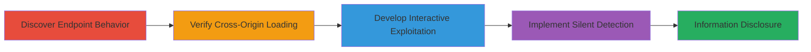

---
tags:
  - csrf
  - information-disclosure
  - admin-detection
  - vk.com
type: attack_chain
tools: []
tactics:
  - '[[Discovery]]'
verified: false
platforms:
  - Web
submitted: true
complexity: medium
created_at: '2023-10-01T00:00:00Z'
procedures:
  - '[[procedures/Discover-Inconsistent-Response-in-al_groups-Endpoint]]'
  - '[[procedures/Verify-Endpoint-Embedding-in-Iframes]]'
  - '[[procedures/Develop-Exploitation-via-Fake-Captcha]]'
  - '[[procedures/Implement-Silent-JavaScript-Admin-Detection]]'
step_count: 4
techniques:
  - '[[Drive-by Compromise]]'
  - '[[JavaScript]]'
updated_at: '2025-12-14T17:27:42.449Z'
description: >-
  A multi-stage CSRF attack exploiting inconsistent responses in VK.com's
  al_groups.php endpoint to silently detect if a logged-in user is a group
  admin, enabling phishing or unauthorized actions.
skill_level: intermediate
impact_level: high
id: 72deac82-0844-4d92-9539-855909911a3b
validated: true
mitre_tactics:
  - '[[Discovery]]'
mitre_techniques:
  - '[[Drive-by Compromise]]'
  - '[[JavaScript]]'
---
# CSRF-Based Detection of VK.com Group Admin Status

Multi-stage attack chain demonstrating a complete workflow to exploit a CSRF vulnerability in VK.com's al_groups.php endpoint, allowing remote detection of group admin status or login state without user interaction.

## Chain Metrics Dashboard

| Metric | Value |
|--------|-------|
| Chain Status | Unverified |
| Total Steps | 4 |
| Execution Time | ~5 minutes |
| Skill Level | Intermediate |
| Complexity | Medium |
| Impact Level | High |

## Attack Flow Visualization



## Prerequisites & Requirements

### Required Tools

- None (uses browser and basic web development)

### Target Environment

- VK.com web platform
- PHP-based backend
- No specific ports; web access required

### Initial Access Requirements

- Attacker controls a malicious website
- Victim is logged into VK.com and visits attacker's site
- Knowledge of target group ID (GID)

## Detailed Attack Procedures

### Step 1: Discover Inconsistent Response Behavior
procedure: [[procedures/Discover-Inconsistent-Response-in-al_groups-Endpoint]]

**Objective**: Identify the CSRF vulnerability by observing differing responses for admin vs. non-admin access to the endpoint.

**Instructions**: Test the endpoint with owned and non-owned group IDs using browser developer tools or direct requests. For own group (admin): https://vk.com/al_groups.php?act=to_public_box&al=1&gid=147481259 returns silent/commented response. For non-owned: https://vk.com/al_groups.php?act=to_public_box&al=1&gid=111 returns 'Ошибка доступа' (Access Error).

**Expected Output**: Silent response for admins; explicit error for non-admins.

**Success Indicators**:
- Inconsistent responses confirmed
- Endpoint behavior documented

### Step 2: Verify Cross-Origin Embedding
procedure: [[procedures/Verify-Endpoint-Embedding-in-Iframes]]

**Objective**: Confirm the endpoint can be loaded cross-origin without restrictions, enabling embedding in malicious sites.

**Instructions**: Embed the endpoint URLs in an iframe on a controlled demo site (e.g., http://lincoln-shop.ru/). Load both admin and non-admin variants to observe responses.

**Expected Output**: Iframe loads without CORS blocks; error visible for non-admins.

**Success Indicators**:
- No X-Frame-Options blocking
- Responses render in external context

### Step 3: Develop Interactive Exploitation Scenario
procedure: [[procedures/Develop-Exploitation-via-Fake-Captcha]]

**Objective**: Create a user-interaction-based exploit to infer admin status via response visibility.

**Instructions**: Build a form on the attacker's site with a fake captcha prompting the user to report the error type after iframe load. Infer admin status from 'Access Error' or silence.

**Expected Output**: User input reveals admin/non-admin status.

**Success Indicators**:
- Victim interacts without suspicion
- Status inferred accurately

### Step 4: Implement Silent Detection
procedure: [[procedures/Implement-Silent-JavaScript-Admin-Detection]]

**Objective**: Achieve non-interactive detection using JavaScript to load the endpoint as a script and catch errors.

**Instructions**: Use [[commands/vk-admin-detection-script]] to dynamically load the endpoint:

```html
<body>
<script>var script = document.createElement('script');
 script.src = "https://vk.com/al_groups.php?act=to_public_box&al=1&gid=147481257";
 document.body.appendChild(script);
 script.onerror = function() {
 alert( "No admin" );
 };
 </script>
 </body>
```

**Expected Output**: Alert for non-admins; silence for admins.

**Success Indicators**:
- Detection without user input
- Potential for chaining to subscription prompts

## Attack Chain Summary

### Key Achievements

1. Exposed CSRF flaw allowing cross-site admin detection
2. Enabled silent information disclosure for phishing
3. Demonstrated escalation to forced group interactions

## Technique & Tactic Coverage

### MITRE ATT&CK Techniques

- [[Drive-by Compromise]]
- [[JavaScript]]

### MITRE ATT&CK Tactics

- [[Discovery]]

---

*Last updated: 2023-10-01T00:00:00Z*
