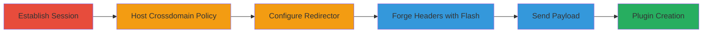

---
tags:
  - csrf
  - flash
  - redirect
  - web
  - bypass
type: attack_chain
tools:
  - '[[tools/Adobe-Flash]]'
  - '[[tools/PHP-Redirector-Script]]'
  - '[[tools/Browser-Developer-Tools]]'
tactics:
  - '[[Initial Access]]'
  - '[[Execution]]'
verified: false
platforms:
  - Web
submitted: true
complexity: medium
created_at: '2023-10-01T00:00:00Z'
procedures:
  - '[[procedures/Establish-Authenticated-Session-on-Target]]'
  - '[[procedures/Host-Malicious-Crossdomain-Policy]]'
  - '[[procedures/Configure-PHP-307-Redirector]]'
  - '[[procedures/Forge-JSON-Content-Type-with-Flash]]'
  - '[[procedures/Execute-CSRF-Payload-to-Create-Plugin]]'
step_count: 5
techniques:
  - '[[Exploit Public-Facing Application]]'
  - '[[Drive-by Compromise]]'
updated_at: '2025-12-14T17:27:36.194Z'
description: >-
  A multi-stage CSRF attack exploiting the lack of CSRF protections in the
  Stripo plugins endpoint, allowing attackers to create plugins on behalf of
  authenticated users via Flash-forged headers and 307 redirects.
skill_level: intermediate
impact_level: high
id: efda9e94-d367-4bb9-bfb5-19ba131d4ace
validated: true
mitre_tactics:
  - '[[Initial Access]]'
  - '[[Execution]]'
mitre_techniques:
  - '[[Exploit Public-Facing Application]]'
  - '[[Drive-by Compromise]]'
---
# CSRF Bypass Using Flash File and 307 Redirect to Create Unauthorized Plugins in Stripo

Multi-stage attack chain demonstrating a complete CSRF exploitation workflow against the Stripo email platform's plugins endpoint.

## Chain Metrics Dashboard

| Metric | Value |
|--------|-------|
| Chain Status | Unverified |
| Total Steps | 5 |
| Execution Time | ~10 minutes |
| Skill Level | Intermediate |
| Complexity | Medium |
| Impact Level | High |

## Attack Flow Visualization

## Prerequisites & Requirements

### Required Tools

- [[tools/Adobe-Flash]]
- [[tools/PHP-Redirector-Script]]
- [[tools/Browser-Developer-Tools]]

### Target Environment

- Web platform with JSON API endpoints
- Authenticated session on https://my.stripo.email/
- Access to hosting for malicious files (e.g., crossdomain.xml and PHP script)

### Initial Access Requirements

- Victim must be tricked into logging in and visiting attacker-controlled sites (e.g., via phishing)
- No special credentials needed beyond victim's session
- Internet access for hosting and redirects

## Detailed Attack Procedures

### Step 1: Establish Authenticated Session
procedure: [[procedures/Establish-Authenticated-Session-on-Target]]

**Objective**: Gain an active session on the target site to abuse for CSRF.

**Instructions**: Trick the victim into logging in to establish cookies. No specific command; this is social engineering.

**Expected Output**: Victim's browser has active session cookies for https://my.stripo.email/.

**Success Indicators**:
- Victim confirms login
- Network inspection shows session cookies present

### Step 2: Host Malicious Crossdomain Policy
procedure: [[procedures/Host-Malicious-Crossdomain-Policy]]

**Objective**: Allow Flash cross-origin access to the target domain.

**Instructions**: Upload crossdomain.xml to an attacker-controlled domain like https://thehackerblog.com/crossdomain/.

**Expected Output**: Policy file accessible, enabling Flash requests.

**Success Indicators**:
- File loads in browser
- Flash can access target domain

### Step 3: Configure PHP 307 Redirector
procedure: [[procedures/Configure-PHP-307-Redirector]]

**Objective**: Set up redirect to preserve forged request to the vulnerable endpoint.

**Instructions**: Deploy PHP script at https://testingsubdomain.000webhostapp.com/stripo.php to issue 307 redirect to https://my.stripo.email/cabinet/stripeapi/v1/plugin/$userid$/plugins.

**Expected Output**: Redirect triggers with preserved method and body.

**Success Indicators**:
- Redirect tested successfully in browser
- Target endpoint receives request

### Step 4: Forge JSON Content-Type Header with Flash
procedure: [[procedures/Forge-JSON-Content-Type-with-Flash]]

**Objective**: Bypass browser restrictions on custom headers for CSRF.

**Instructions**: Use SWF file to send request with Content-Type: application/json;charset=UTF-8.

**Expected Output**: Forged header in request to redirector.

**Success Indicators**:
- DevTools shows custom header
- Request bypasses same-origin policy

### Step 5: Execute CSRF Payload to Create Plugin
procedure: [[procedures/Execute-CSRF-Payload-to-Create-Plugin]]

**Objective**: Create unauthorized plugin using victim's session.

**Instructions**: Direct victim to the Flash-laden page that triggers the full chain; monitor in DevTools.

**Expected Output**: POST payload {"email":"attacker@example.com","name":"csrf poc","webUrl":"csrf poc "} sent successfully.

**Success Indicators**:
- Plugin created on victim's account
- Server response confirms creation (200 OK)

## Attack Chain Summary

### Key Achievements

1. Bypassed CSRF protections without tokens
2. Forged required Content-Type using legacy Flash
3. Created plugins leading to account compromise

## Technique & Tactic Coverage

### MITRE ATT&CK Techniques

- [[Exploit Public-Facing Application]]
- [[Drive-by Compromise]]

### MITRE ATT&CK Tactics

- [[Initial Access]]
- [[Execution]]

---

*Last updated: 2023-10-01T00:00:00Z*
