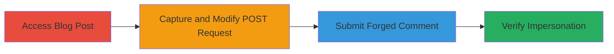

# CSRF Bypass in Airship CMS Blog Comments for User Impersonation

Multi-stage attack chain demonstrating a complete attack workflow exploiting a CSRF token validation bypass in the Airship CMS blog comment system.

## Chain Metrics Dashboard

| Metric | Value |
|--------|-------|
| Chain Status | Unverified |
| Total Steps | 3 |
| Execution Time | ~5 minutes |
| Skill Level | Intermediate |
| Complexity | Low |
| Impact Level | Low |

## Attack Flow Visualization

## Prerequisites & Requirements

### Required Tools

- [[tools/Burp-Suite]]

### Target Environment

- Web platform running Airship CMS (PHP-based)
- Access to a blog post URL (e.g., https://target.com/blog/post-slug)
- Authenticated user session (e.g., administrator or publisher permissions)

### Initial Access Requirements

- Valid session cookie for an authenticated user with publish permissions
- Network access to the target web application
- No prior exploits needed; assumes legitimate access to the site

## Detailed Attack Procedures

### Step 1: Access Blog Post and Prepare Comment
procedure: [[procedures/Bypass-CSRF-in-Airship-CMS-Blog-Comments]]

**Objective**: Navigate to a target blog post and interact with the comment form to generate a legitimate POST request for interception.

**Instructions**: Open the target blog post in a browser, such as https://cspr.ng/blog/2017/05/csprng-airship-dev-branch. Fill out the comment form with sample data (e.g., name, email, message) to trigger the form submission. Use [[tools/Burp-Suite]] to intercept the request if needed, but initially submit normally to understand the flow.

**Expected Output**: The form generates a POST request to the comment endpoint with parameters including _CSRF_TOKEN, author, name, email, url, message, and optionally g-recaptcha-response.

**Success Indicators**:
- Comment form loads without errors
- POST request is observable in browser dev tools or proxy

### Step 2: Intercept and Modify the POST Request
procedure: [[procedures/Bypass-CSRF-in-Airship-CMS-Blog-Comments]]

**Objective**: Capture the POST request and remove the CSRF token to test the bypass, exploiting the $ignoreCSRFToken=true flag in the backend.

**Instructions**: Use [[tools/Burp-Suite]] to intercept the POST request. The request will look like: POST /blog/2017/05/csprng-airship-dev-branch with body parameters such as _CSRF_TOKEN=KrkFX0bGkcwgoIKX8Y7KKr1F%3A0ElYiUhZ5wJDSS8kE2FmPxY58Dr3533SH63ZRJBPBfO-, author=47, name=, email=, url=, message=ssdfsfsfsf+sfsd, g-recaptcha-response=.... Remove the _CSRF_TOKEN parameter entirely from the request body. For users with publish permissions, no CAPTCHA is required, so g-recaptcha-response can also be omitted if present.

**Expected Output**: Modified POST request without _CSRF_TOKEN, ready for resubmission.

**Success Indicators**:
- Request intercepted successfully
- CSRF token removed without syntax errors in the proxy

### Step 3: Submit Modified Request and Verify Bypass
procedure: [[procedures/Bypass-CSRF-in-Airship-CMS-Blog-Comments]]

**Objective**: Send the tampered request to confirm the CSRF bypass and observe successful comment posting, enabling impersonation.

**Instructions**: Forward the modified POST request through [[tools/Burp-Suite]] to the endpoint (e.g., /blog/post-slug). The backend in src/Cabin/Hull/Controller/BlogPosts.php calls post() with $ignoreCSRFToken=true, skipping validation.

**Expected Output**: HTTP/1.1 302 Found response with Location: https://target.com/blog/post-slug#comments, indicating successful comment addition without validation errors.

**Success Indicators**:
- 302 redirect to the post with #comments anchor
- Comment appears on the page, posted as the authenticated user
- No CSRF or CAPTCHA errors in response

## Attack Chain Summary

### Key Achievements

1. Successfully bypassed CSRF token validation in Airship CMS blog comments
2. Forged a comment on behalf of an authenticated user (e.g., admin) without their knowledge
3. Demonstrated potential for spam, impersonation, or phishing via malicious links in comments

## Technique & Tactic Coverage

### MITRE ATT&CK Techniques

- [[Exploit Public-Facing Application]]

### MITRE ATT&CK Tactics

- [[Initial Access]]

---
*Last updated: 2023-10-01T12:00:00Z*
