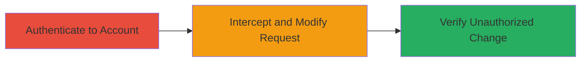

# CSRF Bypass in Django Change Password Endpoint for Unauthorized Updates

Multi-stage attack chain demonstrating exploitation of a CSRF vulnerability in the Veris View application's change password functionality, where server-side validation of the CSRF middleware token is missing. This allows an attacker to modify requests and perform unauthorized password changes, potentially leading to account takeover, though mitigated by the need for the old password.

## Chain Metrics Dashboard

| Metric | Value |
|--------|-------|
| Chain Status | Unverified |
| Total Steps | 3 |
| Execution Time | ~5 minutes |
| Skill Level | Intermediate |
| Complexity | Medium |
| Impact Level | High |

## Attack Flow Visualization

## Prerequisites & Requirements

### Required Tools

- [[tools/Burp-Suite]]

### Target Environment

- Web platform using Django framework
- Access to Veris View account settings endpoint (e.g., /settings/)
- Valid credentials for initial authentication

### Initial Access Requirements

- Valid username and password for Veris View
- Network access to the web application
- Burp Suite configured as a proxy for request interception

## Detailed Attack Procedures

### Step 1: Authenticate to Veris View Account
procedure: [[procedures/Authenticate-to-Veris-View-Account]]

**Objective**: Gain authenticated access to the account to reach the settings page.

**Instructions**: Use valid credentials to log in via the web interface. This establishes a session necessary for accessing protected endpoints like password change.

**Expected Output**: Successful login redirect to the dashboard or account page, with session cookies set.

**Success Indicators**:
- Login success message or dashboard access
- Session token in browser cookies

### Step 2: Intercept and Modify Change Password Request
procedure: [[procedures/Intercept-and-Modify-Change-Password-Request]]

**Objective**: Capture the password change form submission, remove the CSRF token, and forward the request to bypass validation.

**Instructions**: Navigate to settings, fill the password change form with old and new passwords, submit, and use Burp Suite to intercept. Edit the request to delete the csrfmiddlewaretoken parameter, then forward.

**Expected Output**: Server processes the request without token validation, returning a success response.

**Success Indicators**:
- Modified request forwarded successfully
- No CSRF error from server

### Step 3: Verify Password Change Success
procedure: [[procedures/Verify-Password-Change-Success]]

**Objective**: Confirm the password was changed despite the missing CSRF token, validating the vulnerability.

**Instructions**: Log out and attempt to log in with the new password, or check for a success message post-submission.

**Expected Output**: 'Password changed Successfully' message from the server, and new password works for login.

**Success Indicators**:
- Success message displayed
- Account accessible with new password

## Attack Chain Summary

### Key Achievements

1. Bypassed CSRF protection in Django's change password endpoint
2. Demonstrated potential for unauthorized password changes via malicious requests
3. Highlighted partial mitigation due to old password requirement

## Technique & Tactic Coverage

### MITRE ATT&CK Techniques

- [[Exploit Public-Facing Application]]

### MITRE ATT&CK Tactics

- [[Initial Access]]

---
*Last updated: 2023-10-01T00:00:00Z*
