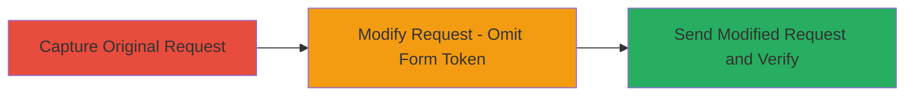

# CSRF Bypass in External Program Creation via Header Token Omission

Multi-stage attack chain demonstrating a CSRF vulnerability in the HackerOne platform's external programs creation endpoint. The weakness arises from duplicate CSRF token validation, allowing requests to succeed without the form authenticity_token if the X-CSRF-Token header is present. This could enable an attacker to forge requests on behalf of authenticated users to create unauthorized programs, though mitigated by the header requirement. The chain involves capturing a legitimate request, modifying it to omit the form token, and confirming successful execution.

## Chain Metrics Dashboard

| Metric | Value |
|--------|-------|
| Chain Status | Unverified |
| Total Steps | 3 |
| Execution Time | ~5 minutes |
| Skill Level | Intermediate |
| Complexity | Low |
| Impact Level | Low |

## Attack Flow Visualization

## Prerequisites & Requirements

### Required Tools

- [[tools/Burp-Suite]]

### Target Environment

- Web platform (HackerOne, Ruby on Rails backend)
- Authenticated session with permissions to create external programs
- Network access to https://hackerone.com/external_programs

### Initial Access Requirements

- Valid user session cookie for HackerOne
- CSRF token from a legitimate session (extracted via browser or proxy)
- No special privileges beyond authenticated user

## Detailed Attack Procedures

### Step 1: Capture Original Request
procedure: [[procedures/Capture-and-Modify-External-Program-Creation-Request]]

**Objective**: Intercept a legitimate POST request to /external_programs to obtain the full structure, including both CSRF tokens and form data.

**Instructions**: Use [[tools/Burp-Suite]] to proxy traffic from your browser. Navigate to the external programs creation page on HackerOne (https://hackerone.com/directory/new), fill in form details (e.g., name='test', handle='edmodotest', website='edmodo.com', policy text with exclusions, disclosure_method='email', disclosure_email='policy@edmodo.com', offers_rewards='true'), and submit. Capture the request in Burp.

**Expected Output**: Raw HTTP POST request with multipart/form-data body containing authenticity_token, X-CSRF-Token header, and all form fields.

**Success Indicators**:
- Request captured with Content-Type: multipart/form-data; boundary=...
- Both CSRF tokens present (header and form field)

### Step 2: Modify Request - Omit Form Token
procedure: [[procedures/Capture-and-Modify-External-Program-Creation-Request]]

**Objective**: Edit the captured request to remove the authenticity_token from the form data while preserving the X-CSRF-Token header, demonstrating the bypass.

**Instructions**: In [[tools/Burp-Suite]], drop to the Repeater tab. Remove the form-data section for "authenticity_token" from the body, adjust Content-Length accordingly (e.g., from 2201 to 2007), and keep all other fields and the header intact. Ensure the boundary remains the same.

**Expected Output**: Modified HTTP POST request without the form authenticity_token field.

**Success Indicators**:
- Form body lacks the authenticity_token line
- Content-Length updated to reflect removal
- X-CSRF-Token header still present

### Step 3: Send Modified Request and Verify
procedure: [[procedures/Capture-and-Modify-External-Program-Creation-Request]]

**Objective**: Submit the modified request and confirm it succeeds, proving the CSRF bypass.

**Instructions**: Forward the modified request in [[tools/Burp-Suite]] Repeater. Observe the response.

**Expected Output**: HTTP 200 OK with JSON body {"handle":"edmodotest"}.

**Success Indicators**:
- Response status 200
- JSON confirms program creation with the specified handle
- No CSRF validation error

## Attack Chain Summary

### Key Achievements

1. Captured legitimate request structure for external program creation.
2. Bypassed form-based CSRF by omitting authenticity_token while using header token.
3. Successfully created an unauthorized program, highlighting potential for CSRF chaining.

## Technique & Tactic Coverage

### MITRE ATT&CK Techniques

- [[Exploit Public-Facing Application]]

### MITRE ATT&CK Tactics

- [[Initial Access]]

---

*Last updated: 2023-10-01T00:00:00Z*
